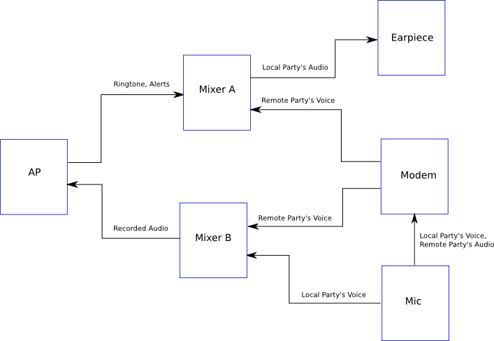

.. include:: defines.rst

.. _bridged-phy-protocols:

Bridged PHY Connection Protocols
================================

This section defines a group of protocols whose purpose is to support
communication with modules on the Greybus network which do not comply
with an existing device class protocol, and which include integrated
circuits using alternative physical interfaces to |unipro|. Modules
which implement any of the protocols defined in this section are said
to be *non-device class conformant*.

USB Protocol
------------

We will support bulk, control, and interrupt transfers, but not
isochronous at this point in time.

Details TBD.

GPIO Protocol
-------------

A connection using GPIO protocol on a |unipro| network is used to manage
a simple GPIO controller. Such a GPIO controller implements one or
more (up to 256) GPIO lines, and each of the operations below
specifies the line to which the operation applies. This protocol
consists of the operations defined in this section.

Conceptually, the GPIO protocol operations are:

.. c:function:: int get_version(u8 *major, u8 *minor);

    Returns the major and minor Greybus GPIO protocol version number
    supported by the GPIO controller. GPIO controllers adhering to the
    protocol specified herein shall report major version 0, minor
    version 1.

.. c:function:: int line_count(u8 *count);

    Returns one less than the number of lines managed by the Greybus
    GPIO controller. This means the minimum number of lines is 1 and
    the maximum is 256.

.. c:function:: int activate(u8 which);

    Notifies the GPIO controller that one of its lines has been
    assigned for use.

.. c:function:: int deactivate(u8 which);

    Notifies the GPIO controller that a previously-activated line has
    been unassigned and can be deactivated.

.. c:function:: int get_direction(u8 which, u8 *direction);

    Requests the GPIO controller return a line’s configured direction
    (0 for output, 1 for input).

.. c:function:: int direction_input(u8 which);

    Requests the GPIO controller configure a line for input.

.. c:function:: int direction_output(u8 which, u8 value);

    Requests the GPIO controller configure a line for output, and sets
    its initial output value (0 for low, 1 for high).

.. c:function:: int get_value(u8 which, u8 *value);

    Requests the GPIO controller return the current value sensed on a
    line (0 for low, 1 for high).

.. c:function:: int set_value(u8 which, u8 value);

    Requests the GPIO controller set the value (0 for low, 1 for high)
    for a line configured for output.

.. c:function:: int set_debounce(u8 which, u16 usec);

    Requests the GPIO controller set the debounce period (in
    microseconds).

Greybus GPIO Protocol Operations
^^^^^^^^^^^^^^^^^^^^^^^^^^^^^^^^

All operations sent to a GPIO controller are contained within a
Greybus GPIO request message. Every operation request will result in a
matching response from the GPIO controller, also taking the form of a
GPIO controller message.  The request and response messages for each
GPIO operation are defined below.

The following table describes the Greybus GPIO protocol operation
types and their values. Both the request type and response type values
are shown.

.. todo::
        Add GPIO "interrupt" type requests from the device that are unsolicited.

===========================  =============  ==============
GPIO Operation Type          Request Value  Response Value
===========================  =============  ==============
Invalid                      0x00           0x80
Protocol Version             0x01           0x81
Line Count                   0x02           0x82
Activate                     0x03           0x83
Deactivate                   0x04           0x84
Get Direction                0x05           0x85
Direction Input              0x06           0x86
Direction Output             0x07           0x87
Get                          0x08           0x88
Set                          0x09           0x89
Set debounce                 0x0a           0x8a
(all other values reserved)  0x0b..0x7f     0x8b..0xff
===========================  =============  ==============

Greybus GPIO Protocol Version Operation
^^^^^^^^^^^^^^^^^^^^^^^^^^^^^^^^^^^^^^^

The Greybus GPIO version operation allows the AP to determine the
version of this protocol to which the GPIO controller complies.

Greybus GPIO Protocol Version Request
"""""""""""""""""""""""""""""""""""""

The Greybus GPIO protocol version request contains no data beyond the
Greybus GPIO message header.

Greybus GPIO Protocol Version Response
""""""""""""""""""""""""""""""""""""""

The Greybus GPIO protocol version response contains a status byte,
followed by two 1-byte values. If the value of the status byte is
non-zero, any other bytes in the response shall be ignored. A Greybus
GPIO controller adhering to the protocol specified herein shall report
major version 0, minor version 1.

=======  ==============  ======  ==========      ===========================
Offset   Field           Size    Value           Description
=======  ==============  ======  ==========      ===========================
0        status          1       Number          Success, or reason for failure
1        version_major   1       |gb-major|      GPIO protocol major version
2        version_minor   1       |gb-minor|      GPIO protocol minor version
=======  ==============  ======  ==========      ===========================

Greybus GPIO Line Count Operation
^^^^^^^^^^^^^^^^^^^^^^^^^^^^^^^^^

The Greybus GPIO line count operation allows the AP to determine how
many GPIO lines are implemented by the GPIO controller.

Greybus GPIO Line Count Request
"""""""""""""""""""""""""""""""

The Greybus GPIO line count request contains no data beyond the
Greybus GPIO message header.

Greybus GPIO Line Count Response
""""""""""""""""""""""""""""""""

The Greybus GPIO line count response contains a status byte, followed
by a 1-byte value defining the number of lines managed by the
controller, minus 1. That is, a count value of 0 represents a single
GPIO line, while a (maximal) count value of 255 represents 256
lines. The lines are numbered sequentially starting with 0 (i.e., no
gaps in the numbering).

=======  ==============  ======  ==========      ===========================
Offset   Field           Size    Value           Description
=======  ==============  ======  ==========      ===========================
0        status          1       Number          Success, or reason for failure
1        count           1       Number          Number of GPIO lines minus 1
=======  ==============  ======  ==========      ===========================

Greybus GPIO Activate Operation
^^^^^^^^^^^^^^^^^^^^^^^^^^^^^^^

The Greybus GPIO activate operation notifies the GPIO controller that
one of its GPIO lines has been allocated for use. This provides a
chance to do initial setup for the line, such as enabling power and
clock signals.

Greybus GPIO Activate Request
"""""""""""""""""""""""""""""

The Greybus GPIO activate request supplies only the number of the line
to be activated.

=======  ==============  ======  ==========      ===========================
Offset   Field           Size    Value           Description
=======  ==============  ======  ==========      ===========================
0        which           1       Number          Controller-relative GPIO line number
=======  ==============  ======  ==========      ===========================

Greybus GPIO Activate Response
""""""""""""""""""""""""""""""

The Greybus GPIO activate response contains only the status byte.

=======  ==============  ======  ==========      ===========================
Offset   Field           Size    Value           Description
=======  ==============  ======  ==========      ===========================
0        status          1       Number          Success, or reason for failure
=======  ==============  ======  ==========      ===========================

Greybus GPIO Deactivate Operation
^^^^^^^^^^^^^^^^^^^^^^^^^^^^^^^^^

The Greybus GPIO deactivate operation notifies the GPIO controller
that a previously-activated line is no longer in use and can be
deactivated.

Greybus GPIO Deactivate Request
"""""""""""""""""""""""""""""""

The Greybus GPIO deactivate request supplies only the number of the
line to be deactivated.

=======  ==============  ======  ==========      ===========================
Offset   Field           Size    Value           Description
=======  ==============  ======  ==========      ===========================
0        which           1       Number          Controller-relative GPIO line number
=======  ==============  ======  ==========      ===========================

Greybus Deactivate Response
"""""""""""""""""""""""""""

The Greybus GPIO deactivate response contains only the status byte.

=======  ==============  ======  ==========      ===========================
Offset   Field           Size    Value           Description
=======  ==============  ======  ==========      ===========================
0        status          1       Number          Success, or reason for failure
=======  ==============  ======  ==========      ===========================

Greybus GPIO Get Direction Operation
^^^^^^^^^^^^^^^^^^^^^^^^^^^^^^^^^^^^

The Greybus GPIO get direction operation requests the GPIO controller
respond with the direction of transfer (in or out) for which a line is
configured.

Greybus GPIO Get Direction Request
""""""""""""""""""""""""""""""""""

The Greybus GPIO get direction request supplies only the target line number.

=======  ==============  ======  ==========      ===========================
Offset   Field           Size    Value           Description
=======  ==============  ======  ==========      ===========================
0        which           1       Number          Controller-relative GPIO line number
=======  ==============  ======  ==========      ===========================

Greybus Get Direction Response
""""""""""""""""""""""""""""""

The Greybus GPIO get direction response contains the status byte and
one byte indicating whether the line in question is configured for
input or output. If the value of the status byte is non-zero, the
direction byte shall be ignored.

=======  ==============  ======  ==========      ===========================
Offset   Field           Size    Value           Description
=======  ==============  ======  ==========      ===========================
0        status          1       Number          Success, or reason for failure
1        direction       1       0 or 1          Direction
=======  ==============  ======  ==========      ===========================

*direction* is 0 for output, and 1 for input.

Greybus GPIO Direction Input Operation
^^^^^^^^^^^^^^^^^^^^^^^^^^^^^^^^^^^^^^

The Greybus GPIO direction input operation requests the GPIO
controller to configure a line to be used for input.

Greybus GPIO Direction Input Request
""""""""""""""""""""""""""""""""""""

The Greybus GPIO direction input request supplies only the number of
the line.

=======  ==============  ======  ==========      ===========================
Offset   Field           Size    Value           Description
=======  ==============  ======  ==========      ===========================
0        which           1       Number          Controller-relative GPIO line number
=======  ==============  ======  ==========      ===========================

Greybus Direction Input Response
""""""""""""""""""""""""""""""""

The Greybus GPIO direction input response contains only the status
byte.

=======  ==============  ======  ==========      ===========================
Offset   Field           Size    Value           Description
=======  ==============  ======  ==========      ===========================
0        status          1       Number          Success, or reason for failure
=======  ==============  ======  ==========      ===========================

Greybus GPIO Direction Output Operation
^^^^^^^^^^^^^^^^^^^^^^^^^^^^^^^^^^^^^^^

The Greybus GPIO direction output operation requests the GPIO
controller to configure a line to be used for output, and specifies
its initial value.

Greybus GPIO Direction Output Request
"""""""""""""""""""""""""""""""""""""

The Greybus GPIO direction output request supplies the number of the
line and its initial value.

=======  ==============  ======  ==========      ===========================
Offset   Field           Size    Value           Description
=======  ==============  ======  ==========      ===========================
0        which           1       Number          Controller-relative GPIO line number
1        value           1       0 or 1          Initial value
=======  ==============  ======  ==========      ===========================

For the *value* field, 0 is low, and 1 is high.

Greybus Direction Output Response
"""""""""""""""""""""""""""""""""

The Greybus GPIO direction output response contains only the status
byte.

=======  ==============  ======  ==========      ===========================
Offset   Field           Size    Value           Description
=======  ==============  ======  ==========      ===========================
0        status          1       Number          Success, or reason for failure
=======  ==============  ======  ==========      ===========================

Greybus GPIO Get Operation
^^^^^^^^^^^^^^^^^^^^^^^^^^

The Greybus GPIO get operation requests the GPIO controller respond
with the current value (high or low) on a line.

Greybus GPIO Get Request
""""""""""""""""""""""""

The Greybus GPIO get request supplies only the target line number.

=======  ==============  ======  ==========      ===========================
Offset   Field           Size    Value           Description
=======  ==============  ======  ==========      ===========================
0        which           1       Number          Controller-relative GPIO line number
=======  ==============  ======  ==========      ===========================

Greybus Get Response
""""""""""""""""""""

The Greybus GPIO get response contains the status byte, plus one byte
indicating the value on the line in question.  If the value of the
status byte is non-zero, the value byte shall be ignored.

=======  ==============  ======  ==========      ===========================
Offset   Field           Size    Value           Description
=======  ==============  ======  ==========      ===========================
0        status          1       Number          Success, or reason for failure
1        value           1       0 or 1          Value
=======  ==============  ======  ==========      ===========================

*value* is 0 for low, and 1 for high.

Greybus GPIO Set Operation
^^^^^^^^^^^^^^^^^^^^^^^^^^

The Greybus GPIO set operation requests the GPIO controller to set a
line configured to be used for output to have either a low or high
value.

Greybus GPIO Set Request
""""""""""""""""""""""""

The Greybus GPIO set request supplies the number of the line and the
value to be set.

.. todo::
    Possibly make this a mask to allow multiple values to be set at once.

=======  ==============  ======  ==========      ===========================
Offset   Field           Size    Value           Description
=======  ==============  ======  ==========      ===========================
0        which           1       Number          Controller-relative GPIO line number
1        value           1       0 or 1          Initial value
=======  ==============  ======  ==========      ===========================

For the *value* field, 0 is low, and 1 is high.

Greybus Set Response
""""""""""""""""""""

The Greybus GPIO set response contains only the status byte.

=======  ==============  ======  ==========      ===========================
Offset   Field           Size    Value           Description
=======  ==============  ======  ==========      ===========================
0        status          1       Number          Success, or reason for failure
=======  ==============  ======  ==========      ===========================

Greybus GPIO Set Debounce Operation
^^^^^^^^^^^^^^^^^^^^^^^^^^^^^^^^^^^

The Greybus GPIO set debounce operation requests the GPIO controller
to set the debounce delay configured to be used for a line.

Greybus GPIO Set Debounce Request
"""""""""""""""""""""""""""""""""

The Greybus GPIO set debounce request supplies the number of the line
and the time period (in microseconds) to be used for the line.  If the
period specified is 0, debounce is disabled.

=======  ==============  ======  ==========      ===========================
Offset   Field           Size    Value           Description
=======  ==============  ======  ==========      ===========================
0        which           1       Number          Controller-relative GPIO line number
1        usec            2       Number          Debounce period (microseconds)
=======  ==============  ======  ==========      ===========================

Greybus Set Debounce Response
"""""""""""""""""""""""""""""

The Greybus GPIO set debounce response contains only the status byte.

=======  ==============  ======  ==========      ===========================
Offset   Field           Size    Value           Description
=======  ==============  ======  ==========      ===========================
0        status          1       Number          Success, or reason for failure
=======  ==============  ======  ==========      ===========================

SPI Protocol
------------

TBD.

UART Protocol
-------------

A connection using the UART protocol on a |unipro| network is used to
manage a simple UART controller.  This protocol is very close to the
CDC protocol for serial modems from the USB-IF specification, and
consists of the operations defined in this section.

The operations that can be performed on a Greybus UART controller are:

.. c:function:: int get_version(u8 *major, u8 *minor);

    Returns the major and minor Greybus UART protocol version number
    supported by the UART device.

.. c:function:: int send_data(u16 size, u8 *data);

    Requests that the UART device begin transmitting characters. One
    or more bytes to be transmitted will be supplied.

.. c:function:: int receive_data(u16 size, u8 *data);

    Receive data from the UART.  One or more bytes will be supplied.

.. c:function:: int set_line_coding(u32 rate, u8 format, u8 parity, u8 data);

   Sets the line settings of the UART to the specified baud rate,
   format, parity, and data bits.

.. c:function:: int set_control_line_state(u8 state);

    Controls RTS and DTR line states of the UART.

.. c:function:: int send_break(u8 state);

    Requests that the UART generate a break condition on its transmit
    line.

.. c:function:: int serial_state(u16 *state);

    Receives the state of the UART’s control lines and any line errors
    that might have occurred.

UART Protocol Operations
^^^^^^^^^^^^^^^^^^^^^^^^

This section defines the operations for a connection using the UART
protocol.  UART protocol allows an AP to control a UART device
contained within a Greybus module.

Greybus UART Protocol Operations
""""""""""""""""""""""""""""""""

This table describes the known Greybus UART operation types and their
values. A message type consists of an operation type combined with a
flag (0x80) indicating whether the operation is a request or a
response.  There are 127 valid operation type values.

===========================  =============  ==============
UART Operation Type          Request Value  Response Value
===========================  =============  ==============
Invalid                      0x00           0x80
Protocol Version             0x01           0x81
Send Data                    0x02           0x82
Receive Data                 0x03           0x83
Set Line Coding              0x04           0x84
Set Control Line State       0x05           0x85
Send Break                   0x06           0x86
Serial State                 0x07           0x87
(all other values reserved)  0x08..0x7f     0x88..0xff
===========================  =============  ==============

Greybus UART Protocol Version Operation
^^^^^^^^^^^^^^^^^^^^^^^^^^^^^^^^^^^^^^^

The Greybus UART protocol version operation allows the AP to determine
the version of this protocol to which the UART device complies.

Greybus UART Protocol Version Request
"""""""""""""""""""""""""""""""""""""

The Greybus UART protocol version request contains no data beyond the
Greybus UART message header.

Greybus UART Protocol Version Response
""""""""""""""""""""""""""""""""""""""

The Greybus UART protocol version response contains a status byte,
followed by two 1-byte values. If the value of the status byte is
non-zero, any other bytes in the response shall be ignored. A Greybus
UART device adhering to the protocol specified herein shall report
major version |gb-major|, minor version |gb-minor|.

=======  ==============  ======  ==========      ===========================
Offset   Field           Size    Value           Description
=======  ==============  ======  ==========      ===========================
0        status          1       Number          Success, or reason for failure
1        version_major   1       |gb-major|      UART protocol major version
2        version_minor   1       |gb-minor|      UART protocol minor version
=======  ==============  ======  ==========      ===========================

Greybus UART Send Data Operation
^^^^^^^^^^^^^^^^^^^^^^^^^^^^^^^^

The Greybus UART start transmission operation allows the AP to request
the UART device begin transmission of characters.  One or more
characters to be transmitted may optionally be provided with this
request.

Greybus UART Send Data Request
""""""""""""""""""""""""""""""

The Greybus UART start transmission request shall request the UART
device begin transmitting.  The request optionally contains one or
more characters to to be transmitted.

=======  ==============  ======  ===========     ===========================
Offset   Field           Size    Value           Description
=======  ==============  ======  ===========     ===========================
0        size            2       Number          Size in bytes of data to be transmitted
2        data            size    Characters      0 or more bytes of data to be transmitted
=======  ==============  ======  ===========     ===========================

Greybus UART Send Data Response
"""""""""""""""""""""""""""""""

The Greybus UART start transmission response contains only the status
byte.

=======  ==============  ======  ==========      ===========================
Offset   Field           Size    Value           Description
=======  ==============  ======  ==========      ===========================
0        status          1       Number          Success, or reason for failure
=======  ==============  ======  ==========      ===========================

Greybus UART Receive Data Operation
^^^^^^^^^^^^^^^^^^^^^^^^^^^^^^^^^^^

Unlike most other Greybus UART operations, the Greybus UART event
operation is initiated by the UART device and received by the AP. It
notifies the AP that a data has been received by the UART.

Greybus UART Receive Data Request
"""""""""""""""""""""""""""""""""

The Greybus UART receive data request contains the size of the data to
be received, and the data bytes to be received.

=======  ==============  ======  ==========      ===========================
Offset   Field           Size    Value           Description
=======  ==============  ======  ==========      ===========================
0        size            2       Number          Size in bytes of received data
2        data            size    Characters      1 or more bytes of received data
=======  ==============  ======  ==========      ===========================

Greybus UART Received Data Response
"""""""""""""""""""""""""""""""""""

The Greybus UART event response is sent by the AP to the UART device,
and contains only the status byte.

=======  ==============  ======  ==========      ===========================
Offset   Field           Size    Value           Description
=======  ==============  ======  ==========      ===========================
0        status          1       Number          Success, or reason for failure
=======  ==============  ======  ==========      ===========================

Greybus UART Set Line Coding Operation
^^^^^^^^^^^^^^^^^^^^^^^^^^^^^^^^^^^^^^

The Greybus UART set line coding operation allows the AP to request
the UART to be set up to a specific set of line coding values.

Greybus UART Set Line Coding State Request
""""""""""""""""""""""""""""""""""""""""""

The Greybus UART set line coding state request contains the specific
line coding values to be set.

=======  ==============  ======  ==========      ===========================
Offset   Field           Size    Value           Description
=======  ==============  ======  ==========      ===========================
0        rate            4       Number          Baud Rate setting
4        format          1       Number          :ref:`uart-stop-bit-format`
5        parity          1       Number          :ref:`uart-parity-format`
6        data_bits       1       Number          Number of data bits
=======  ==============  ======  ==========      ===========================

.. _uart-stop-bit-format:

Greybus UART Stop bit format
""""""""""""""""""""""""""""

==============================  ====
1 Stop Bit                      0x00
1.5 Stop Bits                   0x01
2 Stop Bits                     0x02
(All other values reserved)     0x03..0xff
==============================  ====

.. _uart-parity-format:

Greybus UART Parity format
""""""""""""""""""""""""""

==============================  ====
No Parity                       0x00
Odd Parity                      0x01
Even Parity                     0x02
Mark Parity                     0x03
Space Parity                    0x04
(All other values reserved)     0x05..0xff
==============================  ====

Greybus UART Set Line Coding State Response
"""""""""""""""""""""""""""""""""""""""""""

The Greybus UART set line coding state response contains only a status
byte.

=======  ==============  ======  ==========      ===========================
Offset   Field           Size    Value           Description
=======  ==============  ======  ==========      ===========================
0        status          1       Number          Success, or reason for failure
=======  ==============  ======  ==========      ===========================

Greybus UART Set Control Line State Operation
^^^^^^^^^^^^^^^^^^^^^^^^^^^^^^^^^^^^^^^^^^^^^

The Greybus UART set control line state allows the AP to request the
UART device set “outbound” UART status values.

Greybus UART Set Control Line State Request
"""""""""""""""""""""""""""""""""""""""""""

The Greybus UART set modem status request contains no data beyond the
Greybus UART message header.

=======  ==============  ======  ==========      ===========================
Offset   Field           Size    Value           Description
=======  ==============  ======  ==========      ===========================
0        control         2       Number          :ref:`uart-modem-status-flags`
=======  ==============  ======  ==========      ===========================

.. _uart-modem-status-flags:

Greybus UART Modem Status Flags
"""""""""""""""""""""""""""""""

This table describes the values supplied as flag values for the
Greybus UART set modem request. Any combination of these values may be
supplied in a single request.

============================    ==============  ===================
Flag                            Value           Description
============================    ==============  ===================
DTR                             0x0001          Data Terminal Ready
RTS                             0x0002          Request To Send
(all other values reserved)     0x0004..0x8000
============================    ==============  ===================

Greybus UART Set Control Line State Response
""""""""""""""""""""""""""""""""""""""""""""

The Greybus UART set control line state response contains only a
status byte.

=======  ==============  ======  ==========      ===========================
Offset   Field           Size    Value           Description
=======  ==============  ======  ==========      ===========================
0        status          1       Number          Success, or reason for failure
=======  ==============  ======  ==========      ===========================

Greybus UART Send Break Operation
^^^^^^^^^^^^^^^^^^^^^^^^^^^^^^^^^

The Greybus UART send break operation allows the AP to request the
UART device set the break condition on its transmit line to be either
on or off.

Greybus UART Break Control Request
""""""""""""""""""""""""""""""""""

The Greybus UART break control request supplies the duration of the
break condition that should be generated by the UART device transmit
line.

=======  ==============  ======  ==========      ===========================
Offset   Field           Size    Value           Description
=======  ==============  ======  ==========      ===========================
0        state           1       0 or 1          0 is off, 1 is on
=======  ==============  ======  ==========      ===========================

Greybus UART Break Control Response
"""""""""""""""""""""""""""""""""""

The Greybus UART break control response contains only the status byte.

=======  ==============  ======  ==========      ===========================
Offset   Field           Size    Value           Description
=======  ==============  ======  ==========      ===========================
0        status          1       Number          Success, or reason for failure
=======  ==============  ======  ==========      ===========================

Greybus UART Serial State Operation
^^^^^^^^^^^^^^^^^^^^^^^^^^^^^^^^^^^

Unlike most other Greybus UART operations, the Greybus UART serial
state operation is initiated by the UART device and received by the
AP. It notifies the AP that a control line status has changed, or that
there is an error with the UART.

Greybus UART Serial State Request
"""""""""""""""""""""""""""""""""

The Greybus UART serial state request contains the control value that
the UART is currently in.

=======  ==============  ======  ==========      ===========================
Offset   Field           Size    Value           Description
=======  ==============  ======  ==========      ===========================
0        control         2       Number          Control data state
2        data            2       Number          :ref:`uart-control-flags`
=======  ==============  ======  ==========      ===========================

.. _uart-control-flags:

Greybus UART Control Flags
""""""""""""""""""""""""""

The following table defines the flag values used for a Greybus UART
Serial State request.

============================    ==============  ===================
Flag                            Value           Description
============================    ==============  ===================
DCD                             0x0001          Carrier Detect line enabled
DSR                             0x0002          DSR signal
Break                           0x0004          Break condition detected
RI                              0x0008          Ring Signal detected
Framing Error                   0x0010          Framing error detected
Parity Error                    0x0020          Parity error detected
Overrun                         0x0040          Received data lost due to overrun
(all other values reserved)     0x0080..0x8000
============================    ==============  ===================

Greybus UART Serial State Response
""""""""""""""""""""""""""""""""""

The Greybus UART serial state response is sent by the AP to the UART
device, and contains only the status byte.

=======  ==============  ======  ==========      ===========================
Offset   Field           Size    Value           Description
=======  ==============  ======  ==========      ===========================
0        status          1       Number          Success, or reason for failure
=======  ==============  ======  ==========      ===========================

PWM Protocol
------------

A connection using PWM protocol on a |unipro| network is used to manage
a simple PWM controller. Such a PWM controller implements one or more
(up to 256) PWM devices, and each of the operations below specifies
the line to which the operation applies. This protocol consists of the
operations defined in this section.

Conceptually, the PWM protocol operations are:

.. c:function:: int get_version(u8 *major, u8 *minor);

    Returns the major and minor Greybus PWM protocol version number
    supported by the PWM controller. PWM controllers adhering to the
    protocol specified herein shall report major version 0, minor
    version 1.

.. c:function:: int pwm_count(u8 *count);

    Returns one less than the number of instances managed by the
    Greybus PWM controller. This means the minimum number of PWMs is 1
    and the maximum is 256.

.. c:function:: int activate(u8 which);

    Notifies the PWM controller that one of its instances has been
    assigned for use.

.. c:function:: int deactivate(u8 which);

    Notifies the PWM controller that a previously-activated instance
    has been unassigned and can be deactivated.

.. c:function:: int config(u8 which, u32 duty, u32 period);

    Requests the PWM controller configure an instance for a particular
    duty cycle and period (in units of nanoseconds).

.. c:function:: int set_polarity(u8 which, u8 polarity);

    Requests the PWM controller configure an instance as normally
    active or inversed.

.. c:function:: int enable(u8 which);

    Requests the PWM controller enable a PWM instance to begin
    toggling.

.. c:function:: int disable(u8 which);

    Requests the PWM controller disable a previously enabled PWM
    instance

Greybus PWM Protocol Operations
^^^^^^^^^^^^^^^^^^^^^^^^^^^^^^^

All operations sent to a PWM controller are contained within a Greybus
PWM request message. Every operation request will result in a response
from the PWM controller, also taking the form of a PWM controller
message.  The request and response messages for each PWM operation are
defined below.

The following table describes the Greybus PWM protocol operation types
and their values. Both the request type and response type values are
shown.

===========================  =============  ==============
PWM Operation Type           Request Value  Response Value
===========================  =============  ==============
Invalid                      0x00           0x80
Protocol Version             0x01           0x81
PWM count                    0x02           0x82
Activate                     0x03           0x83
Deactivate                   0x04           0x84
Config                       0x05           0x85
Set Polarity                 0x06           0x86
Enable                       0x07           0x87
Disable                      0x08           0x88
(all other values reserved)  0x09..0x7f     0x89..0xff
===========================  =============  ==============

Greybus PWM Protocol Version Operation
^^^^^^^^^^^^^^^^^^^^^^^^^^^^^^^^^^^^^^

The Greybus PWM version operation allows the AP to determine the
version of this protocol to which the PWM controller complies.

Greybus PWM Protocol Version Request
""""""""""""""""""""""""""""""""""""

The Greybus PWM protocol version request contains no data beyond the
Greybus PWM message header.

Greybus PWM Protocol Version Response
"""""""""""""""""""""""""""""""""""""

The Greybus PWM protocol version response contains a status byte,
followed by two 1-byte values. If the value of the status byte is
non-zero, any other bytes in the response shall be ignored. A Greybus
PWM controller adhering to the protocol specified herein shall report
major version 0, minor version 1.

=======  ==============  ======  ==========      ===========================
Offset   Field           Size    Value           Description
=======  ==============  ======  ==========      ===========================
0        status          1       Number          Success, or reason for failure
1        version_major   1       |gb-major|      PWM protocol major version
2        version_minor   1       |gb-minor|      PWM protocol minor version
=======  ==============  ======  ==========      ===========================

Greybus PWM Count Operation
^^^^^^^^^^^^^^^^^^^^^^^^^^^

The Greybus PWM count operation allows the AP to determine how many
PWM instances are implemented by the PWM controller.

Greybus PWM Count Request
"""""""""""""""""""""""""

The Greybus PWM count request contains no data beyond the Greybus PWM
message header.

Greybus PWM Count Response
""""""""""""""""""""""""""

The Greybus PWM count response contains a status byte, followed by a
1-byte value defining the number of PWM instances managed by the
controller, minus 1. That is, a count value of 0 represents a single
PWM instance, while a (maximal) count value of 255 represents 256
instances. The lines are numbered sequentially starting with 0 (i.e.,
no gaps in the numbering).

=======  ==============  ======  ==========      ===========================
Offset   Field           Size    Value           Description
=======  ==============  ======  ==========      ===========================
0        status          1       Number          Success, or reason for failure
1        count           1       Number          Number of PWM instances minus 1
=======  ==============  ======  ==========      ===========================

Greybus PWM Activate Operation
^^^^^^^^^^^^^^^^^^^^^^^^^^^^^^

The Greybus PWM activate operation notifies the PWM controller that
one of its PWM instances has been allocated for use. This provides a
chance to do initial setup for the PWM instance, such as enabling
power and clock signals.

Greybus PWM Activate Request
""""""""""""""""""""""""""""

The Greybus PWM activate request supplies only the number of the
instance to be activated.

=======  ==============  ======  ==========      ===========================
Offset   Field           Size    Value           Description
=======  ==============  ======  ==========      ===========================
0        which           1       Number          Controller-relative PWM instance number
=======  ==============  ======  ==========      ===========================

Greybus PWM Activate Response
"""""""""""""""""""""""""""""

The Greybus PWM activate response contains only the status byte.

=======  ==============  ======  ==========      ===========================
Offset   Field           Size    Value           Description
=======  ==============  ======  ==========      ===========================
0        status          1       Number          Success, or reason for failure
=======  ==============  ======  ==========      ===========================

Greybuf PWM Deactivate Operation
^^^^^^^^^^^^^^^^^^^^^^^^^^^^^^^^

The Greybus PWM instance deactivate operation notifies the PWM
controller that a previously-activated instance is no longer in use
and can be deactivated.

Greybus PWM Deactivate Request
""""""""""""""""""""""""""""""

The Greybus PWM deactivate request supplies only the number of the
instance to be deactivated.

=======  ==============  ======  ==========      ===========================
Offset   Field           Size    Value           Description
=======  ==============  ======  ==========      ===========================
0        which           1       Number          Controller-relative PWM instance number
=======  ==============  ======  ==========      ===========================

Greybus PWM Deactivate Response
"""""""""""""""""""""""""""""""

The Greybus PWM deactivate response contains only the status byte.

=======  ==============  ======  ==========      ===========================
Offset   Field           Size    Value           Description
=======  ==============  ======  ==========      ===========================
0        status          1       Number          Success, or reason for failure
=======  ==============  ======  ==========      ===========================

Greybus PWM Config Operation
^^^^^^^^^^^^^^^^^^^^^^^^^^^^

The Greybus PWM config operation requests the PWM controller configure
a PWM instance with the given duty cycle and period.

Greybus PWM Config Request
""""""""""""""""""""""""""

The Greybus PWM Config request supplies the target instance number,
duty cycle, and period of the cycle.

=======  ==============  ======  ==========      ===========================
Offset   Field           Size    Value           Description
=======  ==============  ======  ==========      ===========================
0        which           1       Number          Controller-relative PWM instance number
1        duty            4       Number          Duty cycle (in nanoseconds)
5        period          4       Number          Period (in nanoseconds)
=======  ==============  ======  ==========      ===========================

Greybus PWM Config Response
"""""""""""""""""""""""""""

The Greybus PWM Config response contains only the status byte.

=======  ==============  ======  ==========      ===========================
Offset   Field           Size    Value           Description
=======  ==============  ======  ==========      ===========================
0        status          1       Number          Success, or reason for failure
=======  ==============  ======  ==========      ===========================

Greybus PWM Polarity Operation
^^^^^^^^^^^^^^^^^^^^^^^^^^^^^^

The Greybus PWM polarity operation requests the PWM controller
configure a PWM instance with the given polarity.

Greybus PWM Polarity Request
""""""""""""""""""""""""""""

The Greybus PWM Polarity request supplies the target instance number
and polarity (normal or inversed). The polarity may not be configured
when a PWM instance is enabled and will respond with a busy failure.

=======  ==============  ======  ==========      ===========================
Offset   Field           Size    Value           Description
=======  ==============  ======  ==========      ===========================
0        which           1       Number          Controller-relative PWM instance number
1        polatiry        1       Number          0 for normal, 1 for inverted
=======  ==============  ======  ==========      ===========================

Greybus PWM Polarity Response
"""""""""""""""""""""""""""""

The Greybus PWM Config response contains only the status byte.

=======  ==============  ======  ==========      ===========================
Offset   Field           Size    Value           Description
=======  ==============  ======  ==========      ===========================
0        status          1       Number          Success, or reason for failure
=======  ==============  ======  ==========      ===========================

Greybus PWM Enable Operation
^^^^^^^^^^^^^^^^^^^^^^^^^^^^

The Greybus PWM enable operation enables a PWM instance to begin
toggling.

Greybus PWM Enable Request
""""""""""""""""""""""""""

The Greybus PWM enable request supplies only the number of the
instance to be enabled.

=======  ==============  ======  ==========      ===========================
Offset   Field           Size    Value           Description
=======  ==============  ======  ==========      ===========================
0        which           1       Number          Controller-relative PWM instance number
=======  ==============  ======  ==========      ===========================

Greybus PWM Enable Response
"""""""""""""""""""""""""""

The Greybus PWM enable response contains only the status byte.

=======  ==============  ======  ==========      ===========================
Offset   Field           Size    Value           Description
=======  ==============  ======  ==========      ===========================
0        status          1       Number          Success, or reason for failure
=======  ==============  ======  ==========      ===========================

Greybus PWM Disable Operation
^^^^^^^^^^^^^^^^^^^^^^^^^^^^^

The Greybus PWM disable operation stops a PWM instance that has
previously been enabled.

Greybus PWM Disable Request
"""""""""""""""""""""""""""

The Greybus PWM disable request supplies only the number of the
instance to be disabled.

=======  ==============  ======  ==========      ===========================
Offset   Field           Size    Value           Description
=======  ==============  ======  ==========      ===========================
0        which           1       Number          Controller-relative PWM instance number
=======  ==============  ======  ==========      ===========================

Greybus PWM Disable Response
""""""""""""""""""""""""""""

The Greybus PWM disable response contains only the status byte.

=======  ==============  ======  ==========      ===========================
Offset   Field           Size    Value           Description
=======  ==============  ======  ==========      ===========================
0        status          1       Number          Success, or reason for failure
=======  ==============  ======  ==========      ===========================

I2S Protocols
-------------

..  'I2S' should be replaced by 'Audio Streaming' or similar
    because more than i2s is supported by what's defined here.

Audio data may be streamed using the I2S Protocols Specification
described herein.  The I2S Protocols Specification is designed to
support arbitrarily complex audio topologies with any number of
intermediate Modules.  A Module that supports the I2S Protocols
Specification shall be referred to as an *I2S Module* even when
the Module supports other Greybus Protocols.

.. note::

    Where possible, the I2S Protocols Specification tries to be consistent
    with the
    `USB Audio Specification Version 2.0
    <http://www.usb.org/developers/docs/devclass_docs/Audio2.0_final.zip>`_.
    The I2S Protocols Specification is designed to handle
    *Type I Simple Audio Data Format*
    data as defined in Section 2.3.1 of the
    *USB Device Class Definition for Audio Data Formats*
    document.  This does not preclude the use of other
    data formats.

An I2S Module shall contain one or more *I2S Bundles*.  Each I2S Bundle
shall contain one *I2S Management CPort*, and may contain zero or
more *I2S Transmitter CPorts* and zero or more *I2S Receiver CPorts*.
There shall be at least one I2S Transmitter or Receiver CPort in each
I2S Bundle.  An I2S Bundle may have no physical low-level I2S or
similar hardware associated with it.

I2S Management CPorts, I2S Transmitter CPorts, and I2S Receiver CPorts
have unique CPort Protocol values in the `protocol` field of the CPort
Descriptor in the Manifest Data.

An *I2S Transmitter Bundle* is an I2S Bundle containing at least one
I2S Transmitter CPort.  Similarly for an *I2S Receiver Bundle*.
The terms *Transmitter* and *Receiver* are from the perspective of the
|unipro| network.  So an I2S Transmitter Bundle is an I2S Bundle capable
of sending audio data over the |unipro| network even when that I2S
Bundle is a *receiver* on a local low-level I2S interface.  An I2S
Bundle may be both an I2S Transmitter Bundle and an I2S Receiver Bundle.

I2S Management CPorts in the AP Module that are used to manage
I2S Bundles are considered a special case and not part of an I2S Bundle.
This shall not prevent the AP Module from having I2S Bundles.
For example, the AP Module may have an I2S Bundle for sending
ringtones to the Speaker Module when an incoming voice call arrives.
The I2S Management CPort in the AP Module's I2S Bundle is separate
from the I2S Management CPort used by the AP Module to manage that
I2S Bundle.  The AP Module shall treat the I2S Bundle in the AP
Module no differently than an I2S Bundle in any other I2S Module.

Separate Management and Data Protocols
^^^^^^^^^^^^^^^^^^^^^^^^^^^^^^^^^^^^^^

There are two separate protocols contained within the I2S Protocols
Specification.  The first one is the :ref:`i2s-management-protocol`
and is used by the AP Module to manage audio streams.  The second
one is the :ref:`i2s-data-protocol` and is used by I2S Modules to
stream audio data to one another.

The I2S Management Protocol is used over an *I2S Management Connection*
which connects two I2S Management CPorts.  At least one of the I2S
Management CPorts shall be in the AP Module.  The I2S Data Protocol
is used over an *I2S Data Connection* which connects an I2S Transmitter
CPort to an I2S Receiver CPort.

.. _i2s-audio-data-attributes:

Audio Data Attributes and Configuration
^^^^^^^^^^^^^^^^^^^^^^^^^^^^^^^^^^^^^^^

For audio data to be streamed and delivered correctly, the I2S Bundles
at either end of an I2S Data Connection shall be configured similarly.
Note that it is possible for I2S Data Connections in an overall audio
stream to have their associated I2S Bundles configured differently.
For example, an intermediate I2S Module that is a sampling rate
converter may have different sampling rates for its receiving and
transmitting I2S Data Connections.  Even so, the I2S Bundles at
either end of each I2S Data Connection shall be configured similarly.

It is the responsibility of the AP Module to ensure that both the
individual I2S Data Connections, and the overall set of I2S Data
Connections combined with the functions of internal I2S Modules
and non-|unipro| devices are configured correctly.

The I2S Protocols Specification defines the *transfer* of audio data,
not the production or consumption of audio data.
Therefore, the encoding method, compression technique, and audio data
representation are irrelevant with respect to the I2S Protocols
Specification.  However, there are attributes of the audio data
that are relevant and are described herein.

The *Configuration* of an I2S Bundle or Data Connection is the set
of values used by the I2S Bundle or Data Connection for these audio
data attributes.  The I2S Protocols Specification places constraints
on the Configuration.  These constraints are:

*   the Configuration (i.e., sample frequency, number of channels
    per sample, etc.) of an I2S Bundle may not change while there is
    an active I2S Transmitter or Receiver CPorts in the I2S Bundle;
*   the number of audio data bits for an individual channel shall be
    an integer multiple of eight;
*   the number of audio data bits for each channel shall be equal;
*   as per the USB Audio Specification, the number of bytes of audio
    data shall be one, two, three, or four;
*   every :ref:`i2s-send-data-op` shall send an integer number of
    audio data samples.

Some audio data attributes commonly differ for reasons including
underlying hardware constraints and the audio application.
These attributes shall be configurable.  The configurable audio
data attributes are:

*   the sample frequency which is the number of audio sample taken
    per second;
*   the number of audio channels per sample;
*   the number of bytes of audio channel data;
*   the bytes order of multi-byte audio channel data;
*   the spatial location of the audio channels.

The spatial location of the audio channels is defined by the
USB Audio Specification.  The number of channels per sample
in the Configuration shall equal the number of spatial locations
selected by the Configuration.

There are other configurable attributes that don't affect the audio
data within the |unipro| audio stream but do affect the low-level
interface between the I2S Bundle and a non-|unipro| audio device.
These are :ref:`i2s-low-level-attributes`.

It is necessary to include these attributes in the I2S Configuration
data because the AP Module requires this information in order to
configure the low-level interface of the non-|unipro| device.
Examples of non-|unipro| audio devices are analog-to-digital
converters (ADCs), digital-to-analog converters (DACs), combined
ADC/DACs called coders-decoders (codecs), and audio mixers.

In order to configure the I2S Bundles at each end of an I2S Data
Connection similarly, the AP Module requires the ability to query
the I2S Bundles to see which options for each attribute the
I2S Bundle supports.  To enable this, the I2S Management Protocol contains
the :ref:`i2s-get-supported-configurations-op` which returns an array
of structures that describe the configurations supported by the I2S
Bundle.  Each entry of the array is a :ref:`i2s-configuration-struct`.
The AP Module also requires the ability to set the attribute values
of the I2S Bundle.  The :ref:`i2s-set-configuration-op` is provided for
this purpose.

Some attributes in the :ref:`i2s-configuration-struct` returned by
the :ref:`i2s-get-supported-configurations-op` may have multiple options
set.  This indicates that more than one option for that attribute is
supported by the I2S Bundle; however, only one option shall be selected
in the :ref:`i2s-configuration-struct` passed in the
:ref:`i2s-set-configuration-op`.

Configuration of the I2S Bundle shall be performed while no CPorts
in the I2S Bundle are active.

.. _i2s-low-level-attributes:

I2S Low-level Attributes
^^^^^^^^^^^^^^^^^^^^^^^^

There are several I2S Low-level Attributes supported by the
I2S Protocols Specification.  Some of the I2S Low-level Attributes
vary depending on the *low-level Interface Protocol* so more
I2S Low-level Attributes may be added as support for additional
Low-level Interface Protocols is added.  The current I2S Low-level
Attributes are:

*   the Low-level Interface Protocol;
*   the I2S Bundle's role with respect to the Bit Clock (BCLK);
*   the I2S Bundle's role with respect to the Word Clock (WCLK);
*   the polarity of the WCLK;
*   the BCLK edge that the WCLK changes on;
*   the BCLK edge when transmit bits are presented;
*   the BCLK edge when receive bits are latched;
*   the number of BCLK cycles between when WCLK changes and when
    data for the next channel is presented.

The Low-level Interface Protocol specifies the protocol used by the
3- (or more) wire interface between the I2S Bundle and the non-|unipro|
device.  The currently supported Low-level Interface Protocols are:
Pulse Code Modulation (PCM), Inter-IC Sound (I2S), and Left-Right Stereo
(LR Stereo).  They are described in more detail below.

Sometimes Low-level Interface Protocols also specify the format of the
audio data (e.g., I2S).  For this discussion, the audio data format is
irrelevant and only the Low-level Interface Protocol is relevant.

The I2S Bundle's *role* with respect to the Bit and Word Clocks specifies
whether the I2S Bundle generates the respective clock signal or not.
When the I2S Bundle generates the clock signal, its role is *clock master*;
when it does not generate the clock signal, its role is *clock slave*.

The polarity of the WCLK may be reversed for some Low-level Interface
Protocols.  The effects of reversing the WCLK polarity varies by
Low-level Interface Protocol.  The WCLK is also referred to as the
Left-Right Clock (LRCLK) and Word Select (WS).

The remaining I2S Low-level Attributes specify which BCLK edge
various events are synchronized to.

Pulse Code Modulation (PCM) Low-level Interface Protocol
""""""""""""""""""""""""""""""""""""""""""""""""""""""""

There are many variations of the `Pulse Code Modulation (PCM)
<http://en.wikipedia.org/wiki/Pulse-code_modulation>`_
Low-level Interface Protocol.  Most variations are supported
by setting I2S Low-level Attributes appropriately.

..  The link above is useless.  The only other links I've found
    that have decent descriptions are in datasheets for parts
    and the description is buried in the middle.
    Best example I have is:
    http://kcwirefree.com/docs/guides/kcTechnicalAudio.pdf.
    Jump to Sections 10.3.2 and 10.3.3 (p. 12).  Other parts
    have variation of this.  There doesn't seem to be one
    standard.

The PCM Low-level Interface Protocol uses the WCLK signal for
transmitting *Frame SYNC* pulses.  A Frame SYNC pulse is transmitted
when the WCLK master reverses the WCLK polarity for one or more BCLK cycles.
The beginning of a Frame SYNC pulse signals the beginning of a new sample.
The audio data for all channels in the sample is transferred between
Frame SYNC pulses.  If there is no more audio data to transfer,
zero bits are transferred until the next Frame SYNC pulse (which
signals the start of the next sample).

Important points are:

*   one or more audio channels may be transferred;
*   the BCLK role may be master or slave;
*   the WCLK role may be master or slave;
*   the WCLK polarity may be normal or reversed (normal is when
    the WCLK is low except when a Frame SYNC pulse is being transmitted);
*   the WCLK may change on the rising or falling edge of the BCLK;
*   data bits being transmitted may be presented on the rising or
    falling edge of BCLK;
*   data bits being received may be latched on the rising or falling
    edge of BCLK;
*   the first bit of the new sample may start on the same BCLK
    edge as the WCLK signal (i.e., no offset) or one BCLK cycle
    later (i.e., offset by one).

Inter-IC Sound (I2S) Low-level Interface Protocol
"""""""""""""""""""""""""""""""""""""""""""""""""

The `Inter-IC Sound (I2S)
<https://web.archive.org/web/20060702004954/http://www.semiconductors.philips.com/acrobat_download/various/I2SBUS.pdf>`_
Low-level Interface Protocol specifies some I2S Low-level Attribute
values but leaves others open.  The WCLK signal specifies
whether the left or right channel's audio data is being
transferred.

Important points are:

*   there are two channels per sample;
*   the BCLK role may be master or slave;
*   the WCLK role may be master or slave;
*   the WCLK polarity may be normal or reversed (normal is when
    the left channel data is transferred when WCLK is low and the
    right channel data is transferred when WCLK is high);
*   the WCLK may change on the rising or falling edge of the BCLK;
*   data bits being transmitted may be presented on the rising or
    falling edge of BCLK;
*   data bits being received are latched on the rising edge of BCLK;
*   the first bit of the new sample starts one BCLK cycle after WCLK
    changes (i.e., offset by one).

LR Stereo Low-level Interface Protocol
""""""""""""""""""""""""""""""""""""""

The *LR Stereo* Low-level Interface Protocol refers to the
protocol used by
`Left-justified and Right-justified Stereo Formats
<http://www.cirrus.com/en/pubs/appNote/AN282REV1.pdf>`_.
The only difference between the two formats is whether
the audio data is left- or right-justified.  The justification
of the audio data is not relevant to the Low-level Interface Protocol
so the protocols for the two formats are combined into the
LR Stereo Low-level Interface Protocol.

..  I don't like having a hardware vendor's link here but
    I can't find a better one.

The LR Stereo Low-level Interface Protocol is similar to I2S except
the WCLK polarity is reversed and there is no offset between
when WCLK changes and when data for the next channel is presented.

Important points are:

*   there are two channels per sample;
*   the BCLK role may be master or slave;
*   the WCLK role may be master or slave;
*   the WCLK polarity may be normal or reversed (normal is when
    the left channel data is transferred when WCLK is high and the
    right channel data is transferred when WCLK is low);
*   the WCLK may change on the rising or falling edge of the BCLK;
*   data bits being transmitted may be presented on the rising or
    falling edge of BCLK;
*   data bits being received may be latched on the rising or falling
    edge of BCLK;
*   the first bit of the new sample starts on the same BCLK
    edge as the WCLK signal (i.e., no offset).

.. _i2s-audio-samples-per-message:

Audio Samples per Greybus Message
^^^^^^^^^^^^^^^^^^^^^^^^^^^^^^^^^

Since audio samples tend to small but sent many times per second,
and small delays are not perceptible by the human ear, the I2S Protocols
Specification supports combining multiple audio samples into one Greybus
Message.  This is configured using the :ref:`i2s-set-samples-per-message-op`.
The I2S Transmitter and Receiver Bundles at each end of an
I2S Data Connection shall be set to the same samples per message value.
Once set, the I2S Transmitter Bundle shall send the specified number
of audio samples in each :ref:`i2s-send-data-op`.

Setting the samples per message is considered part of the audio stream
configuration and shall be performed while no CPorts are active
in the I2S Bundle.  Once set, the samples per message value shall
remain in effect indefinitely or until modified by another
:ref:`i2s-set-samples-per-message-op`.

When the samples per message is not set, a default value of one shall
be used.

.. _i2s-audio-video-synchronization:

Audio and Video Synchronization
^^^^^^^^^^^^^^^^^^^^^^^^^^^^^^^

One of the I2S Management Protocol's goals is to support synchronizing
audio output with video output.  To that end, the
:ref:`i2s-get-processing-delay-op` provides the AP Module with the amount
of time the I2S Bundle takes to *process* the audio data.  The *processing*
required depends on the I2S Bundle.  For example, an audio mixer's
processing may involve mixing the data from two separate audio streams
while a Speaker Module's processing may involve streaming audio data to
a DAC.  The delay value returned by the Operation should be accurate
to within 500 microseconds.

..  I expect this value to be zero in most cases.  Hopefully, there
    is something similar for video streams so the AP Module can
    determine if it needs to delay the audio stream so the video
    stream can "fill its pipeline".

The I2S Management Protocol contains the :ref:`i2s-set-start-delay-op`
which causes the I2S Transmitter Bundle to buffer its audio data for the
specified amount of time before streaming it.  This only delays when
audio streaming *starts*.  The delay time begins when the first
I2S Transmitter CPort in the I2S Transmitter Bundle is activated.
When the delay time elapses, the I2S Transmitter Bundle shall
begin streaming audio data to its active I2S Transmitter CPorts.
If no I2S Transmitter CPorts are active when the delay time elapses,
no audio data is streamed and any buffered audio data shall be discarded.
The I2S Transmitter Bundle shall delay with an accuracy of 500 microseconds.

It is possible for an I2S Transmitter Bundle to send the buffered data
faster than the audio samples can be output at the final destination.
When this happens, it effectively transfers the audio data buffering
downstream but does not change the audio output at the final destination.

..  Should E2EFC be enabled so audio data isn't discarded when a
    downstream Bundle doesn't have enough space to hold it all?

Setting the start delay is considered part of the audio stream configuration
and shall be performed while no CPorts are active in the I2S Bundle.
Once set, the start delay shall remain in effect indefinitely or until
modified by another :ref:`i2s-set-start-delay-op`.
When the start delay is not set, a default value of zero shall be used.

.. _i2s-audio-stream-activation-deactivation:

Audio Stream Activation and Deactivation
^^^^^^^^^^^^^^^^^^^^^^^^^^^^^^^^^^^^^^^^^

Once the I2S Bundles in a planned audio stream are configured
(i.e., configuration set, samples per message set,
start delay set), audio streaming is ready to begin.
The AP Module starts audio streaming by activating the
I2S Data Connections making up the planned audio stream.
To activate an I2S Data Connection, the AP Module uses
:ref:`i2s-activate-cport-op` to activate the I2S Transmitter
and Receiver CPorts at each end of the I2S Data Connection.

When the first I2S Transmitter CPort in an I2S Bundle is
activated, the start delay time begins and the I2S Bundle
starts buffering audio data.  When the start delay time
elapses, the I2S Bundle begins streaming the audio data
to all active I2S Transmitter CPorts in the I2S Bundle.

I2S Transmitters CPorts may be added or removed while the
I2S Bundle is actively streaming.  When an I2S Transmitter
CPort is activated, its active downstream I2S Data Connections
shall begin receiving audio data and become part of the overall
audio stream.  When an I2S Transmitter CPort is deactivated, its
active downstream I2S Data Connections shall stop receiving audio
data and shall no longer be part of the overall audio stream.
When the last I2S Transmitter CPort in an I2S Bundle is deactivated,
the I2S Bundle may free the resources allocated for the stream
and discard any buffered audio data.

When an I2S Receiver CPort in an I2S Bundle is activated,
it shall wait for audio data to arrive.  When audio data
arrives, it shall pass the data onto the device or function
on whose behalf it is receiving data.

I2S Receiver Bundles may be overrun by incoming audio data.
When an overrun occurs, the I2S Receiver Bundle shall discard
the incoming data.  The I2S Receiver Bundle may buffer
audio data so audio data is not discarded as often.  Whether
audio data is buffered and how much audio data to buffer
is left to the I2S Receiver Bundle designer.  When the I2S
Receiver Bundle is overrun while buffering audio data, it
may discard buffered audio data, the incoming audio data,
or a combination of both.  Regardless of how overruns are
handled, audio data shall remain in order.

.. _i2s-streaming-audio-data:

Streaming Audio Data
^^^^^^^^^^^^^^^^^^^^

An I2S Transmitter Bundle streams audio data to an
I2S Receiver Bundle over an I2S Data Connection using
:ref:`i2s-send-data-op`\s.  Each I2S Send Data Request
contains at least one complete audio sample.
A complete audio sample contains one sample of
audio data for every audio channel being streamed.

Every audio sample sent over an I2S Data Connection
is numbered beginning at zero.  Since different I2S Transmitter
CPorts within the I2S Transmitter Bundle may be
activated at different times, the same audio sample
may be numbered differently in each I2S Data Connection.
However, within an I2S Data Connection the audio sample
number shall begin at zero and increment by one for each
audio sample.

To enable an I2S Receiver Bundle to recognize that one
or more I2S Send Data Requests are missing, each
I2S Send Data Request contains a `sample_number` field.
The `sample_number` field contains the sample number of
the first audio sample contained in the I2S Send Data Request.
The I2S Transmitter Bundle shall increase the value placed
in the `sample_number` field of consecutive I2S Send Data
Requests by the number of audio samples contained in each request.
See :ref:`i2s-send-data-op` for further details on the
I2S Send Data Requests.

When an I2S Receiver Bundle receives an I2S Send Data
Request whose `sample_number` field value does not match
the expected sample number, it can determine the action
to take by comparing the sample number it expected to
the sample number it received.

If the sample number the I2S Receiver Bundle expected is
less than the sample number in the received request,
then at least one I2S Send Data Request is missing.
In this situation, the I2S Receiver Bundle shall fabricate
audio data and substitute the fabricated data for the missing
data.  The number of audio samples to fabricate is calculated
by subtracting the audio sample number in the received
request by the one expected.
How the missing audio data is fabricated is left to
the I2S Module designer.

For example, if the samples per message has been set to four
and the I2S Receiver Bundle has received I2S Send Data Requests
whose `sample_number` values are zero, four, and twelve,
then the I2S Receiver Bundle shall fabricate audio data
for audio samples eight, nine, ten, and eleven.

If the sample number the I2S Receiver Bundle expected is
greater than or equal to the sample number in the received
request, then either the I2S Send Request is a duplicate or
the I2S Send Request arrived late and the I2S Receiver
Bundle has fabricated audio data in its place.  In either
case, the I2S Receiver Bundle shall discard the contents
of the I2S Send Data Request.

It is possible for the I2S Receiver Bundle to be overrun
with incoming I2S Send Data Requests or to underrun by
not having audio data available when required.
The handling of these conditions is left to the I2S Module
designer.

.. _i2s-errors-and-event-reporting:

Errors and Event Reporting
^^^^^^^^^^^^^^^^^^^^^^^^^^

Audio data streaming events detected by the I2S Bundle
are reported to the AP Module using :ref:`i2s-report-event-op`\s.
Events include Greybus I2S Protocol errors, audio data underrun,
and audio data overrun.  The I2S Bundle shall report events when
one or more I2S Transmitter or Receiver CPorts are active;
otherwise, it shall not report events.

The *halted* event indicates that the I2S Bundle is unable to
continue streaming.  This event shall be preceded by another
event indicating why the I2S Bundle halted.  Once an I2S Bundle
reports the halted event it shall deactivate all active I2S
Transmitter and Receiver CPorts.

In order to prevent flooding the AP Module with events,
an I2S Bundle shall only report an event once per occurrence
and shall report no event within 10 milliseconds of a previous
event (except for the halted event which may follow immediately
after another event).

..  This needs more thought.

Example Audio Scenario (Informative)
^^^^^^^^^^^^^^^^^^^^^^^^^^^^^^^^^^^^

Audio configurations may be complex and require several I2S
Data Connections to perform the desired task.
Figure 10.1 illustrates one example.  In the figure, the AP Module
generates a ringtone indicating that their is an incoming call.
The local party answers the call and begins recording.
When necessary, the AP Module generates alert tones indicating to
the local party that an event has occurred (e.g., an SMS text message
arrived).  Several I2S Modules and I2S Audio Connections are
required to carry out these tasks.

    Example Audio Scenario (I2S Data Connections shown)

To set up an audio stream between two I2S Bundles, the AP Module
performs the following steps using the :ref:`control-protocol` and
the :ref:`i2s-management-protocol`.

*   Create a |unipro| Connection between the AP Module
    and each I2S Bundle.  These Connections are the
    I2S Management Connections.
*   Create a |unipro| Connection between the I2S Transmitter CPort
    in the I2S Transmitter Bundle and the I2S Receiver CPort in the
    I2S Receiver Bundle.  This Connection is the I2S Data Connection.
*   Query the I2S Bundles and retrieve the supported configurations
    for each.
*   Determine a configuration suitable to both I2S Bundles
    and any intermediate functions or non-|unipro| devices
    involved in the streaming.
*   Set the I2S Bundles, intermediate functions, and non-|unipro| devices
    to the chosen configuration.
*   If desired, set the number of audio samples per Greybus Message
    in the I2S Transmitter Bundle.  Otherwise one sample per Greybus
    Message shall be sent.
*   If required, determine the start up delay required to synchronize the
    audio data with the video data.
*   If required, set the start delay for the I2S Transmitter Bundle.
    Otherwise a start delay of zero shall be used.
*   If present, configure and start the intermediate functions and
    non-|unipro| devices.
*   Activate the I2S Receiver CPort in the I2S Receiver Bundle.
*   Activate the I2S Transmitter CPort in the I2S Transmitter Bundle.

The I2S Transmitter Bundle may now stream audio data to the
I2S Receiver Bundle using :ref:`i2s-send-data-op`\s.

To tear down an audio stream between two I2S Bundles, the AP Module
performs the following steps using the :ref:`control-protocol` and
the :ref:`i2s-management-protocol`:

*   Deactivate the I2S Transmitter CPort in the I2S Transmitter Bundle.
    This stops the I2S Transmitter Bundle from streaming audio data
    over the associated I2S Data Connection.
*   Deactivate the I2S Receiver CPort in the I2S Receiver Bundle.
*   Destroy the |unipro| Connection between the two I2S Bundles
    used for the I2S Data Connection.
*   Destroy the two |unipro| Connections between the AP Module
    and I2S Bundles used for the I2S Management Connections.

When multiple I2S Data Connections are used in an audio stream,
the AP Module must ensure that the selected configuration satisfies
the constraints of all the I2S Bundles, intermediate modules,
and non-|unipro| devices involved.

.. _i2s-management-protocol:

I2S Management Protocol
^^^^^^^^^^^^^^^^^^^^^^^

I2S Management Protocol Operations are communicated over I2S Management
Connections.  I2S Management Connections connect the AP Module to
I2S Bundles.  There shall be an I2S Management Connection between
the AP Module and each I2S Bundle participating in the audio stream.

In the following descriptions, Operations apply to the I2S Bundle
associated with the I2S Management Connection that the Operation is
sent on.  Similarly, arguments to parameters such as `cport` shall
be CPorts contained within the I2S Bundle associated with the
I2S Management Connection that the Operation is sent on.

Conceptually, the I2S Management Protocol Operations are:

.. c:function:: int get_supported_configurations(u8 *configurations, struct gb_i2s_configuration *configurations);

    Requests the I2S Bundle return an array of :ref:`i2s-configuration-struct`
    describing the configurations it supports.

.. c:function:: int set_configuration(struct gb_i2s_configuration *configuration);

    Requests the I2S Bundle set its configuration values to
    those specified by the supplied configuration.

.. c:function:: int set_samples_per_message(u16 samples_per_message);

    Requests the I2S Bundle send the specified number of audio
    samples in each :ref:`i2s-send-data-op`.

    The default samples per message value shall be 0.

.. c:function:: int get_processing_delay(u32 *microseconds);

    Returns the number of microseconds the I2S Bundle requires
    to process an audio sample before it is forwarded.

..  The USB Audio spec expresses this delay in audio microframes
    instead of microseconds (Section 3.12 of USB Dev Class Def.
    for Audio Devices v2.0).  The issue I have with this is the
    number of microframes varies depending on the sampling rate
    (if I understand what they're doing correctly).  It seems
    simpler to just use microseconds but maybe it should change
    to match USB.

.. c:function:: int set_start_delay(u32 microseconds);

    Requests the I2S Transmitter Bundle buffer audio data
    for the specified amount of time before beginning to
    stream it.

    The default start delay value shall be 0.

.. c:function:: int activate_cport(u16 cport);

    Requests the I2S Bundle activate the specified CPort.

    When `cport` refers to an I2S Transmitter CPort,
    the I2S Bundle shall stream audio data through that CPort.
    When `cport` refers to an I2S Receiver CPort,
    the I2S Bundle shall forward the audio data from the CPort
    to the device or function on whose behalf it is receiving
    the audio data.

.. c:function:: int deactivate_cport(u16 cport);

    Requests the I2S Bundle deactivate the specified CPort.
    When this operation completes, the I2S Bundle shall no
    longer send or receive audio data on the specified CPort.

..  I keep debating whether to have start & stop ops but they
    wouldn't be any different than the activate/deactivate ops
    already defined.  Adding them would just create more work
    for AP.

.. c:function:: int report_event(u32 event);

    Reports an I2S Audio Event to the AP Module.
    The events are described in :ref:`i2s-audio-events`.

.. _i2s-configuration-struct:

Greybus I2S Configuration Structure
^^^^^^^^^^^^^^^^^^^^^^^^^^^^^^^^^^^

The Greybus I2S Configuration Structure describes configurations
supported by I2S Bundles.  It is used by
:ref:`i2s-get-supported-configurations-op`\s and
:ref:`i2s-set-configuration-op`\s.
See :ref:`i2s-audio-data-attributes` for further details.

=======  ====================  =====  =========  ==============================
Offset   Field                 Size   Value      Description
=======  ====================  =====  =========  ==============================
0        sample_frequency      4      Number     Number of samples per second
4        num_channels          1      Number     Number of channels per sample
5        bytes_per_channel     1      Number     Number of audio bytes per channel
6        bytes_order           1      Bit Mask   Byte order of audio data; see
                                                 :ref:`i2s-byte-order-bits`
                                                 for mask values
7        pad                   1                 Padding
8        spatial_locations     4      Bit Mask   Spatial locations for each
                                                 channel;
                                                 see
                                                 :ref:`i2s-spatial-location-bits`
                                                 for mask values
12       ll_protocol           4      Bit Mask   Low-level protocol; see
                                                 :ref:`i2s-protocol-bits`
                                                 for mask values
16       ll_bclk_role          1      Bit Mask   Low-level BCLK role;
                                                 see :ref:`i2s-role-bits`
                                                 for mask values
17       ll_wclk_role          1      Bit Mask   Low-level WCLK role;
                                                 see :ref:`i2s-role-bits`
                                                 for mask values
18       ll_wclk_polarity      1      Bit Mask   WCLK polarity;
                                                 see :ref:`i2s-polarity-bits`
                                                 for mask values
19       ll_wclk_change_edge   1      Bit Mask   The BCLK edge that WCLK
                                                 changes on;
                                                 see :ref:`i2s-clock-edge-bits`
                                                 for mask values
20       ll_data_tx_edge       1      Bit Mask   The BCLK edge that transmit
                                                 data bits are presented on;
                                                 see :ref:`i2s-clock-edge-bits`
                                                 for mask values
21       ll_data_rx_edge       1      Bit Mask   The BCLK edge that receive
                                                 data bits are latched on;
                                                 see :ref:`i2s-clock-edge-bits`
                                                 for mask values
22       ll_data_offset        1      Number     Number of BCLK cycles
                                                 between WCLK changing
                                                 and the first data bit
                                                 of the next channel
                                                 being presented or latched
23       ll_pad                1                 Padding
=======  ====================  =====  =========  ==============================

..  I can't make this table look right even when using a grid table.

.. _i2s-byte-order-bits:

Greybus I2S Byte-Order Bits
"""""""""""""""""""""""""""

This table defines the bit fields which specify the set of supported
I2S byte orders.
These includes a *Not Applicable (NA)* value used
for single-byte audio data.

===============================  =============================  ===============
Symbol                           Brief Description              Mask Value
===============================  =============================  ===============
GB_I2S_BYTE_ORDER_NA             Not applicable                 0x01
GB_I2S_BYTE_ORDER_BE             Big endian                     0x02
GB_I2S_BYTE_ORDER_LE             Little endian                  0x04
===============================  =============================  ===============

.. _i2s-spatial-location-bits:

Greybus I2S Spatial Location Bits
"""""""""""""""""""""""""""""""""

This table defines the bit fields which specify the set of supported
I2S Spatial Locations.
These values are defined in Section 4.1 of the
*USB Device Class Definition for Audio Devices* document which is part
of the `USB Audio Specification Version 2.0
<http://www.usb.org/developers/docs/devclass_docs/Audio2.0_final.zip>`_.

===============================  ===========================    ===============
Symbol                           Brief Description              Mask Value
===============================  ===========================    ===============
GB_I2S_SPATIAL_LOCATION_FL       Front Left                     0x00000001
GB_I2S_SPATIAL_LOCATION_FR       Front Right                    0x00000002
GB_I2S_SPATIAL_LOCATION_FC       Front Center                   0x00000004
GB_I2S_SPATIAL_LOCATION_LFE      Low Frequency Effects          0x00000008
GB_I2S_SPATIAL_LOCATION_BL       Back Left                      0x00000010
GB_I2S_SPATIAL_LOCATION_BR       Back Right                     0x00000020
GB_I2S_SPATIAL_LOCATION_FLC      Front Left of Center           0x00000040
GB_I2S_SPATIAL_LOCATION_FRC      Front Right of Center          0x00000080
GB_I2S_SPATIAL_LOCATION_BC       Back Center                    0x00000100
GB_I2S_SPATIAL_LOCATION_SL       Side Left                      0x00000200
GB_I2S_SPATIAL_LOCATION_SR       Side Right                     0x00000400
GB_I2S_SPATIAL_LOCATION_TC       Top Center                     0x00000800
GB_I2S_SPATIAL_LOCATION_TFL      Top Front Left                 0x00001000
GB_I2S_SPATIAL_LOCATION_TFC      Top Front Center               0x00002000
GB_I2S_SPATIAL_LOCATION_TFR      Top Front Right                0x00004000
GB_I2S_SPATIAL_LOCATION_TBL      Top Back Left                  0x00008000
GB_I2S_SPATIAL_LOCATION_TBC      Top Back Center                0x00010000
GB_I2S_SPATIAL_LOCATION_TBR      Top Back Right                 0x00020000
GB_I2S_SPATIAL_LOCATION_TFLC     Top Front Left of Center       0x00040000
GB_I2S_SPATIAL_LOCATION_TFRC     Top Front Right of Center      0x00080000
GB_I2S_SPATIAL_LOCATION_LLFE     Left Low Frequency Effects     0x00100000
GB_I2S_SPATIAL_LOCATION_RLFE     Right Low Frequency Effects    0x00200000
GB_I2S_SPATIAL_LOCATION_TSL      Top Side Left                  0x00400000
GB_I2S_SPATIAL_LOCATION_TSR      Top Side Right                 0x00800000
GB_I2S_SPATIAL_LOCATION_BC       Bottom Center                  0x01000000
GB_I2S_SPATIAL_LOCATION_BLC      Back Left of Center            0x02000000
GB_I2S_SPATIAL_LOCATION_BRC      Back Right of Center           0x04000000
GB_I2S_SPATIAL_LOCATION_RD       Raw Data                       0x80000000
===============================  ===========================    ===============

.. _i2s-protocol-bits:

Greybus I2S Protocol Bits
"""""""""""""""""""""""""

This table defines the bit fields which specify the set of supported
I2S Low-level Protocols.
See :ref:`i2s-low-level-attributes` for further details.

===============================  ===========================    ===============
Symbol                           Brief Description              Mask Value
===============================  ===========================    ===============
GB_I2S_PROTOCOL_PCM              Pulse Code Modulation (PCM)    0x00000001
GB_I2S_PROTOCOL_I2S              Inter-IC Sound (I2S)           0x00000002
GB_I2S_PROTOCOL_LR_STEREO        LR Stereo                      0x00000004
===============================  ===========================    ===============

.. _i2s-role-bits:

Greybus I2S Role Bits
"""""""""""""""""""""

This table defines the bit fields which specify the set of supported
I2S clock roles.
See :ref:`i2s-low-level-attributes` for further details.

===============================  =============================  ===============
Symbol                           Brief Description              Mask Value
===============================  =============================  ===============
GB_I2S_ROLE_MASTER               Low-level clock generator      0x01
GB_I2S_ROLE_SLAVE                Not low-level clock generator  0x02
===============================  =============================  ===============

.. _i2s-polarity-bits:

Greybus I2S Polarity Bits
"""""""""""""""""""""""""

This table defines the bit fields which specify the set of supported
I2S clock polarities.
See :ref:`i2s-low-level-attributes` for further details.

===============================  ========================       ===============
Symbol                           Brief Description              Mask Value
===============================  ========================       ===============
GB_I2S_POLARITY_NORMAL           Clock polarity normal          0x01
GB_I2S_POLARITY_REVERSED         Clock polarity reversed        0x02
===============================  ========================       ===============

.. _i2s-clock-edge-bits:

Greybus I2S Clock Edge Bits
"""""""""""""""""""""""""""

This table defines the bit fields which specify the set of supported
I2S clock edges.
See :ref:`i2s-low-level-attributes` for further details.

===============================  ========================       ===============
Symbol                           Brief Description              Mask Value
===============================  ========================       ===============
GB_I2S_EDGE_RISING               Synchronized to rising         0x01
                                 or leading clock edge
GB_I2S_EDGE_FALLING              Synchronized to falling        0x02
                                 or trailing clock edge
===============================  ========================       ===============

Greybus I2S Management Protocol Message Types
^^^^^^^^^^^^^^^^^^^^^^^^^^^^^^^^^^^^^^^^^^^^^

This table defines the Greybus I2S Management Protocol Operation
types and their values.  A message type consists of an Operation
Type combined with a flag (0x80) indicating whether the operation
is a request or a response.

===========================================  =============  ==============
I2S Management Operation Type                Request Value  Response Value
===========================================  =============  ==============
Invalid                                      0x00           0x80
:ref:`i2s-get-supported-configurations-op`   0x01           0x81
:ref:`i2s-set-configuration-op`              0x02           0x82
:ref:`i2s-set-samples-per-message-op`        0x03           0x83
:ref:`i2s-get-processing-delay-op`           0x04           0x84
:ref:`i2s-set-start-delay-op`                0x05           0x85
:ref:`i2s-activate-cport-op`                 0x06           0x86
:ref:`i2s-deactivate-cport-op`               0x07           0x87
:ref:`i2s-report-event-op`                   0x08           0x88
(all other values reserved)                  0x09..0x7f     0x89..0xff
===========================================  =============  ==============

.. _i2s-get-supported-configurations-op:

Greybus I2S Get Supported Configurations Operation
^^^^^^^^^^^^^^^^^^^^^^^^^^^^^^^^^^^^^^^^^^^^^^^^^^

The Greybus I2S Get Supported Configurations Operation requests
the I2S Bundle return an array of :ref:`i2s-configuration-struct`\s
which describe the configurations supported by the I2S Bundle.
See :ref:`i2s-audio-data-attributes` for further details.

Greybus I2S Get Supported Configurations Request
""""""""""""""""""""""""""""""""""""""""""""""""

The Greybus I2S Get Supported Configurations Request contains no data
beyond the Greybus I2S message header.

Greybus I2S Get Supported Configurations Response
"""""""""""""""""""""""""""""""""""""""""""""""""

The Greybus I2S Get Supported Configurations Response contains
the status byte, a configurations count, and an array of
:ref:`i2s-configuration-struct`\s.

The following table defines the structure of the
I2S Get Supported Configurations Response.

===========  ==============  ======  ===============================  =======================================
Offset       Field           Size    Value                            Description
===========  ==============  ======  ===============================  =======================================
0            status          1       Number                           Success, or reason for failure
1            config_count    1       Number, N                        Number of entries in `config` array
2            pad             2                                        Padding
4            config[1]       24      :ref:`i2s-configuration-struct`  Descriptor for first I2S Configuration;
                                                                      see :ref:`i2s-configuration-struct`
                                                                      for further details
...          ...             24      :ref:`i2s-configuration-struct`  ...
4+24*(N-1)   config[N]       24      :ref:`i2s-configuration-struct`  Descriptor for Nth I2S Configuration;
                                                                      see :ref:`i2s-configuration-struct`
                                                                      for further details
===========  ==============  ======  ===============================  =======================================

..  I can't make this table look right.

.. _i2s-set-configuration-op:

Greybus I2S Set Configuration Operation
^^^^^^^^^^^^^^^^^^^^^^^^^^^^^^^^^^^^^^^

The Greybus I2S Set Configuration Operation requests the I2S Bundle
set its configuration to the specified values.

Greybus I2S Set Configuration Request
"""""""""""""""""""""""""""""""""""""

The Greybus I2S Set Configuration Request supplies the configuration
values that the I2S Bundle shall use.  There shall be only one option
selected in the bit mask fields.

=======  ==============  ======  ===============================  ================================
Offset   Field           Size    Value              Description
=======  ==============  ======  ===============================  ================================
0        config          24      :ref:`i2s-configuration-struct`  The configuration values for the
                                                                  I2S Bundle; see
                                                                  :ref:`i2s-configuration-struct`
                                                                  for further details
=======  ==============  ======  ===============================  ================================

Greybus I2S Set Configuration Response
""""""""""""""""""""""""""""""""""""""

The Greybus I2S Set Configuration Response contains only the status byte.

=======  ==============  ======  ==========      ===========================
Offset   Field           Size    Value           Description
=======  ==============  ======  ==========      ===========================
0        status          1       Number          Success, or reason for failure
=======  ==============  ======  ==========      ===========================

.. _i2s-set-samples-per-message-op:

Greybus I2S Set Samples per Message Operation
^^^^^^^^^^^^^^^^^^^^^^^^^^^^^^^^^^^^^^^^^^^^^

The Greybus I2S Set Samples per Message Operation requests the
I2S Transmitter Bundle include the specified number of audio samples
in each :ref:`i2s-send-data-op`.  See :ref:`i2s-audio-samples-per-message`
for further details.

The default number of samples per message is one.

Greybus I2S Set Samples per Message Request
"""""""""""""""""""""""""""""""""""""""""""

The Greybus I2S Set Samples per Message Request supplies the number
of audio samples that the transmitter shall include in each
:ref:`i2s-send-data-op`.

=======  ===================  ======  ==========      =========================
Offset   Field                Size    Value           Description
=======  ===================  ======  ==========      =========================
0        samples_per_message  2       Number          Samples per message
=======  ===================  ======  ==========      =========================

Greybus I2S Set Samples per Message Response
""""""""""""""""""""""""""""""""""""""""""""

The Greybus I2S Set Samples per Message Response contains only
the status byte.

=======  ==============  ======  ==========      ===========================
Offset   Field           Size    Value           Description
=======  ==============  ======  ==========      ===========================
0        status          1       Number          Success, or reason for failure
=======  ==============  ======  ==========      ===========================

.. _i2s-get-processing-delay-op:

Greybus I2S Get Processing Delay Operation
^^^^^^^^^^^^^^^^^^^^^^^^^^^^^^^^^^^^^^^^^^

The Greybus I2S Get Processing Delay Operation requests the
I2S Bundle indicate how much time it requires to process
each audio data sample.
See :ref:`i2s-audio-video-synchronization` for further details.

The delay value returned should be accurate to within 500 microseconds.

Greybus I2S Get Processing Delay Request
""""""""""""""""""""""""""""""""""""""""

The Greybus I2S Get Processing Delay Request contains no data
beyond the Greybus I2S message header.

Greybus I2S Get Processing Delay Response
"""""""""""""""""""""""""""""""""""""""""

The Greybus I2S Get Processing Delay Response contains the
status byte, followed by a 4-byte value indicating the controller’s
processing delay in microseconds.

=======  ==============  ======  ==========      ===========================
Offset   Field           Size    Value           Description
=======  ==============  ======  ==========      ===========================
0        status          1       Number          Success, or reason for failure
1        microseconds    4       Number          Processing delay
=======  ==============  ======  ==========      ===========================

.. _i2s-set-start-delay-op:

Greybus I2S Set Start Delay Operation
^^^^^^^^^^^^^^^^^^^^^^^^^^^^^^^^^^^^^

The Greybus I2S Set Start Delay Operation requests the I2S
Transmitter Bundle delay the specified amount of time before
it starts streaming audio data.  Delay values are in microseconds.
See :ref:`i2s-audio-video-synchronization` for further details.

The I2S Transmitter Bundle shall delay with an accuracy of 500 microseconds.

The default start delay value is zero.

Greybus I2S Set Start Delay Request
"""""""""""""""""""""""""""""""""""

The Greybus I2S Set Start Delay Request supplies the amount of
time that the I2S Transmitter Bundle shall delay before it starts
streaming audio data.

=======  ==============  ======  ==========      ===========================
Offset   Field           Size    Value           Description
=======  ==============  ======  ==========      ===========================
0        microseconds    4       Number          Delay before starting
=======  ==============  ======  ==========      ===========================

Greybus I2S Set Start Delay Response
""""""""""""""""""""""""""""""""""""

The Greybus I2S Set Start Delay Response contains only the status byte.

=======  ==============  ======  ==========      ===========================
Offset   Field           Size    Value           Description
=======  ==============  ======  ==========      ===========================
0        status          1       Number          Success, or reason for failure
=======  ==============  ======  ==========      ===========================

.. _i2s-activate-cport-op:

Greybus I2S Activate CPort Operation
^^^^^^^^^^^^^^^^^^^^^^^^^^^^^^^^^^^^

The Greybus I2S Activate CPort Operation requests the
I2S Bundle activate the specified CPort.
See :ref:`i2s-audio-stream-activation-deactivation` for further details.

Greybus I2S Activate CPort Request
""""""""""""""""""""""""""""""""""

The Greybus I2S Activate CPort Request supplies the CPort
that shall be activated.

=======  ==============  ======  ==========      ===========================
Offset   Field           Size    Value           Description
=======  ==============  ======  ==========      ===========================
0        cport           2       Number          I2S Transmitter or Receiver
                                                 CPort
=======  ==============  ======  ==========      ===========================

Greybus I2S Activate CPort Response
"""""""""""""""""""""""""""""""""""

The Greybus I2S Activate CPort response contains only the status byte.

=======  ==============  ======  ==========      ===========================
Offset   Field           Size    Value           Description
=======  ==============  ======  ==========      ===========================
0        status          1       Number          Success, or reason for failure
=======  ==============  ======  ==========      ===========================

.. _i2s-deactivate-cport-op:

Greybus I2S Deactivate CPort Operation
^^^^^^^^^^^^^^^^^^^^^^^^^^^^^^^^^^^^^^

The Greybus I2S Deactivate CPort Operation requests the
I2S Bundle deactivate the specified CPort.
See :ref:`i2s-audio-stream-activation-deactivation` for further details.

Greybus I2S Deactivate CPort Request
""""""""""""""""""""""""""""""""""""

The Greybus I2S Deactivate CPort Request supplies the CPort
that shall be deactivated.

=======  ==============  ======  ==========      ===========================
Offset   Field           Size    Value           Description
=======  ==============  ======  ==========      ===========================
0        cport           2       Number          I2S Transmitter or Receiver
                                                 CPort
=======  ==============  ======  ==========      ===========================

Greybus I2S Deactivate CPort Response
"""""""""""""""""""""""""""""""""""""

The Greybus I2S Deactivate CPort Response contains only the status byte.

=======  ==============  ======  ==========      ===========================
Offset   Field           Size    Value           Description
=======  ==============  ======  ==========      ===========================
0        status          1       Number          Success, or reason for failure
=======  ==============  ======  ==========      ===========================

.. _i2s-report-event-op:

Greybus I2S Report Event Operation
^^^^^^^^^^^^^^^^^^^^^^^^^^^^^^^^^^

The Greybus I2S Report Event Operation notifies the
AP Module of audio streaming events.
See :ref:`i2s-errors-and-event-reporting` for further details.

Greybus I2S Report Event Request
""""""""""""""""""""""""""""""""

The Greybus I2S Report Event Request supplies the one-byte event
that has occurred on the sending controller.

=======  ==============  ======  ==========      ===========================
Offset   Field           Size    Value           Description
=======  ==============  ======  ==========      ===========================
0        event           1       Number          The audio streaming event
                                                 that occurred; see
                                                 :ref:`i2s-audio-events` for
                                                 event values
=======  ==============  ======  ==========      ===========================

.. _i2s-audio-events:

Greybus I2S Events
""""""""""""""""""

This table defines the Greybus I2S audio streaming events and
their values.

===============================  ========================       ===============
Symbol                           Brief Description              Value
===============================  ========================       ===============
GB_I2S_EVENT_UNSPECIFIED         Catch-all for events           0x01
                                 not covered by other
                                 entries in this table
GB_I2S_EVENT_HALT                Streaming has halted           0x02
GB_I2S_EVENT_INTERNAL_ERROR      Internal error that            0x03
                                 should never happen
GB_I2S_EVENT_PROTOCOL_ERROR      Incorrect Operation            0x04
                                 order, etc.
GB_I2S_EVENT_FAILURE             Operation failed               0x05
GB_I2S_EVENT_OUT_OF_SEQUENCE     Sample sequence number         0x06
                                 lower than one already
                                 received
GB_I2S_EVENT_UNDERRUN            No data to send                0x07
GB_I2S_EVENT_OVERRUN             Being flooded by data          0x08
GB_I2S_EVENT_CLOCKING            Low-level clocking issue       0x09
GB_I2S_EVENT_DATA_LEN            Invalid message data           0x0a
                                 length
===============================  ========================       ===============

Greybus I2S Report Event Response
"""""""""""""""""""""""""""""""""

The Greybus I2S Report Event Response contains only the status byte.

=======  ==============  ======  ==========      ===========================
Offset   Field           Size    Value           Description
=======  ==============  ======  ==========      ===========================
0        status          1       Number          Success, or reason for failure
=======  ==============  ======  ==========      ===========================

.. _i2s-data-protocol:

I2S Data Protocol
^^^^^^^^^^^^^^^^^

I2S Data Protocol Operations are communicated over I2S Data Connections.
I2S Data Connections connect I2S Transmitter CPorts to I2S Receiver CPorts.
An I2S Bundle shall have at least one I2S Transmitter or I2S Receiver CPort.
Some I2S Transmitter and I2S Receiver CPorts may be unused depending on
the current audio stream configuration.

In the following descriptions, Operations apply to the I2S Bundle
associated with the I2S Management Connection that the Operation is
sent on.

Conceptually, the I2S Data Protocol Operations are:

.. c:function:: int send_data(u32 sample_number, u32 size, u8 *data);

    Sends an integer number of audio samples from an
    I2S Transmitter CPort to an I2S Receiver CPort over
    an I2S Data Connection.  The I2S Bundles involved
    shall be configured before using this Operation.

Greybus I2S Data Protocol Message Types
^^^^^^^^^^^^^^^^^^^^^^^^^^^^^^^^^^^^^^^

This table defines the Greybus I2S Data Protocol Operation types
and their values.  A message type consists of an Operation Type
combined with a flag (0x80) indicating whether the operation is a
request or a response.  All operations have responses except for
Send Data Request.

=============================  =============  ==============
I2S Data Operation Type        Request Value  Response Value
=============================  =============  ==============
Invalid                        0x00           0x80
:ref:`i2s-send-data-op`        0x01           0x81
(all other values reserved)    0x02..0x7f     0x82..0xff
=============================  =============  ==============

.. _i2s-send-data-op:

Greybus I2S Send Data Operation
^^^^^^^^^^^^^^^^^^^^^^^^^^^^^^^

The Greybus I2S Send Data Operation sends data from an I2S
Transmitter to an I2S Receiver over an I2S Data Connection.
No response message shall be sent.
See :ref:`i2s-streaming-audio-data` for further details.

Greybus I2S Send Data Request
"""""""""""""""""""""""""""""

The Greybus I2S Send Data Request sends one or more complete
audio samples.

=======  ==============  ======  ==========      ===========================
Offset   Field           Size    Value           Description
=======  ==============  ======  ==========      ===========================
0        sample_number   4       Number          Sample number for the first
                                                 sample in this message
4        size            4       Number          Number of bytes in data
                                                 field
8        data            ...     Data            Audio data
=======  ==============  ======  ==========      ===========================

Greybus I2S Send Data Response
""""""""""""""""""""""""""""""

There shall be no response message for the Greybus I2S send data request.

I2C Protocol
------------

This section defines the operations used on a connection implementing
the Greybus I2C protocol. This protocol allows an AP to manage an I2C
device present on a module. The protocol consists of five basic
operations, whose request and response message formats are defined
here.

Conceptually, the five operations in the Greybus I2C protocol are:

.. c:function:: int get_version(u8 *major, u8 *minor);

    Returns the major and minor Greybus I2C protocol version number
    supported by the I2C adapter.

.. c:function:: int get_functionality(u32 *functionality);

    Returns a bitmask indicating the features supported by the I2C
    adapter.

.. c:function:: int set_timeout(u16 timeout_ms);

   Sets the timeout (in milliseconds) the I2C adapter should allow
   before giving up on an addressed client.

.. c:function:: int set_retries(u8 retries);

   Sets the number of times an adapter should retry an I2C op before
   giving up.

.. c:function:: int transfer(u8 op_count, struct i2c_op *ops);

   Performs an I2C transaction made up of one or more “steps” defined
   in the supplied I2C op array.

A transfer is made up of an array of “I2C ops”, each of which
specifies an I2C slave address, flags controlling message behavior,
and a length of data to be transferred. For write requests, the data
is sent following the array of messages; for read requests, the data
is returned in a response message from the I2C adapter.

Greybus I2C Message Types
^^^^^^^^^^^^^^^^^^^^^^^^^

This table describes the Greybus I2C operation types and their
values. A message type consists of an operation type combined with a
flag (0x80) indicating whether the operation is a request or a
response.

===========================  =============  ==============
I2C Operation Type           Request Value  Response Value
===========================  =============  ==============
Invalid                      0x00           0x80
Protocol Version             0x01           0x81
Functionality                0x02           0x82
Timeout                      0x03           0x83
Retries                      0x04           0x84
Transfer                     0x05           0x85
(all other values reserved)  0x06..0x7f     0x86..0xff
===========================  =============  ==============

Greybus I2C Protocol Version Operation
^^^^^^^^^^^^^^^^^^^^^^^^^^^^^^^^^^^^^^

The Greybus I2C protocol version operation allows the AP to determine
the version of this protocol to which the I2C adapter complies.

Greybus I2C Protocol Version Request
""""""""""""""""""""""""""""""""""""

The Greybus I2C protocol version request contains no data beyond the
Greybus I2C message header.

Greybus I2C Protocol Version Response
"""""""""""""""""""""""""""""""""""""

The Greybus I2C protocol version response contains a status byte,
followed by two 1-byte values. If the value of the status byte is
non-zero, any other bytes in the response shall be ignored. A Greybus
I2C adapter adhering to the protocol specified herein shall report
major version 0, minor version 1.

=======  ==============  ======  ==========      ===========================
Offset   Field           Size    Value           Description
=======  ==============  ======  ==========      ===========================
0        status          1       Number          Success, or reason for failure
1        version_major   1       |gb-major|      I2C protocol major version
2        version_minor   1       |gb-minor|      I2C protocol minor version
=======  ==============  ======  ==========      ===========================

Greybus I2C Functionality Operation
^^^^^^^^^^^^^^^^^^^^^^^^^^^^^^^^^^^

The Greybus I2C functionality operation allows the AP to determine the
details of the functionality provided by the I2C adapter.

Greybus I2C Functionality Request
"""""""""""""""""""""""""""""""""

The Greybus I2C functionality request contains no data beyond the I2C
message header.

Greybus I2C Functionality Response
""""""""""""""""""""""""""""""""""

The Greybus I2C functionality response contains the status byte and a
4-byte value whose bits represent support or presence of certain
functionality in the I2C adapter.

=======  ==============  ======  ==========      ===========================
Offset   Field           Size    Value           Description
=======  ==============  ======  ==========      ===========================
0        status          1       Number          Success, or reason for failure
1        functionality   4       Number          :ref:`i2c-functionality-bits`
=======  ==============  ======  ==========      ===========================

.. _i2c-functionality-bits:

Greybus I2C Functionality Bits
""""""""""""""""""""""""""""""

This table describes the defined functionality bit values defined for
Greybus I2C adapters. These include a set of bits describing SMBus
capabilities.  These values are taken directly from the <linux/i2c.h>
header file.

===============================  ===================================================  ========================
Linux Symbol                     Brief Description                                    Mask Value
===============================  ===================================================  ========================
I2C_FUNC_I2C                     Basic I2C protocol (not SMBus) support               0x00000001
I2C_FUNC_10BIT_ADDR              10-bit addressing is supported                       0x00000002
|_|                              (Reserved)                                           0x00000004
I2C_FUNC_SMBUS_PEC               SMBus CRC-8 byte added to transfers (PEC)            0x00000008
I2C_FUNC_NOSTART                 Repeated start sequence can be skipped               0x00000010
|_|                              (Reserved range)                                     0x00000020..0x00004000
I2C_FUNC_SMBUS_BLOCK_PROC_CALL   SMBus block write-block read process call supported  0x00008000
I2C_FUNC_SMBUS_QUICK             SMBus write_quick command supported                  0x00010000
I2C_FUNC_SMBUS_READ_BYTE         SMBus read_byte command supported                    0x00020000
I2C_FUNC_SMBUS_WRITE_BYTE        SMBus write_byte command supported                   0x00040000
I2C_FUNC_SMBUS_READ_BYTE_DATA    SMBus read_byte_data command supported               0x00080000
I2C_FUNC_SMBUS_WRITE_BYTE_DATA   SMBus write_byte_data command supported              0x00100000
I2C_FUNC_SMBUS_READ_WORD_DATA    SMBus read_word_data command supported               0x00200000
I2C_FUNC_SMBUS_WRITE_WORD_DATA   SMBus write_word_data command supported              0x00400000
I2C_FUNC_SMBUS_PROC_CALL         SMBus process_call command supported                 0x00800000
I2C_FUNC_SMBUS_READ_BLOCK_DATA   SMBus read_block_data command supported              0x01000000
I2C_FUNC_SMBUS_WRITE_BLOCK_DATA  SMBus write_block_data command supported             0x02000000
I2C_FUNC_SMBUS_READ_I2C_BLOCK    SMBus read_i2c_block_data command supported          0x04000000
I2C_FUNC_SMBUS_WRITE_I2C_BLOCK   SMBus write_i2c_block_data command supported         0x08000000
|_|                              (All other values reserved)                          0x10000000..0x80000000
===============================  ===================================================  ========================

Greybus I2C Set Timeout Operation
^^^^^^^^^^^^^^^^^^^^^^^^^^^^^^^^^

The Greybus I2C set timeout operation allows the AP to set the timeout
value to be used by the I2C adapter for non-responsive slave devices.

Greybus I2C Set Timeout Request
"""""""""""""""""""""""""""""""

The Greybus I2C set timeout request contains a 16-bit value
representing the timeout to be used by an I2C adapter, expressed in
milliseconds. If the value supplied is 0, an I2C adapter-defined shall
be used.

=======  ==============  ======  ==========      ===========================
Offset   Field           Size    Value           Description
=======  ==============  ======  ==========      ===========================
0        msec            2       Number          Timeout period in milliseconds
=======  ==============  ======  ==========      ===========================

Greybus I2C Set Timeout Response
""""""""""""""""""""""""""""""""

The Greybus I2C set timeout response contains only the status byte.

=======  ==============  ======  ==========      ===========================
Offset   Field           Size    Value           Description
=======  ==============  ======  ==========      ===========================
0        status          1       Number          Success, or reason for failure
=======  ==============  ======  ==========      ===========================

Greybus I2C Set Retries Operation
^^^^^^^^^^^^^^^^^^^^^^^^^^^^^^^^^

The Greybus I2C set retries operation allows the AP to set the number
of times the I2C adapter retries I2C messages.

Greybus I2C Set Retries Request
"""""""""""""""""""""""""""""""

The Greybus I2C set timeout request contains an 8-bit value
representing the number of retries to be used by an I2C adapter.

=======  ==============  ======  ==========      ===========================
Offset   Field           Size    Value           Description
=======  ==============  ======  ==========      ===========================
0        count           1       Number          Retry count
=======  ==============  ======  ==========      ===========================

Greybus I2C Set Retries Response
""""""""""""""""""""""""""""""""

The Greybus I2C set retries response contains only the status byte.

=======  ==============  ======  ==========      ===========================
Offset   Field           Size    Value           Description
=======  ==============  ======  ==========      ===========================
0        status          1       Number          Success, or reason for failure
=======  ==============  ======  ==========      ===========================

Greybus I2C Transfer Operation
^^^^^^^^^^^^^^^^^^^^^^^^^^^^^^

The Greybus I2C transfer operation allows the AP to request the I2C
adapter to perform an I2C transaction. The operation consists of a set of
one or more “I2C ops” to be performed by the I2C adapter. The transfer
operation request will include data for each I2C op involving a write
operation.  The data will be concatenated (without padding) and will
be be sent immediately after the set of I2C op descriptors. The
transfer operation response will include data for each I2C op
involving a read operation, with all read data transferred
contiguously.

Greybus I2C Transfer Request
""""""""""""""""""""""""""""

The Greybus I2C transfer request contains a message count, an array of
message descriptors, and a block of 0 or more bytes of data to be
written.

**Greybus I2C Op**

A Greybus I2C op describes a segment of an I2C transaction.

=======  ==============  ======  ==========      ===========================
Offset   Field           Size    Value           Description
=======  ==============  ======  ==========      ===========================
0        addr            2       Number          Slave address
2        flags           2       Number          :ref:`i2c-op-flag-bits`
4        size            2       Number          Size of data to transfer
=======  ==============  ======  ==========      ===========================

.. _i2c-op-flag-bits:

Greybus I2C Op Flag Bits
""""""""""""""""""""""""

This table describes the defined flag bit values defined for Greybus
I2C ops. They are taken directly from the <linux/i2c.h> header file.

==============  =========================================       ===============
Linux Symbol    Brief Description                               Mask Value
==============  =========================================       ===============
I2C_M_RD        Data is to be read (from slave to master)       0x0001
|_|             (Reserved range)                                0x0002..0x0008
I2C_M_TEN       10-bit addressing is supported                  0x0010
|_|             (Reserved range)                                0x0020..0x0200
I2C_M_RECV_LEN  First byte received contains length             0x0400
|_|             (Reserved range)                                0x0800..0x2000
I2C_M_NOSTART   Skip repeated start sequence                    0x4000
|_|             (Reserved)                                      0x8000
==============  =========================================       ===============

Here is the structure of a Greybus I2C transfer request.

===========  ==============  =======  ==============   ===================================
Offset       Field           Size     Value            Description
===========  ==============  =======  ==============   ===================================
0            op_count        2        Number           Number of I2C ops in transfer
2            op[1]           6        struct i2c_op    Descriptor for first I2C op in the transfer
...          ...             6        struct i2c_op    ...
2+6*(N-1)    op[N]           6        struct i2c_op    Descriptor for Nth I2C op
2+6*N        data            6        Data             Data for first write op in the transfer
...          ...             ...      Data             Data for last write op on the transfer
===========  ==============  =======  ==============   ===================================

Any data to be written will follow the last op descriptor.  Data for
the first write op in the array will immediately follow the last op in
the array, and no padding shall be inserted between data sent for
distinct I2C ops.

Greybus I2C Transfer Response
"""""""""""""""""""""""""""""

The Greybus I2C transfer response contains a status byte followed by
the data read as a result of messages.  If the value of the status
byte is non-zero, the data that follows (if any) shall be ignored.

=======  ==============  ======  ==========      ======================================
Offset   Field           Size    Value           Description
=======  ==============  ======  ==========      ======================================
0        status          1       Number          Success, or reason for failure
1        data                    Data            Data for first read op on the transfer
...      ...             ...     Data            ...
...      ...             ...     Data            Data for last read op on the transfer
=======  ==============  ======  ==========      ======================================

SDIO Protocol
-------------

TBD

