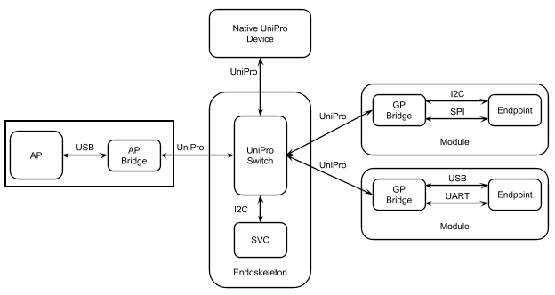

.. highlight:: none

.. These substitution definitions allow us to rev the Greybus protocol
   consistently throughout the document.

.. |gb-major| replace:: 0
.. |gb-minor| replace:: 1

.. These are for all you legal eagles out there

.. |unipro| replace:: UniPro℠
.. |mipi| replace:: MIPI®

.. Headers and footers

.. footer::

   Google Confidential/Restricted. ###Page###/###Total###

Greybus Application Protocol
============================

Greybus Application Protocol
Version: |gb-major|.\ |gb-minor|

**TODO** remove when we're ready to release

Notes for Project Ara Internal Team Use [#a]_

* Go look at `README FIRST
  <https://docs.google.com/a/projectara.com/document/d/1-g9uymGyxUrVKOfuJrYCMkl2kqoMvu-GGvqIw3extPE/edit>`_
  before doing anything else.
* Before reading this document, try to get a basic working knowledge
  of the `MIPI UniPro v1.6 specification
  <https://docs.google.com/a/projectara.com/file/d/0BxTh4XIogG2qbm1PaEo5M1ZES1U/edit>`_. (At
  least look at UniPro spec chapter 4 for an architecture overview).

Terminology
===========

This document abides by Section 13.1 of the IEEE Standards Style
Manual, which describes the use of the words “shall”, “should”, “may”,
and “can” in a document as follows.

- The word *shall* is used to indicate mandatory requirements strictly
  to be followed in order to conform to the Specification and from
  which no deviation is permitted (*shall* equals *is required to*).
- The use of the word *must* is deprecated and shall not be used when
  stating mandatory requirements; must is used only to describe
  unavoidable situations
- The use of the word *will* is deprecated and shall not be used when
  stating mandatory requirements; will is only used in statements of
  fact
- The word *should* is used to indicate that among several
  possibilities one is recommended as particularly suitable, without
  mentioning or excluding others; or that a certain course of action
  is preferred but not necessarily required; or that (in the negative
  form) a certain course of action is deprecated but not prohibited
  (*should* equals *is recommended that*).
- The word *may* is used to indicate a course of action permissible
  within the limits of the Specification (*may* equals *is permitted
  to*).
- The word *can* is used for statements of possibility and capability,
  whether material, physical, or casual (*can* equals *is able to*).

Introduction
============

                    | Good artists copy, great artists steal.
                    | — Pablo Picasso

The |unipro| specification is created by the |mipi| Alliance.  In the
specification for the protocol, it is left as an “implementation
detail” to describe the Application layer of the protocol.  As the
|mipi| Alliance has decided to not define an application layer, and for
the purposes of Project Ara we need an application layer that can
handle dynamic devices being added and removed from the system at any
point in time, and showing up at any place on the “bus”, it is up to
us to define an Application layer protocol, as well as hooks into the
Transport layer in order to control the |unipro| switch controller
properly.  This document aims to define this protocol and interaction
with the |unipro| stack and hardware.  Because this protocol can not
claim to be “|unipro|” officially at all, it should be called “Greybus”
in reference to the first phone that this protocol should be publicly
available for.  If the |mipi| Alliance, or anyone else, wishes to adopt
this protocol layer and rename it, they need to follow the license of
this document.

The notion of a device bus that is self-descriptive and can handle a
multitude of device types has been proven by the great popularity of
USB, as defined by the USB-IF specifications.  Because we do not wish
to reinvent the wheel, you will notice that many of the descriptor
definitions, actions, and protocol types are heavily influenced by
USB, if not direct copies in some places.  Hopefully this is not seen
as a slight, but rather, proof that the USB-IF has done a wonderful
job in creating a system that has worked so well as to be able to
survive for 20 years and still evolving to look to last 20+ more.  We
could only be so fortunate if the Greybus protocol were to be one
smidgen as popular and influential.

This document details a preliminary specification for a Greybus
system. It should be noted that the information contained within is at
a very early draft stage and has not yet been implemented. Especially
for service protocol definitions, we will leverage existing |mipi|
standards heavily where possible.

Greybus System Description
==========================

A Greybus system shall be composed of the following blocks:

1. Exactly one Application Processor module, hereafter referred to as
   the “AP.”

2. An “Endoskeleton,” consisting of the following elements:

   - One Supervisory Controller, hereafter referred to as the “SVC.”
   - One or more |unipro| switches which distribute |unipro| network
     traffic throughout the Greybus network.

3. One or more “Modules” which physically plug into the endoskeleton
   and implement service protocol functionality as defined within this
   document.

   The main functional chipsets on modules may either communicate via
   a native |unipro| interface or via “Bridges,” special-purpose ASICs
   which translate legacy protocols into |unipro| traffic that can be
   routed to nodes on a |unipro| network. Bridges shall implement the
   Greybus application protocol specification.

An example Greybus [#b]_ [#c]_ system using Bridge ASICs and native
|unipro| interfaces is shown in the following figure.

Greybus Hardware Model
======================

Introduction
------------

A Greybus “module” is a device that slides into a physical slot on a
Project Ara endoskeleton.  Each module communicates with other modules
on the network via one or more |unipro| CPorts. A CPort is a
bidirectional pipe through which |unipro| traffic is exchanged. Modules
send “Messages” via CPorts.

Module Information
==================

                    | Imitation is the sincerest form of flattery.
                    | — Charles Caleb Colton

A Greybus module must contain self-descriptive information in order to
identify itself to the |unipro| network. This information is found in
the Module Manifest, which describes components present within the
module that are accessible via |unipro|. The Module Manifest includes a
set of Descriptors which present a functional description of the
module.  Together, these define what the module is from an application
protocol layer, including its capabilities, and how it should be
communicated with.

.. _general-requirements:

General Requirements
--------------------

All data found in message structures defined below shall adhere to the
following general requirements:

* All numeric values shall be unsigned unless explicitly stated otherwise.
* Numeric values prefixed with 0x are hexadecimal; they are decimal otherwise.
* All headers and descriptor data within a Module Manifest shall be
  implicitly followed by pad bytes if necessary to bring the size to a
  multiple of 4 bytes.
* Accordingly, the low-order two bits of all header “size” field values shall be 00.
* Any reserved or unused space (including implicit padding) in a
  header or descriptor shall be ignored when read, and zero-filled
  when written.
* All descriptor field values shall have little endian format.
* All offset and size values are expressed in units of bytes unless
  explicitly stated otherwise.
* All string descriptors shall consist of UTF-8 encoded characters.
* All major structures (like the module manifest header) and interface
  protocols (like that between the AP and SVC) shall be versioned, to
  allow future extensions (or fixes) to be added and recognized.

Module Manifest
---------------

The Module Manifest [#d]_ [#e]_ is a contiguous buffer that includes a
Manifest Header and a set of Descriptors.  When read, a Module
Manifest is transferred in its entirety.  This allows the module to be
described to the host all at once, alleviating the need for multiple
communication messages during the enumeration phase of the module.

Manifest Header
^^^^^^^^^^^^^^^

The Manifest Header is present at the beginning of the Module Manifest
and defines its size in bytes and the version of the Greybus protocol
with which the Manifest complies.

.. list-table::
   :header-rows: 1

   * - Offset
     - Field
     - Size
     - Value
     - Description

   * - 0
     - size
     - 2
     -
     - Size of the entire manifest

   * - 2
     - version_major
     - 1
     - |gb-major|
     - Greybus major version

   * - 3
     - version_minor
     - 1
     - |gb-minor|
     - Greybus minor version

The values of version_major and version_minor values shall refer to
the highest version of this document (currently |gb-major|.\
|gb-minor|) with which the format complies.

Minor versions increment with additions to the existing descriptor
definition, in such a way that reading of the Module Manifest by any
protocol handler that understands the version_major should not fail. A
changed version_major indicates major differences in the Module
Manifest format, and it is not expected that parsers of older major
versions would be able to understand newer ones.

All Module Manifest parsers shall be able to interpret manifests
formatted using older Greybus versions, such that they will still work
properly (i.e. backwards compatibility is required).

Descriptors
^^^^^^^^^^^

Following the Manifest Header is one or more Descriptors.  Each
Descriptor is composed of a Descriptor Header followed by Descriptor
Data. The format of the Descriptor Data depends on the type of the
descriptor, which is specified in the header. These Descriptor formats
are laid out below.

Descriptor Header
"""""""""""""""""

 [#f]_ [#g]_

.. list-table::
   :header-rows: 1

   * - Offset
     - Field
     - Size
     - Description

   * - 0
     - size
     - 2
     - Size of this descriptor record, in bytes

   * - 2
     - type
     - 1
     - Type of the descriptor, see below for values.

Descriptor types
""""""""""""""""

This table describes the known descriptor types and their values:

.. list-table::
   :header-rows: 1

   * - Descriptor Type
     - Value

   * - Invalid
     - 0x00

   * - Module
     - 0x01

   * - String
     - 0x02

   * - Interface
     - 0x03

   * - CPort
     - 0x04

   * - Class
     - 0x05

   * - (All other values reserved)
     - 0x06..0xff

Module Descriptor
^^^^^^^^^^^^^^^^^

This descriptor describes module-specific values as set by the vendor
who created the module. Every module manifest shall have exactly one
module descriptor.

.. list-table::
   :header-rows: 1

   * - Offset
     - Field
     - Size
     - Value
     - Description

   * - 0
     - size
     - 2
     - 0x0013
     - Size of this descriptor record

   * - 2
     - type
     - 1
     - 0x01
     - Type of the descriptor (Module)

   * - 3
     - vendor
     - 2
     -
     - Module vendor id

   * - 5
     - product
     - 2
     -
     - Module product Id

   * - 7
     - version
     - 2
     -
     - Module version

   * - 9
     - vendor_string_id
     - 1
     -
     - String id for descriptor containing the vendor name

   * - 10
     - product_string_id
     - 1
     -
     - String id for descriptor containing the product name

   * - 11
     - unique_id
     - 8
     -
     - Unique ID of the module

The *vendor* field is a value assigned by Google.  All vendors should
apply for a Project Ara vendor ID in order to properly mark their
modules. Contact ara-dev@google.com for more information regarding the
vendor ID application process.

The *product* field is controlled by the vendor, and should be unique
per type of module that is created.

The *version* field is the version of the module that is present. This
number shall be changed if the module firmware functionality changes
in such a way that the operating system needs to know about it. [#h]_
[#i]_ [#j]_ [#k]_

*vendor_string_id* is a reference to a specific string descriptor
 value that provides a human-readable [#l]_ [#m]_ [#n]_ description of
 the vendor who created the module.  If there is no string present for
 this value in the Module Manifest, this value shall be 0x00.

*product_string_id* is a reference to a specific string descriptor
 value that provides a human-readable [#o]_ description of the
 product.  If there is no string present for this value in the Module
 Manifest, this value shall be 0x00.

The *unique_id* field is an 8 byte Unique ID that is written into each
Greybus compliant chip during manufacturing. Google manages the Unique
IDs, providing each manufacturer with the means to generate compliant
Unique IDs for their products. In a module that contains multiple
interfaces, there will be more than one hardware Unique ID
available. It is the responsibility of the module designer to
designate one primary interface and expose that primary Unique ID in
this field.

String Descriptor
^^^^^^^^^^^^^^^^^

A string descriptor provides a human-readable form of a string for a
specific value, like a vendor or product string.  Any string that is
not an even multiple of 4 bytes in length shall be padded out to a
4-byte boundary with 0x00 values.  Strings consist of UTF-8 characters
and are not required to be zero terminated. A string descriptor shall
be referenced only once within the manifest, e.g. only one product (or
vendor) string field may refer to string id 2.

.. list-table::
   :header-rows: 1

   * - Offset
     - Field
     - Size
     - Value
     - Description

   * - 0
     - size
     - 2
     - 0x0005+X
     - Size of this descriptor record

   * - 2
     - type
     - 1
     - 0x02
     - Type of the descriptor (String)

   * - 3
     - length
     - 1
     - X
     - Length of the string in bytes (excluding trailing pad bytes)

   * - 4
     - id
     - 1
     - cannot be 0x00
     - String id for this descriptor

   * - 5
     - string
     - X
     -
     - UTF-8 characters for the string (padded if necessary)

Interface Descriptor
^^^^^^^^^^^^^^^^^^^^

An interface descriptor describes an access point for a module to the
|unipro| network. Each interface represents a single physical port
through which |unipro| packets are transferred. Every module shall have
at least one interface. Each interface has an id whose value is unique
within the module.  The first interface shall have id 0, the second
(if present) shall have value 1, and so on. The purpose of these Ids
is to allow CPort descriptors to define which interface they are
associated with.

.. list-table::
   :header-rows: 1

   * - Offset
     - Field
     - Size
     - Value
     - Description

   * - 0
     - size
     - 2
     - 0x0004
     - Size of this descriptor record

   * - 2
     - type
     - 1
     - 0x03
     - Type of the descriptor (Interface)

   * - 3
     - id
     - 1
     -
     - Module-unique Id for this interface

CPort Descriptor
^^^^^^^^^^^^^^^^

This descriptor describes a CPort implemented within the module. Each
CPort is associated with one of the module’s interfaces, and has an id
unique for that interface.  Every CPort defines the protocol used by
the AP to interact with the CPort. A special control CPort [#p]_
[#q]_shall be defined for every interface, and shall be defined to use
the “control” protocol. The details of these protocols are defined in
the section Function Class Protocols below.

**FIXME** "Function class protocols" is an invalid link

.. list-table::
   :header-rows: 1

   * - Offset
     - Field
     - Size
     - Value
     - Description

   * - 0
     - size
     - 2
     - 0x0007
     - Size of this descriptor record

   * - 2
     - type
     - 1
     - 0x04
     - Type of the descriptor (CPort)

   * - 3
     - interface
     - 1
     -
     - Interface Id this CPort is associated with

   * - 4
     - id
     - 2
     -
     - Id (destination address) of the CPort

   * - 6
     - protocol
     - 1
     -
     - Protocol used for this CPort

The *id* field is the CPort identifier used by other modules to direct
traffic to this CPort. The IDs for CPorts using the same interface
must be unique. Certain low-numbered CPort identifiers (such as the
control CPort) are reserved. Implementors shall assign CPorts
low-numbered id values, generally no higher than 31. (Higher-numbered
CPort ids impact on the total usable number of |unipro| devices and
typically should not be used.)

Protocol
""""""""

**TODO** Cross-reference with existing protocols below

.. list-table::
   :header-rows: 1

   * - Protocol
     - Value

   * - Control
     - 0x00

   * - AP [#r]_ [#s]_
     - 0x01

   * - GPIO
     - 0x02

   * - I2C
     - 0x03

   * - UART
     - 0x04

   * - HID
     - 0x05

   * - USB
     - 0x06

   * - SDIO
     - 0x07

   * - Battery
     - 0x08

   * - PWM
     - 0x09

   * - I2S
     - 0x0a

   * - SPI
     - 0x0b

   * - Display
     - 0x0c

   * - Camera
     - 0x0d

   * - Sensor
     - 0x0e

   * - LED
     - x0f

   * - Vibrator
     - 0x10

   * - (All other values reserved)
     - 0x11..0xfe

   * - Vendor Specific
     - 0xff

Greybus Operations
==================

Greybus communication is built on the use of |unipro| messages to send
information between modules. And although |unipro| offers reliable
transfer of data frames between interfaces, it is often necessary for
the sender to know whether the effects of sending a message were what
was expected. For example, a request sent to a |unipro| switch
controller requesting a reconfiguration of the routing table could
fail, and proceeding as if a failure had not occurred in this case
leads to undefined (and dangerous) behavior.  Similarly, the AP module
will likely need to retrieve information from other modules; this
requires that a message requesting information be paired with a
returned message containing the information requested.

For this reason, Greybus performs communication between modules using
Greybus Operations.  A Greybus Operation defines an activity (such as
a data transfer) initiated in one module that is implemented (or
executed) by another. The particular activity performed is defined by
the operation’s type. An operation is implemented by a pair of
messages--one containing a request, and the other containing a
response. Both messages contain a simple header that includes the type
of the module and size of the message. In addition, each operation has
a unique id, and both messages in an operation contain this value so
the response can be associated with the request. Finally, all
responses contain at least one byte; the first byte of a response
communicates status of the operation, either success or a reason for a
failure.

Operations are performed over Greybus Connections.  A connection is a
communication path between two modules.  Each end of a connection is
|unipro| CPort, associated with a particular interface in a Greybus
module.  A connection can be established once the AP learns of the
existence of a CPort in another module.  The AP will allocate a CPort
for its end of the connection, and once the |unipro| network switch is
configured properly the connection can be used for data transfer (and
in particular, for operations).

Each CPort in a Greybus module has associated with it a protocol.  The
protocol dictates the way the CPort interprets incoming operation
messages.  Stated another way, the meaning of the operation type found
in a request message will depend on the protocol connection uses.
Operation type 5 might mean “receive data” in one protocol, while
operation 5 might mean “go to sleep” in another. When the AP
establishes a connection with a CPort in another module, that
connection will use the CPort’s advertised protocol.

The Greybus Operations mechanism forms a base layer on which other
protocols are built. Protocols define the format of request messages,
their expected response data, and the effect of the request on state
in one or both modules. Users of a protocol can rely on Greybus
getting the operation request message to its intended target, and
transferring the operation status and any other data back. In the
explanations that follow, we refer to the interface through which a
request operation is sent as the source, and the interface from which
the response will be sent as the destination.

Operation Messages
------------------

Operation request messages and operation response messages have the
same basic format. Each begins with a short header, and is followed by
payload data.  In the case of a response message, the payload will
always be at least one byte (the status); request messages can have
zero-byte payload.

Operation Message Header
^^^^^^^^^^^^^^^^^^^^^^^^

The following table summarizes the format of an operation message header.

.. list-table::
   :header-rows: 1

   * - Offset
     - Field
     - Size
     - Value
     - Description

   * - 0
     - size
     - 2
     -
     - Size of the entire operation message

   * - 2
     - id
     - 2
     -
     - Requestor-supplied unique request identifier

   * - 4
     - type
     - 1
     -
     - Type of Greybus operation (protocol-specific)

The *size* includes the operation message header as well as any
payload that follows it. As mentioned earlier, the meaning of a type
value depends on the protocol in use on the connection carrying the
message. Only 127 operations are available for a given protocol,
0x01..0x7f. Operation 0x00 is reserved as an invalid value.  The high
bit (0x80) of an operation type is used as a flag that distinguishes a
request operation from its response.  For requests, this bit is 0, for
responses, it is 1.  For example operation 0x0a will contain 0x0a in
the request message’s type field and 0x8a in the response message’s
type field. The id allows many operations to be “in flight” on a
connection at once.

A connection protocol is defined by describing the format of the
payload portions of the request and response messages used for the
protocol, along with all actions or state changes that take place as a
result of successfully completing the operation [#av]_ [#aw]_ [#ax]_.

Connection Protocols
====================

The following sections define the request and response message formats
for all operations for specific connection protocols. Requests are
most often (but not always) initiated by the AP. Each request has a
unique identifier, supplied by the requestor, and each response will
include the identifier of the request with which it is associated.
This allows operations to complete asynchronously, so multiple
operations can be “in flight” between the AP and a |unipro|-attached
adapter at once.

Each response begins with a status byte, which communicates whether
any error occurred in delivering or processing a requested operation.
If the operation completed successfully the status value is 0.
Otherwise the reason it was not successful will be conveyed by one of
the positive values defined in the following table.

A protocol can define its own status values if needed [#ay]_ [#az]_
[#ba]_ [#bb]_ [#bc]_; every status byte with a MSB set to one beside
0xff will be considered as a protocol status value.

.. list-table::
   :header-rows: 1

   * - Status
     - Value
     - Meaning
   * - Success
     - 0x00
     - Operation completed successfully
   * - Invalid
     - 0x01
     - Invalid argument supplied
   * - No memory
     - 0x02
     - Memory exhaustion prevented completion
   * - Busy
     - 0x03
     - Device or needed resource was in use
   * - Retry
     - 0x04
     - Request should be retried
   * - Reserved
     - 0x05 to 0x7f
     - Reserved for future use
   * -
     - 0x80 to 0xfe
     - Status defined by the protocol (see protocol definitions in
       following sections)
   * - Bad
     - 0xff
     - Initial value; never set by response

All protocols defined herein are subject to the
:ref:`general-requirements` listed above.

Protocol Versions
-----------------

Every protocol has a version, which comprises two one-byte values,
major and minor. A protocol definition can evolve to add new
capabilities, and as it does so, its version changes. If existing (or
old) protocol handling code which complies with this specification can
function properly with the new feature in place, only the minor
version of the protocol will change. Any time a protocol changes in a
way that requires the handling code be updated to function properly,
the protocol’s major version will change.

Two modules may implement different versions of a protocol, and as a
result they shall negotiate a common version of the protocol to
use. This is done by each side exchanging information about the
version of the protocol it supports at the time an initial handshake
between module interfaces is performed (for the control protocol), or
when a connection between CPorts is established (for all other
protocols).  The version of a particular protocol advertised by a
module is the same as the version of the document that defines the
protocol (so for protocols defined herein, the version is |gb-major|.\
|gb-minor|). [#bd]_ [#be]_

To agree on a protocol, an operation request supplies the (greatest)
major and minor version of the protocol supported by the source of a
request. The request destination compares that version with the
(greatest) version of the protocol it supports.  If the destination
supports a protocol version with major number equal to that supplied
by the source, and a minor number greater than or equal to that
supplied by the source, it shall communicate using the protocol
version equal to thatsupplied by the source. Otherwise, it decides
that its own version of the protocol will be the one to be used [#bf]_
[#bg]_. In either case, the chosen version is sent back in the
response, and the source interface will honor that decision and use
the selected version of the protocol. As a consequence of this,
protocol handlers must be capable of handling all prior versions of
the protocol.

Device Class Connection Protocols
=================================

This section defines a group of protocols whose purpose is to provide
a device abstraction for functionality commonly found on mobile
handsets. Modules which implement at least one of the protocols
defined in this section, and which do not implement any of the
protocols defined below in :ref:`bridged-phy-connection-protocols`,
are said to be *device class conformant*.

Vibrator Protocol
-----------------

This section defines the operations used on a connection implementing
the Greybus vibrator protocol.  This protocol allows an AP to manager
a vibrator device present on a module.  The protocol is very simple,
and maps almost directly to the userspace HAL vibrator interface.

The operations in the Greybus vibrator protocol are:

::

    int get_version(u8 *major, u8 *minor);

..

    Returns the major and minor Greybus vibrator protocol version
    number supported by the vibrator adapter.

::

   int vibrator_on(u16 timeout_ms);

..

   Turns on the vibrator for the number of specified milliseconds.

::

   int vibrator_off(void);

..

    Turns off the vibrator immediately.

Greybus Vibrator Message Types
^^^^^^^^^^^^^^^^^^^^^^^^^^^^^^

This table describes the Greybus vibrator operation types [#bh]_
[#bi]_ [#bj]_ and their values. A message type consists of an
operation type combined with a flag (0x80) indicating whether the
operation is a request or a response.

.. list-table::
   :header-rows: 1

   * - Descriptor Type
     - Request Value
     - Response Value
   * - Invalid
     - 0x00
     - 0x80
   * - Protocol version
     - 0x01
     - 0x81
   * - Vibrator On
     - 0x02
     - 0x82
   * - Vibrator Off
     - 0x03
     - 0x83

Greybus Vibrator Protocol Version Operation
^^^^^^^^^^^^^^^^^^^^^^^^^^^^^^^^^^^^^^^^^^^

The Greybus vibrator protocol version operation allows the AP to
determine the version of this protocol to which the vibrator adapter
complies.

Greybus Vibrator Protocol Version Request
"""""""""""""""""""""""""""""""""""""""""

The Greybus vibrator protocol version request contains no data beyond
the Greybus vibrator message header.

Greybus Vibrator Protocol Version Response
""""""""""""""""""""""""""""""""""""""""""

The Greybus vibrator protcol version response contains a status byte,
followed by two 1-byte values. If the value of the status byte is
non-zero, any other bytes in the response shall be ignored. A Greybus
vibrator adapter adhering to the protocol specified herein shall
report major version |gb-major|, minor version |gb-minor|.

.. list-table::
   :header-rows: 1

   * - Offset
     - Field
     - Size
     - Value
     - Description

   * - 0
     - status
     - 1
     -
     - Success, or reason for failure

   * - 1
     - version_major
     - 1
     - |gb-major|
     - Greybus vibrator protocol major version

   * - 2
     - version_minor
     - 1
     - |gb-minor|
     - Greybus vibrator protocol minor version

Greybus Vibrator On Operation
^^^^^^^^^^^^^^^^^^^^^^^^^^^^^

The Greybus Vibrator on operation allows the AP to request the
vibrator be enabled for the specified number of milliseconds.

Greybus Vibrator On Control Request
"""""""""""""""""""""""""""""""""""

The Greybus Vibrator on request supplies the amount of time that the
vibrator should now be enabled for.

.. list-table::
   :header-rows: 1

   * - Offset
     - Field
     - Size
     - Value
     - Description

   * - 0
     - timeout_ms
     - 2
     -
     - timeout in milliseconds

Greybus Vibrator On Control Response
""""""""""""""""""""""""""""""""""""

The Greybus Vibrator on control response contains only the status byte.

.. list-table::
   :header-rows: 1

   * - Offset
     - Field
     - Size
     - Value
     - Description

   * - 0
     - status
     - 1
     -
     - Success, or reason for failure

Greybus Vibrator Off Operation
^^^^^^^^^^^^^^^^^^^^^^^^^^^^^^

The Greybus Vibrator off operation allows the AP to request the
vibrator be turned off as soon as possible.

Greybus Vibrator Off Control Request
""""""""""""""""""""""""""""""""""""

The Greybus Vibrator off request contains no data beyond the Greybus
Vibrator message header.

Greybus Vibrator Off Control Response
"""""""""""""""""""""""""""""""""""""

The Greybus Vibrator off control response contains only the status byte.

.. list-table::
   :header-rows: 1

   * - Offset
     - Field
     - Size
     - Value
     - Description

   * - 0
     - status
     - 1
     -
     - Success, or reason for failure

Battery Protocol
----------------

This section defines the operations used on a connection implementing
the Greybus battery protocol. This protocol allows an AP to manage a
battery device present on a module. The protocol consists of few basic
operations, whose request and response message formats are defined
here.

Conceptually, the operations in the Greybus battery protocol are:

::

    int get_version(u8 *major, u8 *minor);

..

    Returns the major and minor Greybus battery protocol version
    number supported by the battery adapter.

::

    int get_technology(u16 *technology);

..

    Returns a value indicating the technology type that this battery
    adapter controls.

::

    int get_status(u16 *status);

..

    Returns a value indicating the current status of the battery.

::

    int get_max_voltage(u32 *voltage);

..

    Returns a value indicating the maximum voltage that the battery supports.

::

    int get_percent_capacity(u32 *capacity);

..

    Returns a value indicating the current percent capacity of the
    battery.

::

    int get_temperature(u32 *temperature);

..

    Returns a value indicating the current temperature of the battery.

::

    int get_voltage(u32 *voltage);

..

    Returns a value indicating the current voltage of the battery.

 ::

    int get_current(u32 *current);

..

    Returns a value indicating the current voltage [#bk]_ of the battery.

Greybus Battery Message Types
^^^^^^^^^^^^^^^^^^^^^^^^^^^^^

This table describes the Greybus battery operation types [#bl]_ [#bm]_
[#bn]_ and their values. A message type consists of an operation type
combined with a flag (0x80) indicating whether the operation is a
request or a response.

.. list-table::
   :header-rows: 1

   * - Descriptor Type
     - Request Value
     - Response Value

   * - Invalid
     - 0x00
     - 0x80

   * - Protocol version
     - 0x01
     - 0x81

   * - Technology
     - 0x02
     - 0x82

   * - Status
     - 0x03
     - 0x83

   * - Max Voltage
     - 0x04
     - 0x84

   * - Percent Capacity
     - 0x05
     - 0x85

   * - Temperature
     - 0x06
     - 0x86

   * - Voltage
     - 0x07
     - 0x87

   * - Capacity mWh
     - 0x08
     - 0x88

   * - (All other values reserved)
     - 0x09..0x7f
     - 0x89..0xff

Greybus Battery Protocol Version Operation
^^^^^^^^^^^^^^^^^^^^^^^^^^^^^^^^^^^^^^^^^^

The Greybus battery protocol version operation allows the AP to
determine the version of this protocol to which the battery adapter
complies.

Greybus Battery Protocol Version Request
""""""""""""""""""""""""""""""""""""""""

The Greybus battery protocol version request contains no data beyond
the Greybus battery message header.

Greybus Battery Protocol Version Response
"""""""""""""""""""""""""""""""""""""""""

The Greybus battery protcol version response contains a status byte,
followed by two 1-byte values. If the value of the status byte is
non-zero, any other bytes in the response shall be ignored. A Greybus
battery adapter adhering to the protocol specified herein shall report
major version |gb-major|, minor version |gb-minor|.

.. list-table::
   :header-rows: 1

   * - Offset
     - Field
     - Size
     - Value
     - Description
   * - 0
     - status
     - 1
     -
     - Success, or reason for failure
   * - 1
     - version_major
     - 1
     - |gb-major|
     - Greybus battery protocol major version
   * - 2
     - version_minor
     - 1
     - |gb-minor|
     - Greybus battery protocol minor version

Greybus Battery Technology Operation
^^^^^^^^^^^^^^^^^^^^^^^^^^^^^^^^^^^^

The Greybus battery technology operation allows the AP to determine
the details of the battery technology controller by the battery
adapter.

Greybus Battery Technology Request
""""""""""""""""""""""""""""""""""

The Greybus battery functionality request contains no data beyond the
battery message header.

Greybus Battery Technology Response
"""""""""""""""""""""""""""""""""""

The Greybus battery functionality response contains the status byte
and a 2-byte value that represents the type of battery being
controlled.

.. list-table::
   :header-rows: 1

   * - Offset
     - Field
     - Size
     - Value
     - Description
   * - 0
     - status
     - 1
     -
     - Success, or reason for failure
   * - 1
     - technology
     - 2
     -
     - Greybus battery technology

Greybus Battery Technology Types
""""""""""""""""""""""""""""""""

This table describes the defined battery technologies defined for
Greybus battery adapters.  These values are taken directly from the
<linux/power_supply.h> header file.

.. list-table::
   :header-rows: 1

   * - Battery Type
     - Value
   * - Unknown
     - 0x0000
   * - NiMH
     - 0x0001
   * - LION
     - 0x0002
   * - LIPO
     - 0x0003
   * - LiFe
     - 0x0004
   * - NiCd
     - 0x0005
   * - LiMn
     - 0x0006

Greybus Battery Status Operation
^^^^^^^^^^^^^^^^^^^^^^^^^^^^^^^^

The Greybus battery status operation allows the AP to determine the
status of the battery by the battery adapter.

Greybus Battery Status Request
""""""""""""""""""""""""""""""

The Greybus battery status request contains no data beyond the battery
message header.

Greybus Battery Status Response
"""""""""""""""""""""""""""""""

The Greybus battery status response contains the status byte and a
2-byte value that represents the status of battery being controlled.

.. list-table::
   :header-rows: 1

   * - Offset
     - Field
     - Size
     - Value
     - Description
   * - 0
     - status
     - 1
     -
     - Success, or reason for failure
   * - 1
     - battery status
     - 2
     -
     - Greybus battery status

Greybus Battery Status Types
""""""""""""""""""""""""""""

This table describes the defined battery status values defined for
Greybus battery adapters.  These values are taken directly from the
<linux/power_supply.h> header file.

.. list-table::
   :header-rows: 1

   * - Battery Status
     - Value
   * - Unknown
     - 0x0000
   * - Charging
     - 0x0001 [#bo]_
   * - Discharging
     - 0x0002
   * - Not Charging
     - 0x0003
   * - Full
     - 0x0004

Greybus Battery Max Voltage Operation
^^^^^^^^^^^^^^^^^^^^^^^^^^^^^^^^^^^^^

The Greybus battery Max Voltage operation allows the AP to determine
the maximum possible voltage of the battery.

Greybus Battery Max Voltage Request
"""""""""""""""""""""""""""""""""""

The Greybus battery max voltage request contains no data beyond the
battery message header.

Greybus Battery Max Voltage Response
""""""""""""""""""""""""""""""""""""

The Greybus battery max voltage response contains the status byte and
a 4-byte value that represents the maximum voltage of the battery
being controlled, in µV.

.. list-table::
   :header-rows: 1

   * - Offset
     - Field
     - Size
     - Value
     - Description
   * - 0
     - status
     - 1
     -
     - Success, or reason for failure
   * - 1
     - max voltage
     - 4
     -
     - Greybus battery maximum voltage in µV

Greybus Battery Capacity Operation
^^^^^^^^^^^^^^^^^^^^^^^^^^^^^^^^^^

The Greybus battery Capacity operation allows the AP to determine the
current capacity percent of the battery.

Greybus Battery Percent Capacity Request
""""""""""""""""""""""""""""""""""""""""

The Greybus battery capacity request contains no data beyond the
battery message header.

Greybus Battery Percent Capacity Response
"""""""""""""""""""""""""""""""""""""""""

The Greybus battery capacity response contains the status byte and a
4-byte value that represents the capacity of the battery being
controlled, in percentage.

.. list-table::
   :header-rows: 1

   * - Offset
     - Field
     - Size
     - Value
     - Description
   * - 0
     - status
     - 1
     -
     - Success, or reason for failure
   * - 1
     - capacity
     - 4
     -
     - Greybus battery capacity in %

Greybus Battery Temperature Operation
^^^^^^^^^^^^^^^^^^^^^^^^^^^^^^^^^^^^^

The Greybus battery temperature operation allows the AP to determine
the current temperature of the battery.

Greybus Battery Temperature Request
"""""""""""""""""""""""""""""""""""

The Greybus battery temperature request contains no data beyond the
battery message header.

Greybus Battery Temperature Response
""""""""""""""""""""""""""""""""""""

The Greybus battery temperature response contains the status byte and
a 4-byte value that represents the temperature of the battery being
controlled, in ⅒℃.

.. list-table::
   :header-rows: 1

   * - Offset
     - Field
     - Size
     - Value
     - Description
   * - 0
     - status
     - 1
     -
     - Success, or reason for failure
   * - 1
     - temperature
     - 4
     -
     - Greybus battery temperature in ⅒℃

Greybus Battery Voltage Operation
^^^^^^^^^^^^^^^^^^^^^^^^^^^^^^^^^

The Greybus battery Voltage operation allows the AP to determine the
current voltage of the battery.

Greybus Battery Voltage Request
"""""""""""""""""""""""""""""""

The Greybus battery voltage request contains no data beyond the
battery message header.

Greybus Battery Voltage Response
""""""""""""""""""""""""""""""""

The Greybus battery voltage response contains the status byte and a
4-byte value that represents the voltage of the battery being
controlled, in µV.

.. list-table::
   :header-rows: 1

   * - Offset
     - Field
     - Size
     - Value
     - Description
   * - 0
     - status
     - 1
     -
     - Success, or reason for failure
   * - 1
     - voltage
     - 4
     -
     - Greybus battery voltage in µV

Greybus Battery Current Operation
^^^^^^^^^^^^^^^^^^^^^^^^^^^^^^^^^

The Greybus battery Current operation allows the AP to determine the
current current of the battery.

Greybus Battery Current Request
"""""""""""""""""""""""""""""""

The Greybus battery current request contains no data beyond the
battery message header.

Greybus Battery Current Response
""""""""""""""""""""""""""""""""

The Greybus battery current response contains the status byte and a
4-byte value that represents the current of the battery being
controlled, in µA.

.. list-table::
   :header-rows: 1

   * - Offset
     - Field
     - Size
     - Value
     - Description
   * - 0
     - status
     - 1
     -
     - Success, or reason for failure
   * - 1
     - current
     - 4
     -
     - Greybus battery current in µA

Audio Protocol
--------------

TBD

Baseband Modem Protocol
-----------------------

TBD

Bluetooth Protocol
------------------

TBD

Camera Protocol
---------------

TBD

Consumer IR Protocol
--------------------

TBD

Display Protocol
----------------

TBD

GPS Protocol
------------

TBD

Keymaster Protocol
------------------

TBD

Lights Protocol
---------------

TBD

NFC Protocol
------------

TBD

Power Profile Protocol
----------------------

TBD

Sensors Protocol
----------------

TBD

WiFi Protocol
-------------

TBD

.. _bridged-phy-connection-protocols:

Bridged PHY Connection Protocols
================================

This section defines a group of protocols whose purpose is to support
communication with modules on the Greybus network which do not comply
with an existing device class protocol, and which include integrated
circuits using alternative physical interfaces to |unipro|. Modules
which implement any of the protocols defined in this section are said
to be *non-device class conformant*.

USB Protocol
------------

We will support bulk, control, and interrupt transfers, but not
isochronous at this point in time.

Details TBD.

GPIO Protocol
-------------

A connection using GPIO protocol on a |unipro| network is used to manage
a simple GPIO controller. Such a GPIO controller implements one or
more (up to 256) GPIO lines, and each of the operations below
specifies the line to which the operation applies. This protocol
consists of the operations defined in this section.

Conceptually, the GPIO protocol operations are:

::

    int get_version(u8 *major, u8 *minor);

..

    Returns the major and minor Greybus GPIO protocol version number
    supported by the GPIO controller. GPIO controllers adhering to the
    protocol specified herein shall report major version 0, minor
    version 1.

::

    int line_count(u8 *count);

..

    Returns one less than the number of lines managed by the Greybus
    GPIO controller. This means the minimum number of lines is 1 and
    the maximum is 256.

::

    int activate(u8 which);

..

    Notifies the GPIO controller that one of its lines has been
    assigned for use.

::

    int deactivate(u8 which);

..

    Notifies the GPIO controller that a previously-activated line has
    been unassigned and can be deactivated.

::

    int get_direction(u8 which, u8 *direction);

..

    Requests the GPIO controller return a line’s configured direction
    (0 for output, 1 for input).

::

    int direction_input(u8 which);

..

    Requests the GPIO controller configure a line for input.

::

    int direction_output(u8 which, u8 value);

..

    Requests the GPIO controller configure a line for output, and sets
    its initial output value (0 for low, 1 for high).

::

    int get_value(u8 which, u8 *value);

..

    Requests the GPIO controller return the current value sensed on a
    line (0 for low, 1 for high).

::

    int set_value(u8 which, u8 value);

..

    Requests the GPIO controller set the value (0 for low, 1 for high)
    for a line configured for output.

::

    int set_debounce(u8 which, u16 usec);

..

    Requests the GPIO controller set the debounce period (in
    microseconds).

Greybus GPIO Protocol Operations
^^^^^^^^^^^^^^^^^^^^^^^^^^^^^^^^

All operations sent to a GPIO controller are contained within a
Greybus GPIO request message. Every operation request will result in a
matching response [#bp]_ [#bq]_ [#br]_ [#bs]_ from the GPIO
controller, also taking the form of a GPIO controller message.  The
request and response messages for each GPIO operation are defined
below.

The following table describes the Greybus GPIO protocol operation
types and their values. Both the request type and response type values
are shown.

.. list-table::
   :header-rows: 1

   * - GPIO Operation
     - Request Value
     - Response Value
   * - Invalid
     - 0x00
     - 0x80
   * - Protocol version
     - 0x01
     - 0x81
   * - Line count
     - 0x02
     - 0x82
   * - Activate
     - 0x03
     - 0x83
   * - Deactivate
     - 0x04
     - 0x84
   * - Get direction
     - 0x05
     - 0x85
   * - Direction input
     - 0x06
     - 0x86
   * - Direction output
     - 0x07
     - 0x87
   * - Get
     - 0x08
     - 0x88
   * - Set
     - 0x09
     - 0x89
   * - Set debounce
     - 0x0a
     - 0x8a
   * - (All other values reserved)
     - 0x0b..0x7f
     - 0x8b..0xff

Greybus GPIO Protocol Version Operation
^^^^^^^^^^^^^^^^^^^^^^^^^^^^^^^^^^^^^^^

The Greybus GPIO version operation allows the AP to determine the
version of this protocol to which the GPIO controller complies.

Greybus GPIO Protocol Version Request
"""""""""""""""""""""""""""""""""""""

The Greybus GPIO protocol version request contains no data beyond the
Greybus GPIO message header.

Greybus GPIO Protocol Version Response
""""""""""""""""""""""""""""""""""""""

The Greybus GPIO protocol version response contains a status byte,
followed by two 1-byte values. If the value of the status byte is
non-zero, any other bytes in the response shall be ignored. A Greybus
GPIO controller adhering to the protocol specified herein shall report
major version 0, minor version 1.

.. list-table::
   :header-rows: 1

   * - Offset
     - Field
     - Size
     - Value
     - Description
   * - 0
     - status
     - 1
     -
     - Success, or reason for failure
   * - 1
     - version_major
     - 1
     - |gb-major|
     - Greybus GPIO protocol major version
   * - 2
     - version_minor
     - 1
     - |gb-minor|
     - Greybus GPIO protocol minor version

Greybus GPIO Line Count Operation
^^^^^^^^^^^^^^^^^^^^^^^^^^^^^^^^^

The Greybus GPIO line count operation allows the AP to determine how
many GPIO lines are implemented by the GPIO controller.

Greybus GPIO Line Count Request
"""""""""""""""""""""""""""""""

The Greybus GPIO line count request contains no data beyond the
Greybus GPIO message header.

Greybus GPIO Line Count Response
""""""""""""""""""""""""""""""""

The Greybus GPIO line count response contains a status byte, followed
by a 1-byte value defining the number of lines managed by the
controller, minus 1. That is, a count value of 0 represents a single
GPIO line, while a (maximal) count value of 255 represents 256
lines. The lines are numbered sequentially starting with 0 (i.e., no
gaps in the numbering).

.. list-table::
   :header-rows: 1

   * - Offset
     - Field
     - Size
     - Value
     - Description
   * - 0
     - status
     - 1
     -
     - Success, or reason for failure
   * - 1
     - count
     - 1
     -
     - Number of GPIO lines minus 1

Greybus GPIO Activate Operation
^^^^^^^^^^^^^^^^^^^^^^^^^^^^^^^

The Greybus GPIO activate operation notifies the GPIO controller that
one of its GPIO lines has been allocated for use. This provides a
chance to do initial setup for the line, such as enabling power and
clock signals.

Greybus GPIO Activate Request
"""""""""""""""""""""""""""""

The Greybus GPIO activate request supplies only the number of the line
to be activated.

.. list-table::
   :header-rows: 1

   * - Offset
     - Field
     - Size
     - Value
     - Description
   * - 0
     - which
     - 1
     -
     - Controller-relative GPIO line number

Greybus GPIO Activate Response
""""""""""""""""""""""""""""""

The Greybus GPIO activate response contains only the status byte.

.. list-table::
   :header-rows: 1

   * - Offset
     - Field
     - Size
     - Value
     - Description
   * - 0
     - status
     - 1
     -
     - Success, or reason for failure

Greybus GPIO Deactivate Operation
^^^^^^^^^^^^^^^^^^^^^^^^^^^^^^^^^

The Greybus GPIO deactivate operation notifies the GPIO controller
that a previously-activated line is no longer in use and can be
deactivated.

Greybus GPIO Deactivate Request
"""""""""""""""""""""""""""""""

The Greybus GPIO deactivate request supplies only the number of the
line to be deactivated.

.. list-table::
   :header-rows: 1

   * - Offset
     - Field
     - Size
     - Value
     - Description
   * - 0
     - which
     - 1
     -
     - Controller-relative GPIO line number

Greybus Deactivate Response
"""""""""""""""""""""""""""

The Greybus GPIO deactivate response contains only the status byte.

.. list-table::
   :header-rows: 1

   * - Offset
     - Field
     - Size
     - Value
     - Description
   * - 0
     - status
     - 1
     -
     - Success, or reason for failure

Greybus GPIO Get Direction Operation
^^^^^^^^^^^^^^^^^^^^^^^^^^^^^^^^^^^^

The Greybus GPIO get direction operation requests the GPIO controller
respond with the direction of transfer (in or out) for which a line is
configured.

Greybus GPIO Get Direction Request
""""""""""""""""""""""""""""""""""

The Greybus GPIO get direction request supplies only the target line number.

.. list-table::
   :header-rows: 1

   * - Offset
     - Field
     - Size
     - Value
     - Description
   * - 0
     - which
     - 1
     -
     - Controller-relative GPIO line number

Greybus Get Direction Response
""""""""""""""""""""""""""""""

The Greybus GPIO get direction response contains the status byte and
one byte indicating whether the line in question is configured for
input or output. If the value of the status byte is non-zero, the
direction byte shall be ignored.

.. list-table::
   :header-rows: 1

   * - Offset
     - Field
     - Size
     - Value
     - Description
   * - 0
     - status
     - 1
     -
     - Success, or reason for failure
   * - 1
     - direction
     - 1
     - 0 or 1
     - Direction (0 = output, 1 = input)

Greybus GPIO Direction Input Operation
^^^^^^^^^^^^^^^^^^^^^^^^^^^^^^^^^^^^^^

The Greybus GPIO direction input operation requests the GPIO
controller to configure a line to be used for input.

Greybus GPIO Direction Input Request
""""""""""""""""""""""""""""""""""""

The Greybus GPIO direction input request supplies only the number of
the line.

.. list-table::
   :header-rows: 1

   * - Offset
     - Field
     - Size
     - Value
     - Description
   * - 0
     - which
     - 1
     -
     - Controller-relative GPIO line number

Greybus Direction Input Response
""""""""""""""""""""""""""""""""

The Greybus GPIO direction input response contains only the status
byte.

.. list-table::
   :header-rows: 1

   * - Offset
     - Field
     - Size
     - Value
     - Description
   * - 0
     - status
     - 1
     -
     - Success, or reason for failure

Greybus GPIO Direction Output Operation
^^^^^^^^^^^^^^^^^^^^^^^^^^^^^^^^^^^^^^^

The Greybus GPIO direction output operation requests the GPIO
controller to configure a line to be used for output, and specifies
its initial value.

Greybus GPIO Direction Output Request
"""""""""""""""""""""""""""""""""""""

The Greybus GPIO direction output request supplies the number of the
line and its initial value.

.. list-table::
   :header-rows: 1

   * - Offset
     - Field
     - Size
     - Value
     - Description
   * - 0
     - which
     - 1
     -
     - Controller-relative GPIO line number
   * - 1
     - value
     - 1
     - 0 or 1
     - Initial value (0 = low, 1 = high)

Greybus Direction Output Response
"""""""""""""""""""""""""""""""""

The Greybus GPIO direction output response contains only the status
byte.

.. list-table::
   :header-rows: 1

   * - Offset
     - Field
     - Size
     - Value
     - Description
   * - 0
     - status
     - 1
     -
     - Success, or reason for failure

Greybus GPIO Get Operation
^^^^^^^^^^^^^^^^^^^^^^^^^^

The Greybus GPIO get operation requests the GPIO controller respond
with the current value (high or low) on a line.

Greybus GPIO Get Request
""""""""""""""""""""""""

The Greybus GPIO get request supplies only the target line number.

.. list-table::
   :header-rows: 1

   * - Offset
     - Field
     - Size
     - Value
     - Description
   * - 0
     - which
     - 1
     -
     - Controller-relative GPIO line number

Greybus Get Response
""""""""""""""""""""

The Greybus GPIO get response contains the status byte, plus one byte
indicating the value on the line in question.  If the value of the
status byte is non-zero, the value byte shall be ignored.

.. list-table::
   :header-rows: 1

   * - Offset
     - Field
     - Size
     - Value
     - Description
   * - 0
     - status
     - 1
     -
     - Success, or reason for failure
   * - 1
     - value
     - 1
     - 0 or 1
     - Value (0 = low, 1 = high)

Greybus GPIO Set Operation
^^^^^^^^^^^^^^^^^^^^^^^^^^

The Greybus GPIO set operation requests the GPIO controller to set a
line configured to be used for output to have either a low or high
value.

Greybus GPIO Set Request
""""""""""""""""""""""""

The Greybus GPIO set request [#bt]_ [#bu]_ supplies the number of the
line and the value to be set.

.. list-table::
   :header-rows: 1

   * - Offset
     - Field
     - Size
     - Value
     - Description
   * - 0
     - which
     - 1
     -
     - Controller-relative GPIO line number
   * - 1
     - value
     - 1
     - 0 or 1
     - Value (0 = low, 1 = high)

Greybus Set Response
""""""""""""""""""""

The Greybus GPIO set response contains only the status byte.

.. list-table::
   :header-rows: 1

   * - Offset
     - Field
     - Size
     - Value
     - Description
   * - 0
     - status
     - 1
     -
     - Success, or reason for failure

Greybus GPIO Set Debounce Operation
^^^^^^^^^^^^^^^^^^^^^^^^^^^^^^^^^^^

The Greybus GPIO set debounce operation requests the GPIO controller
to set the debounce delay configured to be used for a line.

Greybus GPIO Set Debounce Request
"""""""""""""""""""""""""""""""""

The Greybus GPIO set debounce request supplies the number of the line
and the time period (in microseconds) to be used for the line.  If the
period specified is 0, debounce is disabled.

.. list-table::
   :header-rows: 1

   * - Offset
     - Field
     - Size
     - Value
     - Description
   * - 0
     - which
     - 1
     -
     - Controller-relative GPIO line number
   * - 1
     - usec
     - 2
     -
     - Debounce period (microseconds)

Greybus Set Debounce Response
"""""""""""""""""""""""""""""

The Greybus GPIO set debounce response contains only the status byte.

.. list-table::
   :header-rows: 1

   * - Offset
     - Field
     - Size
     - Value
     - Description
   * - 0
     - status
     - 1
     -
     - Success, or reason for failure

SPI Protocol
------------

TBD.

UART Protocol
-------------

A connection using the UART protocol on a |unipro| network is used to
manage a simple UART controller.  This protocol is very close to the
CDC protocol for serial modems from the USB-IF specification, and
consists of the operations defined in this section.

The operations that can be performed on a Greybus UART controller are:

::

    int get_version(u8 *major, u8 *minor);

..

    Returns the major and minor Greybus UART protocol version number
    supported by the UART device.

::

    int send_data(u16 size, u8 *data);

..

    Requests that the UART device begin transmitting characters. One
    or more bytes to be transmitted will be supplied.

::

    int receive_data(u16 size, u8 *data);

..

    Receive data from the UART.  One or more bytes will be supplied.

::

    int set_line_coding(u32 rate, u8 format, u8 parity, u8 data);

..

   Sets the line settings of the UART to the specified baud rate,
   format, parity, and data bits.

::

    int set_control_line_state(u8 state);

..

    Controls RTS and DTR line states of the UART.

::

    int send_break(u8 state);

..

    Requests that the UART generate a break condition on its transmit
    line.

::

    int serial_state(u16 *state);

..

    Receives the state of the UART’s control lines and any line errors
    that might have occurred.

UART Protocol Operations
^^^^^^^^^^^^^^^^^^^^^^^^

This section defines the operations for a connection using the UART
protocol.  UART protocol allows an AP to control a UART device
contained within a Greybus module.

Greybus UART Message Types
""""""""""""""""""""""""""

This table describes the known Greybus UART operation types and their
values. A message type consists of an operation type combined with a
flag (0x80) indicating whether the operation is a request or a
response.  There are 127 valid operation type values.

.. list-table::
   :header-rows: 1

   * - Descriptor Type
     - Request Value
     - Response Value
   * - Invalid
     - 0x00
     - 0x80
   * - Protocol version
     - 0x01
     - 0x81
   * - Send Data
     - 0x02
     - 0x82
   * - Receive Data
     - 0x03
     - 0x83
   * - Set Line Coding
     - 0x04
     - 0x84
   * - Set Control Line State
     - 0x05
     - 0x85
   * - Send Break
     - 0x06
     - 0x86
   * - Serial State
     - 0x07
     - 0x87
   * - (All other values reserved)
     - 0x08..0x7f
     - 0x08..0xff

Greybus UART Protocol Version Operation
^^^^^^^^^^^^^^^^^^^^^^^^^^^^^^^^^^^^^^^

The Greybus UART protocol version operation allows the AP to determine
the version of this protocol to which the UART device complies.

Greybus UART Protocol Version Request
"""""""""""""""""""""""""""""""""""""

The Greybus UART protocol version request contains no data beyond the
Greybus UART message header.

Greybus UART Protocol Version Response
""""""""""""""""""""""""""""""""""""""

The Greybus UART protocol version response contains a status byte,
followed by two 1-byte values. If the value of the status byte is
non-zero, any other bytes in the response shall be ignored. A Greybus
UART device adhering to the protocol specified herein shall report
major version |gb-major|, minor version |gb-minor|.

.. list-table::
   :header-rows: 1

   * - Offset
     - Field
     - Size
     - Value
     - Description
   * - 0
     - status
     - 1
     -
     - Success, or reason for failure
   * - 1
     - version_major
     - 1
     - |gb-major|
     - Greybus UART protocol major version
   * - 2
     - version_minor
     - 1
     - |gb-minor|
     - Greybus UART protocol minor version

Greybus UART Send Data Operation
^^^^^^^^^^^^^^^^^^^^^^^^^^^^^^^^

The Greybus UART start transmission operation allows the AP to request
the UART device begin transmission of characters.  One or more
characters to be transmitted may optionally be provided with this
request.

Greybus UART Send Data Request
""""""""""""""""""""""""""""""

The Greybus UART start transmission request shall request the UART
device begin transmitting.  The request optionally contains one or
more characters to to be transmitted.

.. list-table::
   :header-rows: 1

   * - Offset
     - Field
     - Size
     - Value
     - Description
   * - 0
     - size
     - 2
     -
     - Size (bytes) of data to be transmitted
   * - 2
     - data
     -
     -
     - 0 or more bytes of data to be transmitted

Greybus UART Send Data Response
"""""""""""""""""""""""""""""""

The Greybus UART start transmission response contains only the status
byte.

.. list-table::
   :header-rows: 1

   * - Offset
     - Field
     - Size
     - Value
     - Description
   * - 0
     - status
     - 1
     -
     - Success, or reason for failure

Greybus UART Receive Data Operation
^^^^^^^^^^^^^^^^^^^^^^^^^^^^^^^^^^^

Unlike most other Greybus UART operations, the Greybus UART event
operation is initiated by the UART device and received by the AP. It
notifies the AP that a data has been received by the UART.

Greybus UART Receive Data Request
"""""""""""""""""""""""""""""""""

The Greybus UART receive data request contains the size of the data to
be received, and the data bytes to be received.

.. list-table::
   :header-rows: 1

   * - Offset
     - Field
     - Size
     - Value
     - Description
   * - 0
     - size
     - 2
     -
     - Size (bytes) of received data
   * - 2
     - data
     -
     -
     - 1 or more bytes of received data

Greybus UART Received Data Response
"""""""""""""""""""""""""""""""""""

The Greybus UART event response is sent by the AP to the UART device,
and contains only the status byte.

.. list-table::
   :header-rows: 1

   * - Offset
     - Field
     - Size
     - Value
     - Description
   * - 0
     - status
     - 1
     -
     - Success, or reason for failure

Greybus UART Set Line Coding Operation
^^^^^^^^^^^^^^^^^^^^^^^^^^^^^^^^^^^^^^

The Greybus UART set line coding operation allows the AP to request
the UART to be set up to a specific set of line coding values.

Greybus UART Set Line Coding State Request
""""""""""""""""""""""""""""""""""""""""""

The Greybus UART set line coding state request contains the specific
line coding values to be set.

.. list-table::
   :header-rows: 1

   * - Offset
     - Field
     - Size
     - Value
     - Description
   * - 0
     - rate
     - 4
     -
     - Baud Rate setting
   * - 4
     - format
     - 1
     -
     - Stop bit format setting
   * - 5
     - parity
     - 1
     -
     - Parity setting
   * - 6
     - data
     - 1
     -
     - Data bits setting

**Stop bit format setting**

.. list-table::
   :header-rows: 1

   * - 1 Stop Bit
     - 0x00
   * - 1.5 Stop Bits
     - 0x01
   * - 2 Stop Bits
     - 0x02
   * - (All other values reserved)
     - 0x03..0xff

**Parity setting**

.. list-table::
   :header-rows: 1

   * - No Parity
     - 0x00
   * - Odd Parity
     - 0x01
   * - Even Parity
     - 0x02
   * - Mark Parity
     - 0x03
   * - Space Parity
     - 0x04
   * - (All other values reserved)
     - 0x05..0xff

Greybus UART Set Line Coding State Response
"""""""""""""""""""""""""""""""""""""""""""

The Greybus UART set line coding state response contains only a status
byte.

.. list-table::
   :header-rows: 1

   * - Offset
     - Field
     - Size
     - Value
     - Description
   * - 0
     - status
     - 1
     -
     - Success, or reason for failure

Greybus UART Set Control Line State Operation
^^^^^^^^^^^^^^^^^^^^^^^^^^^^^^^^^^^^^^^^^^^^^

The Greybus UART set control line state allows the AP to request the
UART device set “outbound” UART status values.

Greybus UART Set Control Line State Request
"""""""""""""""""""""""""""""""""""""""""""

The Greybus UART set modem status request contains no data beyond the
Greybus UART message header.

.. list-table::
   :header-rows: 1

   * - Offset
     - Field
     - Size
     - Value
     - Description
   * - 0
     - control
     - 2
     -
     - Modem status flag values (see below)

This table describes the values supplied as flag values for the
Greybus UART set modem request. Any combination of these values may be
supplied in a single request.

.. list-table::
   :header-rows: 1

   * - Flag
     - Value
     - Meaning
   * - DTR
     - 0x0001
     - Data terminal ready
   * - RTS
     - 0x0002
     - Request to send
   * - (All other values reserved)
     - 0x0004..0x8000
     -

Greybus UART Set Control Line State Response
""""""""""""""""""""""""""""""""""""""""""""

The Greybus UART set control line state response contains only a
status byte.

.. list-table::
   :header-rows: 1

   * - Offset
     - Field
     - Size
     - Value
     - Description
   * - 0
     - status
     - 1
     -
     - Success, or reason for failure

Greybus UART Send Break Operation
^^^^^^^^^^^^^^^^^^^^^^^^^^^^^^^^^

The Greybus UART send break operation allows the AP to request the
UART device set the break condition on its transmit line to be either
on or off.

Greybus UART Break Control Request
""""""""""""""""""""""""""""""""""

The Greybus UART break control request supplies the duration of the
break condition that should be generated by the UART device transmit
line.

.. list-table::
   :header-rows: 1

   * - Offset
     - Field
     - Size
     - Value
     - Description
   * - 0
     - state
     - 1
     - 0 or 1
     - 0 is off, 1 is on

Greybus UART Break Control Response
"""""""""""""""""""""""""""""""""""

The Greybus UART break control response contains only the status byte.

.. list-table::
   :header-rows: 1

   * - Offset
     - Field
     - Size
     - Value
     - Description
   * - 0
     - status
     - 1
     -
     - Success, or reason for failure

Greybus UART Serial State Operation
^^^^^^^^^^^^^^^^^^^^^^^^^^^^^^^^^^^

Unlike most other Greybus UART operations, the Greybus UART serial
state operation is initiated by the UART device and received by the
AP. It notifies the AP that a control line status has changed, or that
there is an error with the UART.

Greybus UART Serial State Request
"""""""""""""""""""""""""""""""""

The Greybus UART serial state request contains the control value that
the UART is currently in.

.. list-table::
   :header-rows: 1

   * - Offset
     - Field
     - Size
     - Value
     - Description
   * - 0
     - control
     - 2
     -
     - Control data state
   * - 2
     - data
     -
     -
     - 1 or more bytes of received data

**Greybus UART Control Flags**

The following table defines the flag values used for a Greybus UART
Serial State request.

.. list-table::
   :header-rows: 1

   * - Flag
     - Value
     - Meaning
   * - DCD
     - 0x0001
     - Carrier Detect line enabled
   * - DSR
     - 0x0002
     - DSR signal
   * - Break
     - 0x0004
     - Break condition detected on input
   * - RI
     - 0x0008
     - Ring Signal detection
   * - Framing error
     - 0x0010
     - Framing error detected on input
   * - Parity error
     - 0x0020
     - Parity error detected on input
   * - Overrun
     - 0x0040
     - Received data lost due to overrun
   * - (All other values reserved)
     - 0x0080..0x8000
     -

Greybus UART Serial State Response
""""""""""""""""""""""""""""""""""

The Greybus UART serial state response is sent by the AP to the UART
device, and contains only the status byte.

.. list-table::
   :header-rows: 1

   * - Offset
     - Field
     - Size
     - Value
     - Description
   * - 0
     - status
     - 1
     -
     - Success, or reason for failure

PWM Protocol
------------

A connection using PWM protocol on a |unipro| network is used to manage
a simple PWM controller. Such a PWM controller implements one or more
(up to 256) PWM devices, and each of the operations below specifies
the line to which the operation applies. This protocol consists of the
operations defined in this section.

Conceptually, the PWM protocol operations are:

::

    int get_version(u8 *major, u8 *minor);

..

    Returns the major and minor Greybus PWM protocol version number
    supported by the PWM controller. PWM controllers adhering to the
    protocol specified herein shall report major version 0, minor
    version 1.

::

    int pwm_count(u8 *count);

..

    Returns one less than the number of instances managed by the
    Greybus PWM controller. This means the minimum number of PWMs is 1
    and the maximum is 256.

::

    int activate(u8 which);

..

    Notifies the PWM controller that one of its instances has been
    assigned for use.

::

    int deactivate(u8 which);

..

    Notifies the PWM controller that a previously-activated instance
    has been unassigned and can be deactivated.

::

    int config(u8 which, u32 duty, u32 period);

..

    Requests the PWM controller configure an instance for a particular
    duty cycle and period (in units of nanoseconds).

::

    int set_polarity(u8 which, u8 polarity);

..

    Requests the PWM controller configure an instance as normally
    active or inversed.

::

    int enable(u8 which);

..

    Requests the PWM controller enable a PWM instance to begin
    toggling.

::

    int disable(u8 which);

..

    Requests the PWM controller disable a previously enabled PWM
    instance

Greybus PWM Protocol Operations
^^^^^^^^^^^^^^^^^^^^^^^^^^^^^^^

All operations sent to a PWM controller are contained within a Greybus
PWM request message. Every operation request will result in a response
from the PWM controller, also taking the form of a PWM controller
message.  The request and response messages for each PWM operation are
defined below.

The following table describes the Greybus PWM protocol operation types
and their values. Both the request type and response type values are
shown.

.. list-table::
   :header-rows: 1

   * - PWM Operation
     - Request Value
     - Response Value
   * - Invalid
     - 0x00
     - 0x80
   * - Protocol version
     - 0x01
     - 0x81
   * - PWM count
     - 0x02
     - 0x82
   * - Activate
     - 0x03
     - 0x83
   * - Deactivate
     - 0x04
     - 0x84
   * - Config
     - 0x05
     - 0x85
   * - Set Polarity
     - 0x06
     - 0x86
   * - Enable
     - 0x07
     - 0x87
   * - Disable
     - 0x08
     - 0x88
   * - (All other values reserved)
     - 0x09..0x7f
     - 0x89..0xff

Greybus PWM Protocol Version Operation
^^^^^^^^^^^^^^^^^^^^^^^^^^^^^^^^^^^^^^

The Greybus PWM version operation allows the AP to determine the
version of this protocol to which the PWM controller complies.

Greybus PWM Protocol Version Request
""""""""""""""""""""""""""""""""""""

The Greybus PWM protocol version request contains no data beyond the
Greybus PWM message header.

Greybus PWM Protocol Version Response
"""""""""""""""""""""""""""""""""""""

The Greybus PWM protocol version response contains a status byte,
followed by two 1-byte values. If the value of the status byte is
non-zero, any other bytes in the response shall be ignored. A Greybus
PWM controller adhering to the protocol specified herein shall report
major version 0, minor version 1.

.. list-table::
   :header-rows: 1

   * - Offset
     - Field
     - Size
     - Value
     - Description
   * - 0
     - status
     - 1
     -
     - Success, or reason for failure
   * - 1
     - version_major
     - 1
     - |gb-major|
     - Greybus PWM protocol major version
   * - 2
     - version_minor
     - 1
     - |gb-minor|
     - Greybus PWM protocol minor version

Greybus PWM Count Operation
^^^^^^^^^^^^^^^^^^^^^^^^^^^

The Greybus PWM count operation allows the AP to determine how many
PWM instances are implemented by the PWM controller.

Greybus PWM Count Request
"""""""""""""""""""""""""

The Greybus PWM count request contains no data beyond the Greybus PWM
message header.

Greybus PWM Count Response
""""""""""""""""""""""""""

The Greybus PWM count response contains a status byte, followed by a
1-byte value defining the number of PWM instances managed by the
controller, minus 1. That is, a count value of 0 represents a single
PWM instance, while a (maximal) count value of 255 represents 256
instances. The lines are numbered sequentially starting with 0 (i.e.,
no gaps in the numbering).

.. list-table::
   :header-rows: 1

   * - Offset
     - Field
     - Size
     - Value
     - Description
   * - 0
     - status
     - 1
     -
     - Success, or reason for failure
   * - 1
     - count
     - 1
     -
     - Number of PWM instances minus 1

Greybus PWM Activate Operation
^^^^^^^^^^^^^^^^^^^^^^^^^^^^^^

The Greybus PWM activate operation notifies the PWM controller that
one of its PWM instances has been allocated for use. This provides a
chance to do initial setup for the PWM instance, such as enabling
power and clock signals.

Greybus PWM Activate Request
""""""""""""""""""""""""""""

The Greybus PWM activate request supplies only the number of the
instance to be activated.

.. list-table::
   :header-rows: 1

   * - Offset
     - Field
     - Size
     - Value
     - Description
   * - 0
     - which
     - 1
     -
     - Controller-relative PWM instance number

Greybus PWM Activate Response
"""""""""""""""""""""""""""""

The Greybus PWM activate response contains only the status byte.

.. list-table::
   :header-rows: 1

   * - Offset
     - Field
     - Size
     - Value
     - Description
   * - 0
     - status
     - 1
     -
     - Success, or reason for failure

Greybuf PWM Deactivate Operation
^^^^^^^^^^^^^^^^^^^^^^^^^^^^^^^^

The Greybus PWM instance deactivate operation notifies the PWM
controller that a previously-activated instance is no longer in use
and can be deactivated.

Greybus PWM Deactivate Request
""""""""""""""""""""""""""""""

The Greybus PWM deactivate request supplies only the number of the
instance to be deactivated.

.. list-table::
   :header-rows: 1

   * - Offset
     - Field
     - Size
     - Value
     - Description
   * - 0
     - which
     - 1
     -
     - Controller-relative PWM instance number

Greybus PWM Deactivate Response
"""""""""""""""""""""""""""""""

The Greybus PWM deactivate response contains only the status byte.

.. list-table::
   :header-rows: 1

   * - Offset
     - Field
     - Size
     - Value
     - Description
   * - 0
     - status
     - 1
     - .
     - Success, or reason for failure

Greybus PWM Config Operation
^^^^^^^^^^^^^^^^^^^^^^^^^^^^

The Greybus PWM config operation requests the PWM controller configure
a PWM instance with the given duty cycle and period.

Greybus PWM Config Request
""""""""""""""""""""""""""

The Greybus PWM Config request supplies the target instance number,
duty cycle, and period of the cycle.

.. list-table::
   :header-rows: 1

   * - Offset
     - Field
     - Size
     - Value
     - Description
   * - 0
     - which
     - 1
     -
     - Controller-relative PWM instance number
   * - 1
     - duty
     - 4
     -
     - Duty cycle (in nanoseconds)
   * - 5
     - period
     - 4
     -
     - Period (in nanoseconds)

Greybus PWM Config Response
"""""""""""""""""""""""""""

The Greybus PWM Config response contains only the status byte.

.. list-table::
   :header-rows: 1

   * - Offset
     - Field
     - Size
     - Value
     - Description
   * - 0
     - status
     - 1
     -
     - Success, or reason for failure

Greybus PWM Polarity Operation
^^^^^^^^^^^^^^^^^^^^^^^^^^^^^^

The Greybus PWM polarity operation requests the PWM controller
configure a PWM instance with the given polarity.

Greybus PWM Polarity Request
""""""""""""""""""""""""""""

The Greybus PWM Polarity request supplies the target instance number
and polarity (normal or inversed). The polarity may not be configured
when a PWM instance is enabled and will respond with a busy failure.

.. list-table::
   :header-rows: 1

   * - Offset
     - Field
     - Size
     - Value
     - Description
   * - 0
     - which
     - 1
     -
     - Controller-relative PWM instance number
   * - 1
     - polarity
     - 1
     -
     - 0 for normal, 1 for inversed

Greybus PWM Polarity Response
"""""""""""""""""""""""""""""

The Greybus PWM Config response contains only the status byte.

.. list-table::
   :header-rows: 1

   * - Offset
     - Field
     - Size
     - Value
     - Description
   * - 0
     - status
     - 1
     -
     - Success, or reason for failure

Greybus PWM Enable Operation
^^^^^^^^^^^^^^^^^^^^^^^^^^^^

The Greybus PWM enable operation enables a PWM instance to begin
toggling.

Greybus PWM Enable Request
""""""""""""""""""""""""""

The Greybus PWM enable request supplies only the number of the
instance to be enabled.

.. list-table::
   :header-rows: 1

   * - Offset
     - Field
     - Size
     - Value
     - Description
   * - 0
     - which
     - 1
     -
     - Controller-relative PWM instance number

Greybus PWM Enable Response
"""""""""""""""""""""""""""

The Greybus PWM enable response contains only the status byte.

.. list-table::
   :header-rows: 1

   * - Offset
     - Field
     - Size
     - Value
     - Description
   * - 0
     - status
     - 1
     -
     - Success, or reason for failure

Greybus PWM Disable Operation
^^^^^^^^^^^^^^^^^^^^^^^^^^^^^

The Greybus PWM disable operation stops a PWM instance that has
previously been enabled.

Greybus PWM Disable Request
"""""""""""""""""""""""""""

The Greybus PWM disable request supplies only the number of the
instance to be disabled.

.. list-table::
   :header-rows: 1

   * - Offset
     - Field
     - Size
     - Value
     - Description
   * - 0
     - which
     - 1
     -
     - Controller-relative PWM instance number

Greybus PWM Disable Response
""""""""""""""""""""""""""""

The Greybus PWM disable response contains only the status byte.

.. list-table::
   :header-rows: 1

   * - Offset
     - Field
     - Size
     - Value
     - Description
   * - 0
     - status
     - 1
     -
     - Success, or reason for failure

I2S Protocol
____________

TBD.

I2C Protocol
------------

This section defines the operations used on a connection implementing
the Greybus I2C protocol. This protocol allows an AP to manage an I2C
device present on a module. The protocol consists of five basic
operations, whose request and response message formats are defined
here.

Conceptually, the five operations in the Greybus I2C protocol are:

::

    int get_version(u8 *major, u8 *minor);

..

    Returns the major and minor Greybus i2c protocol version number
    supported by the i2c adapter.

::

    int get_functionality(u32 *functionality);

..

    Returns a bitmask indicating the features supported by the i2c
    adapter.

::

    int set_timeout(u16 timeout_ms);

..

   Sets the timeout (in milliseconds) the i2c adapter should allow
   before giving up on an addressed client.

::

    int set_retries(u8 retries);

..

   Sets the number of times an adapter should retry an i2c op before
   giving up.

::

    int transfer(u8 op_count, struct i2c_op *ops);

..

   Performs an i2c transaction made up of one or more “steps” defined
   in the supplied i2c op array.

A transfer is made up of an array of “I2C ops”, each of which
specifies an I2C slave address, flags controlling message behavior,
and a length of data to be transferred. For write requests, the data
is sent following the array of messages; for read requests, the data
is returned in a response message from the I2C adapter.

Greybus I2C Message Types
^^^^^^^^^^^^^^^^^^^^^^^^^

This table describes the Greybus I2C operation types and their
values. A message type consists of an operation type combined with a
flag (0x80) indicating whether the operation is a request or a
response.

.. list-table::
   :header-rows: 1

   * - Descriptor Type
     - Request Value
     - Response Value
   * - Invalid
     - 0x00
     - 0x80
   * - Protocol version
     - 0x01
     - 0x81
   * - Functionality
     - 0x02
     - 0x82
   * - Timeout
     - 0x03
     - 0x83
   * - Retries
     - 0x04
     - 0x84
   * - Transfer
     - 0x05
     - 0x85
   * - (All other values reserved)
     - 0x06..0x7f
     - 0x86..0xff

Greybus I2C Protocol Version Operation
^^^^^^^^^^^^^^^^^^^^^^^^^^^^^^^^^^^^^^

The Greybus I2C protocol version operation allows the AP to determine
the version of this protocol to which the I2C adapter complies.

Greybus I2C Protocol Version Request
""""""""""""""""""""""""""""""""""""

The Greybus I2C protocol version request contains no data beyond the
Greybus I2C message header.

Greybus I2C Protocol Version Response
"""""""""""""""""""""""""""""""""""""

The Greybus I2C protcol version response contains a status byte,
followed by two 1-byte values. If the value of the status byte is
non-zero, any other bytes in the response shall be ignored. A Greybus
I2C adapter adhering to the protocol specified herein shall report
major version 0, minor version 1.

.. list-table::
   :header-rows: 1

   * - Offset
     - Field
     - Size
     - Value
     - Description
   * - 0
     - status
     - 1
     - .
     - Success, or reason for failure
   * - 1
     - version_major
     - 1
     - |gb-major|
     - Greybus I2C protocol major version
   * - 2
     - version_minor
     - 1
     - |gb-minor|
     - Greybus I2C protocol minor version

Greybus I2C Functionality Operation
^^^^^^^^^^^^^^^^^^^^^^^^^^^^^^^^^^^

The Greybus I2C functionality operation allows the AP to determine the
details of the functionality provided by the I2C adapter.

Greybus I2C Functionality Request
"""""""""""""""""""""""""""""""""

The Greybus I2C functionality request contains no data beyond the I2C
message header.

Greybus I2C Functionality Response
""""""""""""""""""""""""""""""""""

The Greybus I2C functionality response contains the status byte and a
4-byte value whose bits represent support or presence of certain
functionality in the I2C adapter.

.. list-table::
   :header-rows: 1

   * - Offset
     - Field
     - Size
     - Value
     - Description
   * - 0
     - status
     - 1
     -
     - Success, or reason for failure
   * - 1
     - functionality
     - 4
     -
     - Greybus I2C functionality mask (see below)

**Greybus I2C Functionality Bits**

This table describes the defined functionality bit values defined for
Greybus I2C adapters. These include a set of bits describing SMBus
capabilities.  These values are taken directly from the <linux/i2c.h>
header file.

.. list-table::
   :header-rows: 1

   * - Linux Symbol
     - Brief Description
     - Mask Value
   * - I2C_FUNC_I2C
     - Basic I2C protocol (not SMBus) support
     - 0x00000001
   * - I2C_FUNC_10BIT_ADDR
     - 10-bit addressing is supported
     - 0x00000002
   * - .
     - (Reserved)
     - 0x00000004
   * - I2C_FUNC_SMBUS_PEC
     - SMBus CRC-8 byte added to transfers (PEC)
     - 0x00000008
   * - I2C_FUNC_NOSTART
     - Repeated start sequence can be skipped
     - 0x00000010
   * - .
     - (Reserved range)
     - 0x00000020..0x00004000
   * - I2C_FUNC_SMBUS_BLOCK_PROC_CALL
     - SMBus block write-block read process call supported
     - 0x00008000
   * - I2C_FUNC_SMBUS_QUICK
     - SMBus write_quick command supported
     - 0x00010000
   * - I2C_FUNC_SMBUS_READ_BYTE
     - SMBus read_byte command supported
     - 0x00020000
   * - I2C_FUNC_SMBUS_WRITE_BYTE
     - SMBus write_byte command supported
     - 0x00040000
   * - I2C_FUNC_SMBUS_READ_BYTE_DATA
     - SMBus read_byte_data command supported
     - 0x00080000
   * - I2C_FUNC_SMBUS_WRITE_BYTE_DATA
     - SMBus write_byte_data command supported
     - 0x00100000
   * - I2C_FUNC_SMBUS_READ_WORD_DATA
     - SMBus read_word_data command supported
     - 0x00200000
   * - I2C_FUNC_SMBUS_WRITE_WORD_DATA
     - SMBus write_word_data command supported
     - 0x00400000
   * - I2C_FUNC_SMBUS_PROC_CALL
     - SMBus process_call command supported
     - 0x00800000
   * - I2C_FUNC_SMBUS_READ_BLOCK_DATA
     - SMBus read_block_data command supported
     - 0x01000000
   * - I2C_FUNC_SMBUS_WRITE_BLOCK_DATA
     - SMBus write_block_data command supported
     - 0x02000000
   * - I2C_FUNC_SMBUS_READ_I2C_BLOCK
     - SMBus read_i2c_block_data command supported
     - 0x04000000
   * - I2C_FUNC_SMBUS_WRITE_I2C_BLOCK
     - SMBus write_i2c_block_data command supported
     - 0x08000000
   * - .
     - (All other values reserved)
     - 0x10000000..0x80000000

Greybus I2C Set Timeout Operation
^^^^^^^^^^^^^^^^^^^^^^^^^^^^^^^^^

The Greybus I2C set timeout operation allows the AP to set the timeout
value to be used by the I2C adapter for non-responsive slave devices.

Greybus I2C Set Timeout Request
"""""""""""""""""""""""""""""""

The Greybus I2C set timeout request contains a 16-bit value
representing the timeout to be used by an I2C adapter, expressed in
milliseconds. If the value supplied is 0, an I2C adapter-defined shall
be used.

.. list-table::
   :header-rows: 1

   * - Offset
     - Field
     - Size
     - Value
     - Description
   * - 0
     - msec
     - 2
     -
     - Timeout period (milliseconds)

Greybus I2C Set Timeout Response
""""""""""""""""""""""""""""""""

The Greybus I2C set timeout response contains only the status byte.

.. list-table::
   :header-rows: 1

   * - Offset
     - Field
     - Size
     - Value
     - Description
   * - 0
     - status
     - 1
     -
     - Success, or reason for failure

Greybus I2C Set Retries Operation
^^^^^^^^^^^^^^^^^^^^^^^^^^^^^^^^^

The Greybus I2C set retries operation allows the AP to set the number
of times the I2C adapter retries I2C messages.

Greybus I2C Set Retries Request
"""""""""""""""""""""""""""""""

The Greybus I2C set timeout request contains an 8-bit value
representing the number of retries to be used by an I2C adapter.

.. list-table::
   :header-rows: 1

   * - Offset
     - Field
     - Size
     - Value
     - Description
   * - 0
     - count
     - 1
     -
     - Retry count

Greybus I2C Set Retries Response
""""""""""""""""""""""""""""""""

The Greybus I2C set retries response contains only the status byte.

.. list-table::
   :header-rows: 1

   * - Offset
     - Field
     - Size
     - Value
     - Description
   * - 0
     - status
     - 1
     -
     - Success, or reason for failure

Greybus I2C Transfer Operation
^^^^^^^^^^^^^^^^^^^^^^^^^^^^^^

The Greybus I2C transfer operation allows the AP to request the I2C
adapter perform an I2C transaction. The operation consists of a set of
one or more “i2c ops” to be performed by the I2C adapter. The transfer
operation request will include data for each I2C op involving a write
operation.  The data will be concatenated (without padding) and will
be be sent immediately after the set of I2C op descriptors. The
transfer operation response will include data for each I2C op
involving a read operation, with all read data transferred
contiguously.

Greybus I2C Transfer Request
""""""""""""""""""""""""""""

The Greybus I2C transfer request contains a message count, an array of
message descriptors, and a block of 0 or more bytes of data to be
written.

**Greybus I2C Op**

A Greybus I2C op describes a segment of an I2C transaction.

.. list-table::
   :header-rows: 1

   * - Offset
     - Field
     - Size
     - Value
     - Description
   * - 0
     - addr
     - 2
     -
     - Slave address
   * - 2
     - flags
     - 2
     -
     - i2c op flags
   * - 2
     - size
     - 2
     -
     - Size of data to transfer

**Greybus I2C Op Flag Bits**

This table describes the defined flag bit values defined for Greybus
I2C ops. They are taken directly from the <linux/i2c.h> header file.

.. list-table::
   :header-rows: 1

   * - Linux Symbol
     - Brief Description
     - Mask Value
   * - I2C_M_RD
     - Data is to be read (from slave to master)
     - 0x0001
   * - .
     - (Reserved range)
     - 0x0002..0x0008
   * - I2C_M_TEN
     - 10-bit addressing is supported
     - 0x0010
   * - .
     - (Reserved range)
     - 0x0020..0x0200
   * - I2C_M_RECV_LEN
     - First byte received contains length
     - 0x0400
   * - .
     - (Reserved range)
     - 0x0800..0x2000
   * - I2C_M_NOSTART
     - Skip repeated start sequence
     - 0x4000
   * - .
     - (Reserved)
     - 0x8000

Here is the structure of a Greybus I2C transfer request.

.. list-table::
   :header-rows: 1

   * - Offset
     - Field
     - Size
     - Value
     - Description
   * - 0
     - op_count
     - 2
     - N
     - Number of I2C ops in transfer
   * - 2
     - op[1]
     - 6
     -
     - Descriptor for first I2C op in the transfer
   * -
     - ...
     -
     -
     - ...
   * - 2+6*(N-1)
     - op[N]
     - 6
     -
     - Descriptor for Nth I2C op (and so on)
   * - 2+6*N
     - (data)
     -
     -
     - Data for first write op in the transfer
   * -
     - ...
     -
     -
     - ...
   * -
     - ...
     -
     -
     - Data for last write op in the transfer

Any data to be written will follow the last op descriptor.  Data for
the first write op in the array will immediately follow the last op in
the array, and no padding shall be inserted between data sent for
distinct I2C ops.

Greybus I2C Transfer Response
"""""""""""""""""""""""""""""

The Greybus I2C transfer response contains a status byte followed by
the data read as a result of messages.  If the value of the status
byte is non-zero, the data that follows (if any) shall be ignored.

.. list-table::
   :header-rows: 1

   * - Offset
     - Field
     - Size
     - Value
     - Description
   * - 0
     - status
     - 1
     -
     - Success, or reason for failure
   * - 1
     - (data)
     -
     -
     - Data for first read op in the transfer
   * -
     - ...
     -
     -
     - ...
   * -
     - ...
     -
     -
     - Data for last read op in the transfer

SDIO Protocol
-------------

TBD

Control Protocol
================

This section defines the operations used on an interface using the
Greybus Control protocol. This protocol is different from all other
protocols, because it operates over a pseudo connection rather than a
“real” connection. Every interface must have a control CPort running
the control protocol, and any module interface can send control
protocol operation requests from its own control CPort to the control
CPort on another interface.  In order to allow this multiplexing of
the control CPort, every control protocol request begins with a
one-byte source device id so the destination of the request knows
where the response to a request should be sent.

The control protocol is used to inform an interface of the device it
it has been assigned, and thereafter it is used to set up and tear
down connections between CPorts.

Conceptually, the operations in the Greybus control protocol are:

::

    int identify(u8 svc_device_id, u16 endo_id, u8 module_id,
                 u8 interface_id, u8 device_id, u8 *extra_device_ids,
                 u16 *id_data_size, u8 *id_data);

..

    The SVC initiates this operation after it has first determined
    a |unipro| link is up. The request informs the interface of its
    whereabouts, including the type of endo it resides in, where
    the module resides on that endo, which interface it is on that
    module, as well as the |unipro| device id assigned to the
    interface. The destination supplies in its response the
    number [#bv]_ of additional device ids it requires [#bw]_ to
    represent the range of CPort ids it supports. The destination
    also provides additional identifying information in its
    response. All versions of the control protocol support the
    identify operation, so this operation can be sent prior to
    performing a handshake between interfaces.

::

    int handshake(u8 src_device_id, u8 src_major, u8 src_minor,
                  u8 *major, u8 *minor);

..

    Connections between interfaces are set up using the control
    protocol. Once an interface has been identified by the SVC, it can
    initiate a handshake operation with the SVC interface in order to
    have both sides agree on the version of the control connection
    they will use. The source sends the highest version of the control
    protocol it supports. The destination responds with its own
    version, or if that is higher than what was sent it responds with
    (and thereafter uses) the source interface’s version. The SVC uses
    the version found in the response. If each of two interfaces
    simultaneously initiates a handshake with the other, the one with
    the lower device id will proceed; the interface with the higher
    device id will fail. Once a handshake has succeeded, either
    interface can send operations to the other.

::

    int register_ap(u8 src_device_id);

..

    This operation is sent by the AP (on one of its interfaces) to the
    SVC, in order to tell the SVC where it should send subsequent event
    notifications. The device id serves both to indicate where the
    response should go and to tell the SVC which interface should be
    sent (e.g.) hotplug and link status change indications.

::

    int register_battery(u8 src_device_id);

..

    This operation is sent by a module to the SVC to tell the SVC this
    interface is associated with a battery. The SVC can then use battery
    protocol operations in order to further inquire about the battery’s
    status. The device id indicates where the response should go and and
    tells the SVC the interface through which a battery connection can
    be established.

::

    int connect(u8 src_device_id, u16 src_cport_id, u16 dst_cport_id,
                u8 src_major, u8 src_minor, u8 *major, u8 *minor);

..

    This operation is used to establish a connection between two
    interfaces. It is most often sent by the AP to set up a connection
    with another interface, but this can also be initiated between two
    peer interfaces using a separate (peer_connect) operation initiated by
    the AP.  The protocol used for the connection is the one associated
    with the destination CPort, and the version of the protocol used is
    agreed to as a result of the message exchange. As with the handshake
    operation, the sender supplies the highest version of the protocol it
    supports.  The receiver supplies in its response the highest version
    it supports, or if that exceeds what the sender supports it supplies
    the sender’s version. The version in the response is the version that
    will be used by both sides thereafter.

::

    int disconnect(u8 src_device_id, u16 dst_cport_id);

..

    This operation is used to tear down a previously-established
    connection between two interfaces. The CPort id on the destination
    is sufficient to identify the connection to be torn down. Either
    end of a connection can initiate the operation.

::

    int connect_peer(u8 src_device_id, u16 dst_cport_id,
                     u8 peer_device_id, u16 peer_cport_id);

..

    This operation is used by the AP to request the destination
    interface establish a connection with an interface in another peer
    module. The destination interface responds to this request by
    initiating a connection request between the indicated destination
    CPort [#bx]_ [#by]_ and the one on the indicated peer interface.

::

    int disconnect_peer(u8 src_device_id, u16 dst_cport_id);

..

    This operation is used to tear down a previously-established
    connection [#bz]_ [#ca]_ between a CPort on the destination interface and a
    CPort on one of its peer interfaces. The CPort id on the
    destination [#cb]_ [#cc]_ [#cd]_ is sufficient to identify the connection
    to be torn down. The destination will complete a disconnect of its
    peer connection before responding to the disconnect_peer request.

.. note::

   The following additional operations are also defined to be part of
   the control protocol.  They are only exchanged between the SVC and
   AP, and may be segregated into a separate “SVC protocol” in the
   future. As with all control protocol operations, the first value is
   the |unipro| device id of the source of the request.

::

    int hotplug(u8 svc_device_id, u8 module_id, u16 id_data_size,
                u8 id_data[]);

..

    This operation is sent by the SVC to the AP to inform it that a
    module has been inserted and is now present in the endo. The module
    id indicates the subject of the request. The hotplug notification
    provides identifying data that the SVC acquired from the module in
    its response to the SVC identify request.

::

    int hotunplug(u8 svc_device_id, u8 module_id);

..

    This operation is sent by the SVC to the AP to inform it that a
    module that had previously been subject of a hotplug operation has
    been removed from the endo.

::

    int link_up(u8 svc_device_id, u8 module_id, u8 interface_id,
                u8 device_id);

..

   This operation is sent by the SVC to the AP to inform it that an
   interface on a module has indicated its link is functioning. The
   module will have previously been the subject of a hotplug
   operation. A module can have more than one interface; the interface
   id (whose value is normally 0) is used to distinguish among them if
   there is more than one. The device id tells the AP what |unipro|
   device id is assigned to that interface.

::

    int link_down(u8 svc_device_id, u8 device_id);

..

    This operation is sent by the SVC to the AP to report that an
    interface that was previously reported to be up is no longer
    functional.  The device id is sufficient to identify the link that
    has gone down.

::

    int set_route(u8 ap_device_id, u8 from_device_id, u8 to_device_id);

..

    This operation is sent by the AP to the SVC to request that a
    bidirectional route be set up in the |unipro| switching network that
    allows traffic to flow between the two indicated device
    ids. Initially routes are in a disabled state; traffic flow will
    only be allowed when the route has been enabled. **Note: in ES1,
    routing is based only on destination address, and it is not
    possible to disable a route [#ce]_ [#cf]_.**

::

    int enable_route(u8 ap_device_id, u8 from_device_id, u8 to_device_id);

..

    This operation is sent by the AP to the SVC to request that a
    route defined by an earlier set route call should be enabled,
    allowing traffic to flow.

::

    int disable_route(u8 ap_device_id, u8 from_device_id, u8 to_device_id);

..

    This operation is sent by the AP to the SVC to request that a
    route defined by an earlier set route call should be disabled,
    preventing any further traffic flow between the indicated
    interfaces.

Greybus Control Message Types
-----------------------------

This table describes the Greybus control operation types and their
values. A message type consists of an operation type combined with a
flag (0x80) indicating whether the operation is a request or a
response.

.. list-table::
   :header-rows: 1

   * - Descriptor Type
     - Request Value
     - Response Value
   * - Invalid
     - 0x00
     - 0x80
   * - Identify
     - 0x01
     - 0x81
   * - Handshake
     - 0x02
     - 0x82
   * - Register AP
     - 0x03
     - 0x83
   * - Register battery
     - 0x04
     - 0x84
   * - Connect
     - 0x05
     - 0x85
   * - Disconnect
     - 0x06
     - 0x87
   * - Connect peer
     - 0x07
     - 0x87
   * - Disconnect peer
     - 0x08
     - 0x88
   * - (reserved)
     - 0x09..0x0f
     - 0x89..0x8f
   * - Hotplug
     - 0x10
     - 0x90
   * - Hot unplug
     - 0x11
     - 0x91
   * - Link up
     - 0x12
     - 0x92
   * - Link down
     - 0x13
     - 0x93
   * - Set route
     - 0x14
     - 0x94
   * - Enable route
     - 0x15
     - 0x95
   * - Disable route
     - 0x16
     - 0x96
   * - (All other values reserved)
     - 0x09..0x7f
     - 0x89..0xff

Greybus Control Identify Operation
----------------------------------

The Greybus control protocol identify operation is sent by the SVC to
supply an interface with information about its physical location, as
well the |unipro| device id it has been assigned. The physical location
is partially defined by the unique Endo type that contains the
system. The request indicates where within the Endo the module
resides, and which of a module’s interfaces is the destination of the
request. Finally, the request tells the interface the |unipro| device id
that it has been assigned.

Normally an interface (with a single |unipro| device id) supports up to
32 CPorts.  It is possible to support more than that by allotting a
contiguous range of more than one device id to a single interface.
Two device ids can support 64 CPorts, three can support 96, and so
on. The response to an identify request allows an interface to
indicate how many additional device ids it requires to support its
CPorts.  The SVC can then account for this as it allocates additional
device ids.

The identify response finally allows an interface to supply an
additional block of identifying information of an arbitrary size (up
to 64KB). This information will be supplied to the AP with a hotplug
event the SVC sends associated with the interface.

Greybus Control Identify Request
^^^^^^^^^^^^^^^^^^^^^^^^^^^^^^^^

Like all control protocol requests, the Greybus control identify
request begins with a one-byte source device id field. In this case,
only the SVC sends this request, and the field name reflects
that. This request also contains the endo, module, and interface ids
that represent the physical location of the destination interface.  It
finally contains the device id that has been assigned to the
destination interface.

.. list-table::
   :header-rows: 1

   * - Offset
     - Field
     - Size
     - Value
     - Description
   * - 0
     - SVC device id
     - 1
     -
     - Device id for response to SVC
   * - 1
     - Endo id
     - 2
     -
     - Unique id for the Endo configuration
   * - 3
     - Module id
     - 1
     -
     - Location of the module within the Endo
   * - 4
     - Interface id
     - 1
     -
     - Module-relative interface number
   * - 5
     - Device id
     - 1
     -
     - |unipro| device id assigned to destination

Greybus Control Identify Response
^^^^^^^^^^^^^^^^^^^^^^^^^^^^^^^^^

The Greybus control identify response begins with a status byte.  If
the value of the status byte is non-zero, all other bytes in the
response shall be ignored.  Following the status byte is a one-byte
value indicating how many additional device ids the interface requires
to account for its range of CPort ids (normally this is 0). Finally,
the response contains additional data to identify the interface,
beginning with a two-byte size field.  The identity data is padded if
necessary [#cg]_to ensure the response payload size is a multiple of 4
bytes.

.. list-table::
   :header-rows: 1

   * - Offset
     - Field
     - Size
     - Value
     - Description
   * - 0
     - Status
     - 1
     -
     - Success, or reason for failure
   * - 1
     - Extra device ids
     - 1
     -
     - Number of additional device ids required
   * - 2
     - Identity data size
     - 2 [#ch]_
     - N
     - Number of bytes of identity data
   * - 4
     - Identity data [#ci]_ [#cj]_ [#ck]_
     - N
     -
     - Identity data from the interface (padded)

Greybus Control Handshake Operation
-----------------------------------

Once an interface has been identified it can arrange to connect with
other interfaces. Connections are established using the Greybus
control protocol, and the handshake operation is used to agree on a
version of that protocol to use between interfaces. No connections may
be established until a handshake between the involved interfaces has
been completed. If handshake operations between two interfaces are
initiated by interfaces at the same time, the one initiated by the
interface with the higher assigned device id will fail.

Greybus Control Handshake Request
^^^^^^^^^^^^^^^^^^^^^^^^^^^^^^^^^

The first byte of a handshake request is the device id to which the
response should be sent. The other two bytes are the highest version
of the control protocol the source interface supports.

.. list-table::
   :header-rows: 1

   * - Offset
     - Field
     - Size
     - Value
     - Description
   * - 0
     - Source device id
     - 1
     -
     - Device id of source for response
   * - 1
     - Source major version
     - 1
     -
     - Source control protocol major version
   * - 2
     - Source minor version
     - 1
     -
     - Source control protocol minor version

Greybus Control Handshake Response
^^^^^^^^^^^^^^^^^^^^^^^^^^^^^^^^^^

The Greybus control handshake response begins with a status byte.  If
the value of the status byte is non-zero, all other bytes in the
response shall be ignored.  The major and minor version in the
response message are the highest control protocol version that are
mutually usable by the source and destination interfaces.  It will be
the same as what was in the handshake request, or something lower if
the destination interface cannot support that version. Both ends of
the connection shall use the version of the control protocol indicated
in the response.

.. list-table::
   :header-rows: 1

   * - Offset
     - Field
     - Size
     - Value
     - Description
   * - 0
     - Status
     - 1
     -
     - Success, or reason for failure
   * - 1
     - Major version
     - 1
     -
     - Agreed-to control protocol major version
   * - 2
     - Minor version
     - 1
     -
     - Agreed-to control protocol minor version

Greybus Control Register AP Operation
-------------------------------------

This operation is used by an AP to register itself with the SVC as the
single legitimate AP. The SVC uses this to determine where to send
event notifications (such as hotplug events). More generally, this can
be used to control whether certain requests (such as switch
configuration) are allowed.  This request includes a block of data
intended to ensure only an authenticated AP can successfully complete
this operation. Details about the content of this data is not yet
specified [#cl]_.

Greybus Control Register AP Request
^^^^^^^^^^^^^^^^^^^^^^^^^^^^^^^^^^^

Like all control protocol requests, this request begins with a byte
indicating where the response should be directed.  This is followed by
a two-byte size field, which defines how many bytes of authentication
data follow.  This is allowed to have value 0.  The authentication
data itself is of arbitrary length, but this field is implicitly
padded with zero bytes sufficient to make the size of the payload a
multiple of four bytes.

.. list-table::
   :header-rows: 1

   * - Offset
     - Field
     - Size
     - Value
     - Description
   * - 0
     - Source device id
     - 1
     -
     - Device id of source for response
   * - 1
     - Authentication data size
     - 2
     - N
     - Number of bytes of authentication data
   * - 3
     - Authentication data
     - N
     -
     - Authentication data (padded)

Greybus Control Register AP Response
^^^^^^^^^^^^^^^^^^^^^^^^^^^^^^^^^^^^

The register AP response contains only the status byte.  The SVC uses
the authentication data in the request to determine whether to accept
the AP as legitimate; it responds with an error if not.

.. list-table::
   :header-rows: 1

   * - Offset
     - Field
     - Size
     - Value
     - Description
   * - 0
     - Status
     - 1
     -
     - Success, or reason for failure

Greybus Control Register Battery Operation
------------------------------------------

This operation is used by a battery module to register itself with the
SVC as a legitimate battery. More than one battery can be
registered. The SVC uses this to know which modules can supply power.
This request includes a block of data intended to ensure only an
authenticated battery can successfully complete this
operation. Details about the content of this data is not yet specified
[#cm]_ [#cn]_ [#co]_.

Greybus Control Register Battery Request
^^^^^^^^^^^^^^^^^^^^^^^^^^^^^^^^^^^^^^^^

.. list-table::
   :header-rows: 1

   * - Offset
     - Field
     - Size
     - Value
     - Description
   * - 0
     - Source device id
     - 1
     -
     - Device id of source for response
   * - 1
     - Authentication data size
     - 2
     - N
     - Number of bytes of authentication data
   * - 3
     - Authentication data
     - N
     -
     - Authentication data (padded)

Greybus Control Register Battery Response
^^^^^^^^^^^^^^^^^^^^^^^^^^^^^^^^^^^^^^^^^

The register battery response contains only the status byte.  The SVC
uses the authentication data in the request to determine whether to
accept the battery as legitimate; it responds with an error if not.

.. list-table::
   :header-rows: 1

   * - Offset
     - Field
     - Size
     - Value
     - Description
   * - 0
     - Status
     - 1
     - .
     - Success, or reason for failure

Greybus Control Connect Operation
---------------------------------

The Greybus control connect operation is used to establish a
connection between a CPort associated with one interface with a CPort
associated with another interface [#cp]_ [#cq]_. The protocol used
over the connection is the one advertised in the module manifest as
being associated with the destination CPort. The connect operation
allows the version of that protocol to be used over the connection to
be determined.  Operations defined for the protocol can only be
performed on the connection when a connection has been established.  A
connection is defined by a CPort and device id for one interface and a
CPort and device id for another interface.

Greybus Control Connect Request
^^^^^^^^^^^^^^^^^^^^^^^^^^^^^^^

The connect request begins with the source device id.  This is
required for control operations, but it also is used in this case to
identify to the destination the device id used for the “other end” of
the connection. The CPort ids for both ends of the connection are
supplied in the request as well. The source supplies the major and
minor version number of the highest version of the protocol it
supports.

.. list-table::
   :header-rows: 1

   * - Offset
     - Field
     - Size
     - Value
     - Description
   * - 0
     - Source device id [#cr]_ [#cs]_
     - 1
     -
     - Device id of source
   * - 1
     - Source CPort id
     - 2
     -
     - CPort id to connect with
   * - 3
     - Destination CPort Id
     - 2
     -
     - CPort id to connect to
   * - 5
     - Source major version
     - 1
     -
     - Source protocol major version
   * - 6
     - Source minor version
     - 1
     -
     - Source protocol minor version

Greybus Control Connect Response
^^^^^^^^^^^^^^^^^^^^^^^^^^^^^^^^

The connect response contains the status byte, and if it is non-zero
the remainder of the response shall be ignored. The major and minor
version contained in the response is the same as those supplied in the
request, or the highest version supported by the destination if it is
not able to support the source’s version.  Both ends of the connection
shall use the version of the protocol in the response once it has been
received.

.. list-table::
   :header-rows: 1

   * - Offset
     - Field
     - Size
     - Value
     - Description
   * - 0
     - Status
     - 1
     -
     - Success, or reason for failure
   * - 1
     - Major version
     - 1
     -
     - Agreed-to protocol major version
   * - 2
     - Minor version
     - 1
     -
     - Agreed-to protocol minor version

Greybus Control Disconnect Operation
------------------------------------

The Greybus control disconnect operation abolishes a connection that
was previously established by a connect operation.  Either end of a
connection can issue the disconnect operation. All that’s required to
identify the connection to be abolished is the CPort id on the
destination interface used by the connection. Disconnect requests can
only be issued by an interface involved in the connection.

Greybus Control Disconnect Request
^^^^^^^^^^^^^^^^^^^^^^^^^^^^^^^^^^

The first byte of the disconnect request is the device id for the
response. This device id is also used to ensure the disconnect request
is coming from an interface used by the connection. The second byte
identifies which connection should be torn down.

.. list-table::
   :header-rows: 1

   * - Offset
     - Field
     - Size
     - Value
     - Description
   * - 0
     - Source device id
     - 1
     -
     - Device id of source for response
   * - 1
     - Destination CPort Id
     - 2
     -
     - CPort id to disconnect

Greybus Control Disconnect Response
^^^^^^^^^^^^^^^^^^^^^^^^^^^^^^^^^^^

The disconnect response contains only the status byte, indicating
whether the connection was successfully torn down.

.. list-table::
   :header-rows: 1

   * - Offset
     - Field
     - Size
     - Value
     - Description
   * - 0
     - Status
     - 1
     -
     - Success, or reason for failure

Greybus Control Connect Peer Operation
--------------------------------------

The Greybus control connect peer operation is used to request a
connection be established between CPorts on two other interfaces
[#ct]_--separate from the interface over which the request is
sent. This is used by the AP only, to set up a direct communication
channel between CPorts on two other modules. Before responding, the
destination will initiate a connection with the peer interface, using
the destination CPort id at its end of the connection and the peer’s
CPort id at the other end.  If necessary, the destination will first
perform a handshake with the peer interface. Once the connection has
been established between the destination and its peer, the destination
will reply to the source with the status of the request.

Greybus Control Connect Peer Request
^^^^^^^^^^^^^^^^^^^^^^^^^^^^^^^^^^^^

The connect peer request is only initiated by the AP, and this fact is
reflected in the name of the “respond-to” device id that begins the
request message.  The connection to be established will use the
destination interface, and the CPort id on that interface.  The
destination will initiate a connect request with the peer device and
device id specified.  Note that the protocol that will be used on the
connection is defined by the peer CPort’s protocol (listed in its
module manifest), and the destination and its peer will independently
negotiate the version of that protocol to use.

.. list-table::
   :header-rows: 1

   * - Offset
     - Field
     - Size
     - Value
     - Description
   * - 0
     - AP device id
     - 1
     -
     - Device id of source for response
   * - 1
     - Destination CPort id [#cu]_ [#cv]_
     - 2
     -
     - CPort at destination to use for connection
   * - 3
     - Peer device id
     - 1
     -
     - Device id of peer interface for connection
   * - 4
     - Peer CPort id
     - 2
     -
     - CPort at peer to use for connection

Greybus Control Connect Peer Response
^^^^^^^^^^^^^^^^^^^^^^^^^^^^^^^^^^^^^

The connect peer response contains only the status byte, indicating
whether the peer connection was successfully established.

.. list-table::
   :header-rows: 1

   * - Offset
     - Field
     - Size
     - Value
     - Description
   * - 0
     - Status
     - 1
     -
     - Success, or reason for failure

Greybus Control Disconnect Peer Operation
-----------------------------------------

Greybus Control Disconnect Peer Request
^^^^^^^^^^^^^^^^^^^^^^^^^^^^^^^^^^^^^^^

The Greybus control disconnect peer operation requests that the
destination interface disconnect a connection that was previously
established as a result of a peer connect operation.  This operation
must be sent to the same interface that received its corresponding
connect peer operation. All that’s required to identify the connection
to be abolished is the CPort id on the destination interface used by
the connection. Disconnect requests can only be issued by an AP
interface.

.. list-table::
   :header-rows: 1

   * - Offset
     - Field
     - Size
     - Value
     - Description
   * - 0
     - AP device id
     - 1
     -
     - Device id of source for response
   * - 1
     - Destination CPort Id
     - 2
     -
     - CPort id to disconnect

Greybus Control Disconnect Peer Response
^^^^^^^^^^^^^^^^^^^^^^^^^^^^^^^^^^^^^^^^

The disconnect peer response contains only the status byte, indicating
whether the connection was successfully torn down.

.. list-table::
   :header-rows: 1

   * - Offset
     - Field
     - Size
     - Value
     - Description
   * - 0
     - Status
     - 1
     -
     - Success, or reason for failure

Greybus Control Hotplug Operation
---------------------------------

The Greybus control hotplug operation is sent by the SVC to the AP to
notify it that a module has been inserted and is present in the Endo.

Greybus Control Hotplug Request
^^^^^^^^^^^^^^^^^^^^^^^^^^^^^^^

The first byte of the hotplug request is the SVC device id, for the
response. The second byte indicates which module’s presence is being
reported. The identifying data is the data that the SVC originally
collected in the “identify” operation it performed when it first
detected the module was present. The SVC will not send any “link up”
messages for interfaces on a module until after the module’s hotplug
request has completed.

.. list-table::
   :header-rows: 1

   * - Offset
     - Field
     - Size
     - Value
     - Description
   * - 0
     - SVC device id
     - 1
     -
     - Device id of SVC, for the response
   * - 1
     - Module id
     - 1
     -
     - Module id whose presence is detected
   * - 2
     - Data size
     - 2
     - N
     - Size of module identifying data (can be 0)
   * - 4
     - Data
     - N
     -
     - Module identifying data

Greybus Control Hotplug Response
^^^^^^^^^^^^^^^^^^^^^^^^^^^^^^^^

The hotplug response contains only the status byte.

.. list-table::
   :header-rows: 1

   * - Offset
     - Field
     - Size
     - Value
     - Description
   * - 0
     - Status
     - 1
     -
     - Success, or reason for failure

Greybus Control Hot Unplug Operation
------------------------------------

The Greybus control hotplug operation is sent by the SVC to the AP to
notify it that a module has been inserted and is present in the Endo.

Greybus Control Hot Unplug Request
^^^^^^^^^^^^^^^^^^^^^^^^^^^^^^^^^^

The first byte of the disconnect request is the SVC device id, for the
response. The second byte indicates which module has become unplugged.
The hot unplug request will not occur until “link down” operations for
all interfaces on the module have completed.

.. list-table::
   :header-rows: 1

   * - Offset
     - Field
     - Size
     - Value
     - Description
   * - 0
     - SVC device id
     - 1
     -
     - Device id of SVC, for the response
   * - 1
     - Module id
     - 1
     -
     - Module id whose presence is detected

Greybus Control Hot Unplug Response
^^^^^^^^^^^^^^^^^^^^^^^^^^^^^^^^^^^

The hotplug response contains only the status byte.

.. list-table::
   :header-rows: 1

   * - Offset
     - Field
     - Size
     - Value
     - Description
   * - 0
     - Status
     - 1
     -
     - Success, or reason for failure

Greybus Control Link Up Operation
---------------------------------

The Greybus control link up operation is sent by the SVC to the AP to
notify it that an interface on a module that was the subject of a
previous hotplug message reports it has a functioning |unipro| link.

Greybus Control Link Up Request
^^^^^^^^^^^^^^^^^^^^^^^^^^^^^^^

The first byte of the link up request is the SVC device id, for the
response. The second byte indicates which module contains the
interface whose link up condition is being reported. The third byte is
used for modules with more than one interface to indicate which
interface on the module now has a functioning |unipro| link. The final
byte indicates the |unipro| device id that was assigned to that link.

.. list-table::
   :header-rows: 1

   * - Offset
     - Field
     - Size
     - Value
     - Description
   * - 0
     - SVC device id
     - 1
     - .
     - Device id of SVC, for the response
   * - 1
     - Module id
     - 1
     -
     - Id for module containing the interface
   * - 2
     - Interface id
     - 1
     -
     - Which interface within the module
   * - 4
     - Device id
     -
     -
     - |unipro| device id for this link

Greybus Control Link Up Response
^^^^^^^^^^^^^^^^^^^^^^^^^^^^^^^^

The link up response contains only the status byte.

.. list-table::
   :header-rows: 1

   * - Offset
     - Field
     - Size
     - Value
     - Description
   * - 0
     - Status
     - 1
     -
     - Success, or reason for failure

Greybus Control Link Down Operation
-----------------------------------

The Greybus control link down operation is sent by the SVC to the AP
to notify it that an interface on a module that was previously
reported “up” no longer has a functional |unipro| link.

Greybus Control Link Down Request
^^^^^^^^^^^^^^^^^^^^^^^^^^^^^^^^^

The first byte of the link down request is the SVC device id, for the
response. The second byte indicates device id of the link that has
gone down.

.. list-table::
   :header-rows: 1

   * - Offset
     - Field
     - Size
     - Value
     - Description
   * - 0
     - SVC device id
     - 1
     - .
     - Device id of SVC, for the response
   * - 1
     - Device id
     - 1
     - .
     - |unipro| device id for this link

Greybus Control Link Down Response
^^^^^^^^^^^^^^^^^^^^^^^^^^^^^^^^^^

The link down response contains only the status byte.

.. list-table::
   :header-rows: 1

   * - Offset
     - Field
     - Size
     - Value
     - Description
   * - 0
     - Status
     - 1
     -
     - Success, or reason for failure

Greybus Control Set Route Operation
-----------------------------------

The Greybus control set route operation is sent by the AP to the SVC
to request it that the |unipro| switch network be configured to allow
traffic to flow between two interfaces.

Greybus Control Set Route Request
^^^^^^^^^^^^^^^^^^^^^^^^^^^^^^^^^

The first byte of the set route request is the AP interface device id,
for the response. The second and third bytes indicate the device ids
of the interfaces between which traffic should be routed. Switch
routing is always configured to be bidirectional. A configured route
is by default in a disabled state; this means that despite the route
existing, no traffic will be allowed until that route has been
enabled. Note: ES1 does not support disabled routes; all routes will
be enabled.

.. list-table::
   :header-rows: 1

   * - Offset
     - Field
     - Size
     - Value
     - Description
   * - 0
     - AP device id
     - 1
     -
     - Device id of AP interface, for the response
   * - 1
     - From device id
     - 1
     -
     - First |unipro| device id
   * - 2
     - To device id
     - 1
     -
     - Second |unipro| device id

Greybus Control Set Route Response
^^^^^^^^^^^^^^^^^^^^^^^^^^^^^^^^^^

The set route response contains only the status byte.

.. list-table::
   :header-rows: 1

   * - Offset
     - Field
     - Size
     - Value
     - Description
   * - 0
     - Status
     - 1
     -
     - Success, or reason for failure

Greybus Control Enable Route Operation
--------------------------------------

The Greybus control enable route operation is sent by the AP to the
SVC to request it that a route that was previously set between two
interfaces be enabled.

Greybus Control Enable Route Request
^^^^^^^^^^^^^^^^^^^^^^^^^^^^^^^^^^^^

The first byte of the enable route request is the AP interface device
id, for the response. The second and third bytes indicate the device
ids of the interfaces whose route is to allow traffic flow.  Note: ES1
does not support disabled routes; all routes will be enabled.

.. list-table::
   :header-rows: 1

   * - Offset
     - Field
     - Size
     - Value
     - Description
   * - 0
     - AP device id
     - 1
     -
     - Device id of AP interface, for the response
   * - 1
     - From device id
     - 1
     -
     - First |unipro| device id
   * - 2
     - To device id
     - 1
     -
     - Second |unipro| device id

Greybus Control Enable Route Response
^^^^^^^^^^^^^^^^^^^^^^^^^^^^^^^^^^^^^

The enable route response contains only the status byte.

.. list-table::
   :header-rows: 1

   * - Offset
     - Field
     - Size
     - Value
     - Description
   * - 0
     - Status
     - 1
     -
     - Success, or reason for failure

Greybus Control Disable Route Operation
---------------------------------------

The Greybus control disable route operation is sent by the AP to the
SVC to request it that a previously enabled |unipro| switch network
route be disabled, preventing further traffic flow.

Greybus Control Disable Route Request
^^^^^^^^^^^^^^^^^^^^^^^^^^^^^^^^^^^^^

The first byte of the disable route request is the AP interface device
id, for the response. The second and third bytes indicate the device
ids of the interfaces between which traffic flow should be
stopp. Note: ES1 does not support disabled routes; all routes will be
enabled.

.. list-table::
   :header-rows: 1

   * - Offset
     - Field
     - Size
     - Value
     - Description
   * - 0
     - AP device id
     - 1
     -
     - Device id of AP interface, for the response
   * - 1
     - From device id
     - 1
     -
     - First |unipro| device id
   * - 2
     - To device id
     - 1
     -
     - Second |unipro| device id

Greybus Control Disable Route Response
^^^^^^^^^^^^^^^^^^^^^^^^^^^^^^^^^^^^^^

The disable route response contains only the status byte.

.. list-table::
   :header-rows: 1

   * - Offset
     - Field
     - Size
     - Value
     - Description
   * - 0
     - Status
     - 1
     -
     - Success, or reason for failure

Footnotes
=========

.. rubric:: Footnotes

.. [#a] TODO: remove these links when we are ready to incorporate this doc
        into the MDK.

.. [#b] Also, is "Endpoint" in the diagram well-defined?  Does it
        represent what you're later referring to as a "function?"  If
        so I suggest you update the diagram that way also.

.. [#c] Answer:  "Endpoint" in this diagram is *not* well-defined.

.. [#d] In what way can the host get the module manifest information?

.. [#e] The SVC will provide the module manifest via messages to the
        AP. We have stated that a hotplug event will supply the
        manifest. Some of the details of this have not yet been fully
        specified.

.. [#f] I suggest the total size of the header is word aligned(4bytes
        aligned). Also , the other message's part better to be word aligned.

.. [#g] Any objections to just making this so?  I think we may have
        already done so in the code.

.. [#h] This is a pretty vague statement. Any idea how to make it
        sharper? Why not have major/minor versions for this as well, so
        m odule vendors can handle compatibility breaks vs. bugfixes
        the same way we do?

.. [#i] Given later Greybus changes (we version protocols
        independently), does the operating system even need to
        interpret this value at all? Does it make sense to instead
        specify that it's for the vendor's use, and is not given
        special interpretation by the operating system?
        +elder_alex@projectara.com

.. [#j] The purpose for this version field is to version the module *as
        a whole*.  In my mind, yes, it's an attribute fully under
        control of the vendor.  I could envision a class driver of some
        kind making use of this information, but to date we don't use
        it. Your questions highlight that we should clarify how we
        expect each of these fields are to be used.  If they don't
        serve a particular purpose we should just remove them.

.. [#k] So shouldn't we just remove this one, if we don't have a use
        for it yet?

.. [#l] suggest adding "but not internationalized"

.. [#m] You mean it should be in English?  I'm not sure what
        "internationalized" means.

.. [#n] Right, it's human readable, but it's only in one language
        (presumably English)

.. [#o] ditto here

.. [#p] This will be CPort 0 if possible.  If we can't reserve it for
        our exclusive use it will be CPort 1.

.. [#q] ...or whatever we can get.

.. [#r] I think there will be no "AP" protocol. This table is currently
        tentative.  To date, only GPIO, I2C, and PWM protocols are
        well-defined.

.. [#s] On the other hand, I believe there will be an "SVC" protocol
        that will implement certain requests between the AP and the SVC
        (such as setting routes, or the SVC notifying the AP about
        battery status and module events).

.. [#t] Class Device descriptor?  I'd like to distinguish between a
        "class" of device and an instance of a device of a certain
        class.

.. [#u] I'm just going to state for the record that the notion of a
        "class" is still not very well defined.  We have a pretty clear
        idea of protocols and CPorts now, and how certain simple device
        functionality (like GPIO) can be implemented using them. But a
        class will offer a higher level of functionality, and it might
        span the use of multiple CPorts.  This is still a bit fuzzy and
        how exactly this will look is still under discussion.

.. [#v] I mention in an e-mail the possibility of implementing SVC
        communication by defining it as a distinct function type.

.. [#w] In addition, we could define a "multiplexor" function type.
        This would have a one-byte payload which defines which of up to
        256 "actual" functions within a device a message should be
        directed to.  I.e., it would provide a natural way of
        multiplexing communication with more than one function using a
        single CPort.

.. [#x] Supporting a multiplexor function would be pretty easy.  The
        MUX function would claim the CPort; then each of the
        multiplexed functions would point also use the same CPort,
        indicating also a unique "which function" number to be used to
        address messages to the function.  I suspect that might mean we
        reserve function 0 to communicate with the MUX function itself.

.. [#y] More specific?  I suspect this is unnecessarily copied from
        USB.  DME access and |unipro| configuration, which covers much of
        the same purpose, has a dedicated protocol. While some devices
        also use the control pipe for part of the application protocol,
        others do not, and there's no need to special case it anyway.
        (It's special cased precisely because it also handles USB
        configuration—see above.)  Given our constraints, requiring
        extra cports that devices don't need seems like a poor choice.

.. [#z] DME does not cover the |unipro| application layer, which is
        explicitly the layer for which Greybus is defined.

        Perhaps, rather than dedicating one of the CPorts to the
        Control "function," we could assert that CPort 0 shall support
        (in addition to any other functionality it offers) the
        control-related features.  This would require all control
        operations to be distinct from all other operations defined
        over the connection.

.. [#aa] This won't be a class, it'll be a "control CPort" that runs
         the "control" protocol.  I have defined some control protocol
         functionality and will be adding it to this document soon.

.. [#ab] I had a lot of questions about how everything is wired
         together as I looked through this, and they are probably
         covered in other documentation.

         For example:

         - Is the AP module distinguished from others in any way other
           than how it responds to power-up events?  E.g., is there a
           special physical connection to tell the SVC *this* module is
           the AP?

         - Is the AP module limited in which physical Ara "slots" it can reside in?

         - Is it possible to have more than one AP module on an Ara "handset" (or Endo?)?

         - The SVC must manage the |unipro| network using its own
           out-of-band communication medium. Does all the AP <-> SVC
           communication require any connection in addition to the
           |unipro| channel?  (It seems like it shouldn't.)

.. [#ac] We are in the process of redefining the SVC <--> AP
         interactions in terms of the "operations" protocol currently
         defined later in this document.

.. [#ad] Based on the diagram below, it appears the AP *sets/defines*
         routes, while the SVC implements them (that is, configures the
         switch hardware). Is there any reason the SVC should somehow
         verify the sanity of what gets set by an authenticated AP?  (I
         presume not.)

.. [#ae] The "Bootup sequence" mostly clarifies this as SVC
         independently setting up the initial state so communication
         can occur between it and the AP. The use cases in the Ara
         |unipro| Network functional spec also confirm this in more
         detail as to how the SVC sets up initial state after power on
         reset. In that document it's unclear who owns the post setup
         route configuration, but step 6 below confirms that the AP
         owns route configuration requests with the SVC merely
         implementing those requests as you say.

.. [#af] Is the model for when modules can be plugged in and unplugged
         defined somewhere?  Can a module be unplugged without AP
         knowledge/involvement when the OS is booted?

.. [#ag] Yes. There's now an RFC sequence diagram for what happens in
         this case in the SVC section of the software architecture doc.

.. [#ah] I was going to suggest this term.

         Do you prefer something else, to avoid confusion because this
         is *not* using |unipro| protocol?  If that is the case, perhaps
         using a completely different set of terms would make
         distinguishing them clearer.

.. [#ai] Is it your intention to impose the same sort of restrictions
         on these structures as were made for the descriptors,
         earlier?  Sizes rounded up to 4 byte multiples, etc.?

.. [#aj] Is a reply message expected?

.. [#ak] Once we switch over to the operations model, yes, there will
         be a reply.

.. [#al] I have now defined operations for all of these in a "control
         protocol" found at the end of this document.

.. [#am] The module Id needs to convey the physical location of the
         module within the Endo. Application software may need to know
         this in order to function properly.

.. [#an] Furthermore the SVC need to be able to communicate what model
         of Endo is in use, to allow correct interpretation of this
         position information.

.. [#ao] The "October 8th" proposal I just sent out will address these
         issues.

.. [#ap] (Referencing the comment above.)

         In this case, we *are* talking about a module id.  I think an
         interface block would be tightly coupled with the notion of a
         |unipro| device, and looking ahead we are not limited to one
         interface block per module.  I expect an endo would define a
         mapping between the interface blocks in each module and their
         device numbers (along with the physical position of each
         module).

.. [#aq] MDK 0.2 Draft Figure 5.5 defines unique IDs for each IB in the
         mini and medium endos (large is not yet defined). As mentioned
         in my proposal, we can define a unique Module ID using the
         unique IB IDs that have that physical positioning attribute
         defined in the MDK.

.. [#ar] Given the above comments, I would like to rename this field
         "position" or something along those lines, to emphasize that
         it is more than simply a unique identifier within the Endo.

.. [#as] Is there any need (or ability) to determine the current state
         of an EPM?

.. [#at] Don't we also need resume commands to be passed from modules
         to the AP (via the SVC)?

.. [#au] No suspend message types yet...

.. [#av] +elder_alex@projectara.com Presumably, protocols are defined
         also in terms of state changes due to e.g. error handling for
         failed operations as well, no?

.. [#aw] I'm not completely sure what you mean.  Are you just
         questioning the word "successfully" in this sentence?  If so,
         you're right--error behavior should be well-defined for every
         operation too.

.. [#ax] Yes, just questioning the word "successfully"

.. [#ay] Is it worth adding symbolic constants for these (e.g. reuse
         the equivalent errno defines)? So Invalid=EINVAL, etc.

         CC: +elder_alex@projectara.com

.. [#az] Marked as resolved

.. [#ba] Re-opened

.. [#bb] Whoops.

.. [#bc] There are some symbolic constants we've been using in the
         code, and I think it would be a good idea to duplicate them here.

         As far as matching existing symbols like EINVAL, etc., I don't
         like that idea.  If our meaning exactly matches the POSIX
         EINVAL meaning, then that would be fine, but I wouldn't want
         to assume that.  I think we need to define our own name space
         with our own precise meaning attached to each symbol.

.. [#bd] I believe this is no longer correct, since we allow protocols
         to change versions independently from one another.

         Is that correct? If so, I will update the text.

         CC +elder_alex@projectara.com

.. [#be] It is technically correct at the moment.  If these sections
         split into separate (and separately-versioned) documents, then
         it would be correct for those as well.

         It doesn't matter to me.  We could state what version is
         documented for each protocol.

.. [#bf] This is kind of vague.

         Since the backwards compatibility requirement implies that
         protocol versions form a total order (X.Y is less than X.(Y+n)
         and X.Y is less than (X+n).Z for nonnegative integers X,Y,Z,
         and positive integers n), perhaps we can introduce formal
         language that more clearly defines the "greater" and "greater
         than or equal to" relations between protocol versions, and
         rely on that with more precision here?

.. [#bg] That would be great.

         I found it very cumbersome to try to explain this, and in the
         end it is fairly simple logic.  I would love to have it
         improved but at the moment won't try myself.

         Similarly we should probably explain that "X.Y" is a notation
         we use for major version X, minor version Y (if, in fact,
         that's what we're doing...).

.. [#bh] Can we add -

         "get_shutdowntemperature" - shutdown temperature at which
         device should get turned off..(60 or 80 or 70 Celsius etc..)

         "get_totalcapacity" - Total (design) battery capacity in mAh.

         "get_lowwarning" - when system should raise low warning level

         This is to update few parameters in android framework. I see
         these parameters vary from battery to battery.

.. [#bi] for shutdown temp, would that be the
         POWER_SUPPLY_PROP_TEMP_ALERT_MAX value in the kernel?

         For total capacity, is that POWER_SUPPLY_PROP_CURRENT_MAX ?

         As for "low warning", I don't understand how that works from
         the kernel side, is there a value you read from the kernel for
         this?  Or does Android take the existing capacity % and just
         use it (less than 10% is an issue)?

.. [#bj] yes, we use "POWER_SUPPLY_PROP_TEMP_ALERT_MAX" - get the alert
         value for shutdown temp

         At present, no idea if we can calculate total capacity in mAh
         from "POWER_SUPPLY_PROP_CURRENT_MAX" ? Do you have any ?  Need
         to look further for this.

         "low warning" level is statically defined in user space config
         file for each vendor. But you are right We can use static
         value for all - 10/15% to indicate low warning level.. - I am
         ok with that

.. [#bk] typo: voltage instead of current

.. [#bl] Can we add -

         "get_shutdowntemperature" - shutdown temperature at which
         device should get turned off..(60 or 80 or 70 Celsius etc..)

         "get_totalcapacity" - Total (design) battery capacity in mAh.

         "get_lowwarning" - when system should raise low warning level

         This is to update few parameters in android framework. I see
         these parameters vary from battery to battery.

.. [#bm] for shutdown temp, would that be the
         POWER_SUPPLY_PROP_TEMP_ALERT_MAX value in the kernel?

         For total capacity, is that POWER_SUPPLY_PROP_CURRENT_MAX ?

         As for "low warning", I don't understand how that works from
         the kernel side, is there a value you read from the kernel for
         this?  Or does Android take the existing capacity % and just
         use it (less than 10% is an issue)?

.. [#bn] yes, we use "POWER_SUPPLY_PROP_TEMP_ALERT_MAX" - get the alert
         value for shutdown temp

         At present, no idea if we can calculate total capacity in mAh
         from "POWER_SUPPLY_PROP_CURRENT_MAX" ? Do you have any ?  Need
         to look further for this.

         "low warning" level is statically defined in user space config
         file for each vendor. But you are right We can use static
         value for all - 10/15% to indicate low warning level.. - I am
         ok with that

.. [#bo] in the case of a weak USB charger (like a regular USB port),
         there is actually a possibility that the battery is "charging
         but discharging", i.e. the charging current is less that the
         current consumed by the phone. Would should be the status
         reported then? also note the get_current() function returns
         unsigned value, so cannot be used to handle it.

.. [#bp] If the AP send out a request, it will automatically receive a
         response through CPort Rx path, right? So, the AP need to
         decode the response message to see what the message is .

.. [#bq] Yes.  The response can be as simple as acknowledging that the
         request was received, but a few request types may supply
         additional information.

.. [#br] If the response is just acknowledging that the request was
         received, it my be useless for AP to get this
         information. But, AP does not know whether it's a simple
         acknowledge or not. So, there will always an interrupt to
         notify the AP that a response messages received. Then AP will
         be busy to serve the interrupt.

.. [#bs] We have discussed having an option for sending requests
         without a response for cases where the sender really doesn't
         care.  I am only now updating the document to reflect some
         other changes; I believe the no-response option will be added
         before this is finalized.

.. [#bt] Each request can only set one line? Why cannt it set multiple
         lines with each request?

.. [#bu] Good question.  I suppose we could encode a mask of the GPIOs
         to be affected rather than just indicating a single one.

.. [#bv] There are 2^12 unique CPort ids (defined by 7-bit encoded
         device id and 5-bit CPort id). The absolute maximum number
         required by an interface would be half that.  That means no
         more than 64 device ids can be assigned to an interface.

.. [#bw] What happens if the response contains an invalid number of
         additional device ids?

         What happens if we are unable to allocate the number that are
         required?  This protocol assumes the response is acceptable.
         (This is why a revoke operation might be needed.)

         We could resolve this with a weird nested request--where the
         destination requests more before responding to the
         assign_device_id request.

.. [#bx] Should this be src_cport_id?

.. [#by] No.

         There are three interfaces involved here.  The "source" (the
         AP); the "destination" (to which the request is sent); and
         the "peer" (the one with which the destination will establish
         a connection).

         The source device id defines where the destination should
         send its response.

         The destination device id is implied, because the destination
         receives the request and knows its own device id.

         The destination CPort id names the "local" (with respect to
         the destination interface) end of the connection.

         The peer device id and peer CPort id define the "remote"
         (again with respect to the destination interface) end of the
         connection to be established.

.. [#bz] Is this really any different from disconnect()? You seem to be
           providing the same amount of data

.. [#ca] Yes.

         A normal disconnect is a structured tear-down (as opposed to
         one end simply becoming unresponsive) of a connection,
         initiated by one of the interfaces involved in the connection.

         A peer disconnect is requesting another interface begin the
         tear-down of a connection it has with a (third) peer
         interface.

         They have the same parameters but they have different
         semantics.

.. [#cb] The term destination here makes this seem somewhat
         directional. Do you really have to disconnect the destination
         side of the connection as set up? Or does disconnecting the
         connected cport on either device side of the connection
         suffice?

.. [#cc] Your observation is correct, it's really generally intended
         to be a symmetric relationship.

         I was using "sender" and "receiver" initially, but Matt
         requested I use "source" and "destination" because it was a
         pair of terms he thought were very familiar and frequently
         used.

         I never did like the implication of direction that "source"
         and "destination" have, so if people feel some other terms
         are better I'm very open to switching.

.. [#cd] Oh, and to answer your question, unless it turns out to not
         be possible in implementation, my intention is to allow
         either end of a connection to send a disconnect to the other.

.. [#ce] TBC: the destination device can be disabled in the attributes;
         it is possible to re-route the traffic to the SVC's port.

.. [#cf] The reason why I said it can't be disabled is that disabling
         a particular (from, to) route is not possible in ES1.  If you
         want to disable one path through the switch to a destination,
         you have to disable them all.

         I'm not sure what you mean by re-routing the traffic to the
         SVC (nor why you'd want to do that).

.. [#cg] Is this actually important? I don't really think so.  Already
         the header is making the alignment unpredictable.

.. [#ch] I would like to make the identity data be fairly
         limited--like the vendor id, product id, version, and maybe
         unique id.  In that case I would want to switch this size
         field to be one byte, to emphasize it's intended to be a
         small amount of data.

.. [#ci] This would be the module manifest as currently specified.

.. [#cj] What is the expected size of the manifest data? Should it be
         sent in multiple messages?

.. [#ck] We've talked about this. Most of the data is small-on the
         order of a few bytes.  But strings can be 255 bytes each, and
         there could be dozens of CPorts.  So I'd say on the order of
         1KB would be reasonable.

         Everything we send will be done using a single |unipro|
         message.  This will be broken up by |unipro| into segments as
         needed.

.. [#cl] These details need to be nailed down.

.. [#cm] These details need to be nailed down.

.. [#cn] The folowing info is needed: battery capacity, charge (%) so
         that the SVC knows if there is sufficient power for the boot
         sequence

.. [#co] Yes, this is the subject of an ongoing e-mail thread.  The
         power information might be exchanged during an earlier
         pre-boot phase of operation.  Or, we may include this in the
         "identify" operation described earlier.

.. [#cp] This doesn't apply to ES1

.. [#cq] Do you say this because ES1 can't support it, or because our
        schedule dictates that we won't be doing this for the upcoming demo?

.. [#cr] Is the destination device id also needed? Ditto for the
         disconnect message

.. [#cs] The message is sent to the destination device (by specifying
         its device id in the |unipro| header).  So it's sort of
         implied, and not part of the message itself.

.. [#ct] This doesn't apply to ES1

.. [#cu] Is the source device id is also needed (aka 'Destination
         device id' in the table)? Ditto for the disconnect message

.. [#cv] The request will be sent to the destination device.  Each
         interface knows its own device id, so the destination device
         is implied.
